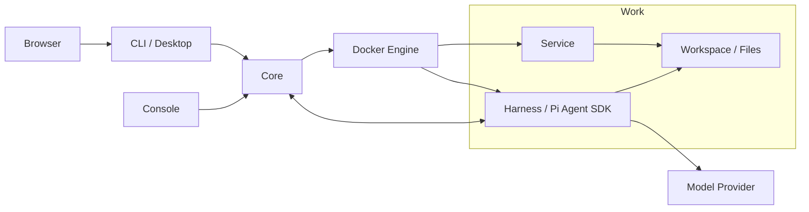

<p align="center">
  
</p>

# Piwork

**English** | [简体中文](README.zh-CN.md)

Piwork is an AI work environment that groups conversations, files, and container services into a Work you can manage, export, and move between installations.

## Architecture



Core manages resources and control operations. The Harness runs models and tools, Services provide applications, and work files live in the Work's shared volume. See [Core operations](docs/operations.md) for runtime and data boundaries, and [AGENTS.md](AGENTS.md) for implementation and directory conventions.

## Problem

An AI task often involves conversation history, project files, and running services. Piwork organizes these into a Work so you can converse, run applications, manage files, and preserve the environment across stops, restarts, and migrations.

## Piwork's Core Model: Work / Service / Harness

| Model | Meaning |
| --- | --- |
| **Work** | A unit of work with its own configuration, conversation history, files, and service definitions. It can be started, stopped, exported, and imported. |
| **Service** | An application service inside a Work. Core manages its lifecycle; it communicates over the Work's private network and can share the workspace when authorized. |
| **Harness** | The agent execution layer inside a Work. It uses the Pi Agent SDK to run conversations, models, and tools, and load Skills and Pi Packages. |

Each Work has its own Harness. The Harness executes tasks, Services provide application capabilities, and both operate within the Work. Core manages these resources, while CLI / Desktop provides the user interface.

The default Web development environment uses FastAPI + React + TypeScript + Vite. Its reusable image source, maintenance process, sqlite3 tools, and application update behavior are documented in the [Web base guide](deploy/images/web-base/README.md).

The default templates adopt successfully deployed updates automatically and preserve supported drafts and paths. Application Services have no Piwork memory cap; CPU/count limits and Agent/helper memory policies still apply. Existing Works adopt new packages and Agent images through explicit Update/Apply. See the [website guide](https://pphboy.github.io/piwork/guide/web-development.html) and [Brain workflow](docs/piwork-brain.md).

## Demo GIF / Video


Desktop chat interface preview, captured from a UI verification fixture.

## Quick Start

### Try Core and CLI with Docker

<!-- docker-quickstart:start -->

**Local candidate: images have not been pushed.** These commands and the Compose file match this candidate; the public entry becomes available after release verification.

### Core

Use Linux x86-64 with Docker Engine 28+. The host environment must already contain `PIWORK_ADMIN_ACCOUNT`, `PIWORK_ADMIN_PASSWORD` (at least 12 characters), `PIWORK_MODEL_PROVIDER`, `PIWORK_MODEL`, and `PIWORK_API_KEY`. Optional `PIWORK_MODEL_BASE_URL` uses HTTPS reachable from Work containers; leave it unset when unused.

Run Core in the host terminal. The image includes release defaults and automatically prepares the Agent and helpers:

```sh
docker run --detach --init \
    --name piwork-core-quickstart \
    --network host \
    --restart unless-stopped \
    --stop-timeout 60 \
    --env PIWORK_ADMIN_ACCOUNT \
    --env PIWORK_ADMIN_PASSWORD \
    --env PIWORK_MODEL_PROVIDER \
    --env PIWORK_MODEL \
    --env PIWORK_API_KEY \
    --env PIWORK_MODEL_BASE_URL \
    --mount type=bind,src=/var/run/docker.sock,dst=/var/run/docker.sock \
    --volume /var/lib/piwork/quickstart/core:/var/lib/piwork/quickstart/core \
    docker.io/pphboy/piwork-core:0.0.1-1a2cc85e7059-a6cb96f4e5b3-dirty
```

Core can also be deployed alone with [Core-only docker-compose.yml](deploy/docker/docker-compose.yml) (Compose 2.24+); CLI keeps its independent Docker command. Stop the previous Core before switching deployment methods, retaining the same data directory. For an optional combined setup, see [Single-host deployment](examples/single-host/README.md).

### CLI

Run CLI independently against an existing Core; no Core initialization variables are needed. This command connects to Core on the same host; replace `PIWORK_CORE_URL` for another Core. It waits for full readiness and opens a terminal:

```sh
docker run --rm --init --interactive --tty \
    --add-host host.docker.internal:host-gateway \
    --env PIWORK_CORE_URL=http://host.docker.internal:7171 \
    --mount type=volume,src=piwork-quickstart-client-state,dst=/var/lib/piwork/client \
    docker.io/pphboy/piwork-cli:0.0.1-1a2cc85e7059-a6cb96f4e5b3-dirty
```

Run the following **inside the CLI container**. Replace `ACCOUNT` with your account; login prompts for a hidden password. Creating a Work starts it automatically:

```sh
piwork-cli login --account ACCOUNT
piwork-cli work create --name 'My Work' --wait
```

Replace `WORK_ID` with the actual `workId` returned by creation, then send your first message:

```sh
piwork-cli chat WORK_ID --message 'Hello, Piwork!'
```

The reply appears in the terminal. Use `exit` to leave; the same CLI startup command reuses credentials and exiting the CLI does not stop Work. For failed readiness or interrupted observation, use the [terminal operations guide](deploy/docker/README.md#terminal-operations) to inspect status or recover the original Operation/Run without resubmitting.

<!-- docker-quickstart:end -->

For Windows Docker clients, remote Linux Core addresses, or the advanced Core-only Demo, see the [Docker guide](deploy/docker/README.md#terminal-operations).

<details>
<summary>Use the native CLI (connect to an existing Core)</summary>

<!-- native-quickstart:start -->

Download the [Linux Core / Console / CLI bundle](https://github.com/pphboy/piwork/releases/download/v0.0.1/piwork-linux-amd64-0.0.1.tar.gz) or [experimental Windows CLI bundle](https://github.com/pphboy/piwork/releases/download/v0.0.1/piwork-cli-windows-amd64-0.0.1.zip). Verify the release SHA256 before extracting; the Linux CLI is in `bin/`.

Use an already configured, ready Core, compatible with your native CLI version. In the directory containing the executable, replace `CORE_URL` with its address (`http://127.0.0.1:7171` for the same Linux computer) and `ACCOUNT` with your account. Login prompts for a hidden password. On Windows PowerShell, replace `./piwork-cli` with `.\piwork-cli.exe`.

```sh
./piwork-cli --core CORE_URL login --account ACCOUNT
./piwork-cli work create --name 'My Work' --wait
```

Use the actual `workId` returned by creation:

```sh
./piwork-cli chat WORK_ID --message 'Hello, Piwork!'
```

More commands are in the [CLI guide](docs/user-cli.md); see [CLI delivery](docs/cli-platforms.md) for platform details.

<!-- native-quickstart:end -->

</details>

To deploy Core from source, see [Core startup and initialization](docs/operations.md#从源码启动); administrator access is described in the [Console guide](docs/serve-console.md).

Model connections can be managed in Console **AI models**: independent Responses / Messages models, advisory message Test and lifecycle actions, without Provider or capability JSON setup. Work Chat keeps its existing model and Thinking selection. This flow requires matching current Core, Console, Agent and CLI builds; existing Works explicitly Apply a compatible Agent. See [AI models](docs/ai-models.md).

## .work Import / Export

A `.work` file is a complete offline copy of a Work, including files in its managed volumes, private conversation history, configuration, service definitions, Skills, Pi Packages, and fixed container images.

The following commands use the native Linux CLI. Log in to the appropriate Core first. Replace `WORK_ID` with the source Work ID and `IMPORTED_WORK_ID` with the new ID returned by import. The export destination must not already exist.

```sh
./piwork-cli work stop WORK_ID --wait
./piwork-cli work export WORK_ID --output ./saved.work
./piwork-cli work package inspect ./saved.work
./piwork-cli work import ./saved.work --name 'Restored Work' --wait
./piwork-cli work start IMPORTED_WORK_ID --wait
```

Stop the Work before exporting. Import creates an independent Work and leaves it stopped; start it explicitly afterward. To migrate to another Core, log in to the target Core before importing and starting it. Offline inspect verifies package integrity, not whether the target installation can use it.

Configure matching model credentials on the target Core separately. Platform-managed model keys and installation credentials are excluded from the package, but secrets saved in your files or history travel with it. See [Work snapshots](docs/work-snapshot.md) and the [package format](docs/work-package-format.md) for the complete workflow and data boundaries.

## Current Status / Limitations

- **0.0.1 Preview**: Intended for evaluation and feedback. The native Windows CLI is experimental and has not completed all formal acceptance checks.
- **Core**: A single Linux installation using the local Docker Engine Unix socket.
- **Clients**: The native CLI targets Windows and Linux, with command-line and Desktop interfaces. Outstanding native Windows acceptance checks are documented in [CLI delivery](docs/cli-platforms.md).
- **Docker delivery**: The verified scope is `linux/amd64`, Linux Core, and Linux CLI containers on Linux or Windows Docker Desktop. Docker Engine 28+ is required; Compose 2.24+ is needed when choosing the Core-only deployment, the single-host example or advanced Compose setups. See [delivery acceptance](docs/docker-release-quickstart-acceptance.md).
- **Runtime requirements**: Running a Work requires an available Docker Engine, model configuration, and credentials. A normal Core shutdown stops managed Work containers and preserves persistent data. Exiting the CLI does not stop Works.
- **Verification**: Installation, build, and unit tests have passed from a clean clone. Coverage, skipped checks, and platform boundaries are recorded in the [open-source readiness review](docs/open-source-readiness.md) and [testing guide](docs/testing.md).

## Roadmap

Piwork is still early. The current focus is to make the Work lifecycle reliable, portable, and easy to understand.

### Near term

- Improve the first-run experience and installation flow
- Strengthen `.work` import / export reliability
- Improve Windows client compatibility
- Improve Desktop UX and model configuration
- Publish more example Works and end-to-end demos

### Next

- Make Works easier to share and reuse
- Improve Service lifecycle management
- Expand Harness capabilities and tool integration
- Improve cross-machine and multi-environment portability
- Introduce better Work packaging and distribution

### Longer term

- Evolve Piwork into a portable AI-native workspace runtime
- Let Harnesses adapt and evolve with the Work
- Enable AI to operate and modify Services directly
- Explore layered Work packaging and richer distribution models

The roadmap will evolve based on real usage and feedback.

## Contributing

Read [AGENTS.md](AGENTS.md) for development conventions and the [testing guide](docs/testing.md) for test entry points. The basic build requires Go 1.25.5, Node 24 (see `.nvmrc`)/npm, Git, Make, and Bash. Run these commands from the repository root:

```sh
npm ci
make build
make test
```

`make build` writes native programs to `dist/go/` and builds the Agent and browser assets. Building and running unit tests does not require real model keys, local runtime data, or `.env.test`. To build only the client, run `npm run build:cli`; artifacts are written to `dist/cli/<target>/`.

## License

[Apache License 2.0](LICENSE)

## Discussion / Issue
