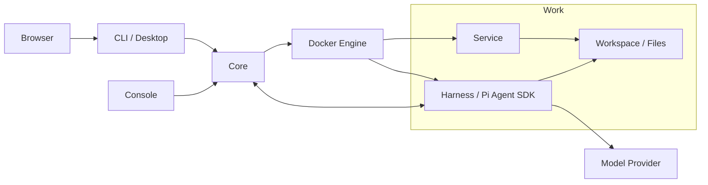

# Piwork

**English** | [简体中文](README.zh-CN.md)

Piwork is an AI work environment that groups conversations, files, and container services into a Work you can manage, export, and move between installations.

## Problem

An AI task often involves conversation history, project files, and running services. Piwork organizes these into a Work so you can converse, run applications, manage files, and preserve the environment across stops, restarts, and migrations.

## Piwork's Core Model: Work / Service / Harness

| Model | Meaning |
| --- | --- |
| **Work** | A unit of work with its own configuration, conversation history, files, and service definitions. It can be started, stopped, exported, and imported. |
| **Service** | An application service inside a Work. Core manages its lifecycle; it communicates over the Work's private network and can share the workspace when authorized. |
| **Harness** | The agent execution layer inside a Work. It uses the Pi Agent SDK to run conversations, models, and tools, and load Skills and Pi Packages. |

Each Work has its own Harness. The Harness executes tasks, Services provide application capabilities, and both operate within the Work. Core manages these resources, while CLI / Desktop provides the user interface.

## Demo GIF / Video

## Quick Start

### Connect to an Existing Core

Obtain the CLI executable for your platform and make sure Core has an administrator, model, and runtime configured. Start Desktop from the directory containing the executable.

Linux:

```sh
./piwork-cli desktop
```

Windows PowerShell:

```powershell
.\piwork-cli.exe desktop
```

When the browser opens, enter your Core URL, account, and password. Create and start a Work, then open Chat, Service, or Files. Desktop uses local port `17891` by default; use `desktop --no-open` to open the browser manually.

For command-line usage, see the [CLI guide](docs/user-cli.md). Platform and installation details are in [CLI delivery](docs/cli-platforms.md).

### Deploy Your Own Core

- **Core and CLI containers**: Follow the [Docker setup guide](deploy/docker/README.zh-CN.md) to configure and start both containers. It includes complete commands for Linux and Windows Docker Desktop clients. The native CLI remains available.
- **Run from source**: Follow [Core startup and initialization](docs/operations.md#从源码启动) to build the programs and images, configure the administrator and model, then start Desktop.
- **Administrator UI**: See the [Console guide](docs/serve-console.md) for startup, TLS configuration, and login.

## .work Import / Export

A `.work` file is a complete offline copy of a Work, including files in its managed volumes, private conversation history, configuration, service definitions, Skills, Pi Packages, and fixed container images.

The following commands use the native Linux CLI. Log in to the appropriate Core first. Replace `WORK_ID` with the source Work ID and `IMPORTED_WORK_ID` with the new ID returned by import. The export destination must not already exist.

```sh
./piwork-cli work stop WORK_ID --wait
./piwork-cli work export WORK_ID --output ./saved.work
./piwork-cli work package inspect ./saved.work
./piwork-cli work import ./saved.work --name 'Restored Work' --wait
./piwork-cli work start IMPORTED_WORK_ID --wait
```

Stop the Work before exporting. Import creates an independent Work and leaves it stopped; start it explicitly afterward. To migrate to another Core, log in to the target Core before importing and starting it. Offline inspect verifies package integrity, not whether the target installation can use it.

Configure matching model credentials on the target Core separately. Platform-managed model keys and installation credentials are excluded from the package, but secrets saved in your files or history travel with it. See [Work snapshots](docs/work-snapshot.md) and the [package format](docs/work-package-format.md) for the complete workflow and data boundaries.

## Architecture



Core manages resources and control operations. The Harness runs models and tools, Services provide applications, and work files live in the Work's shared volume. See [Core operations](docs/operations.md) for runtime and data boundaries, and [AGENTS.md](AGENTS.md) for implementation and directory conventions.

## Current Status / Limitations

- **Core**: A single Linux installation using the local Docker Engine Unix socket.
- **Clients**: The native CLI targets Windows and Linux, with command-line and Desktop interfaces. Outstanding native Windows acceptance checks are documented in [CLI delivery](docs/cli-platforms.md).
- **Docker delivery**: The verified scope is `linux/amd64`, Linux Core, and Linux CLI containers on Linux or Windows Docker Desktop. Docker Engine 28+ and Compose 2.24+ are required. See [delivery acceptance](docs/docker-delivery-acceptance.md).
- **Runtime requirements**: Running a Work requires an available Docker Engine, model configuration, and credentials. A normal Core shutdown stops managed Work containers and preserves persistent data. Exiting the CLI does not stop Works.
- **Verification**: Installation, build, and unit tests have passed from a clean clone. Coverage, skipped checks, and platform boundaries are recorded in the [open-source readiness review](docs/open-source-readiness.md) and [testing guide](docs/testing.md).

## Roadmap

## Contributing

Read [AGENTS.md](AGENTS.md) for development conventions and the [testing guide](docs/testing.md) for test entry points. The basic build requires Go 1.25.5, Node 24 (see `.nvmrc`)/npm, Git, Make, and Bash. Run these commands from the repository root:

```sh
npm ci
make build
make test
```

`make build` writes native programs to `dist/go/` and builds the Agent and browser assets. Building and running unit tests does not require real model keys, local runtime data, or `.env.test`. To build only the client, run `npm run build:cli`; artifacts are written to `dist/cli/<target>/`.

## License

[Apache License 2.0](LICENSE)

## Discussion / Issue
