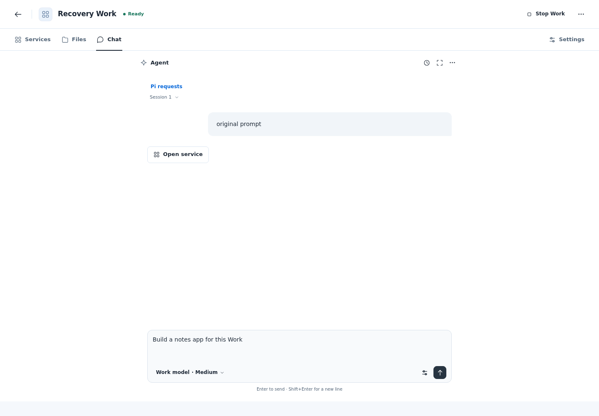
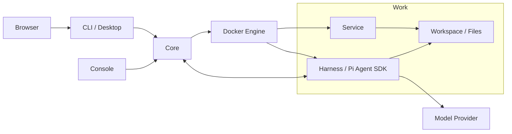

<p align="center">
  
</p>

# Piwork

**English** | [简体中文](README.zh-CN.md)

Piwork is an AI work environment that groups conversations, files, and container services into a Work you can manage, export, and move between installations.

## Problem

An AI task often involves conversation history, project files, and running services. Piwork organizes these into a Work so you can converse, run applications, manage files, and preserve the environment across stops, restarts, and migrations.

## Piwork's Core Model: Work / Service / Harness

| Model | Meaning |
| --- | --- |
| **Work** | A unit of work with its own configuration, conversation history, files, and service definitions. It can be started, stopped, exported, and imported. |
| **Service** | An application service inside a Work. Core manages its lifecycle; it communicates over the Work's private network and can share the workspace when authorized. |
| **Harness** | The agent execution layer inside a Work. It uses the Pi Agent SDK to run conversations, models, and tools, and load Skills and Pi Packages. |

Each Work has its own Harness. The Harness executes tasks, Services provide application capabilities, and both operate within the Work. Core manages these resources, while CLI / Desktop provides the user interface.

## Demo GIF / Video



Desktop chat interface preview, captured from a UI verification fixture.

## Quick Start

### Try Core and CLI with Docker

<!-- docker-quickstart:start -->

This example uses one Linux computer with a local rootful Docker Engine 28+ and `linux/amd64` images. Prepare a model provider, model ID, and API key; the model endpoint must be reachable from Work containers. Complete each step before continuing. If a command fails, stop and resolve it using the [terminal troubleshooting guide](deploy/docker/README.md#terminal-operations).

**1. Download and verify the installer.**

Run these commands in your host terminal, starting in a new directory:

```sh
(
    set -eu
    mkdir piwork-preview-0.0.1 || exit
    cd piwork-preview-0.0.1 || exit
    PIWORK_RELEASE_URL=https://github.com/pphboy/piwork/releases/download/v0.0.1
    curl --fail --location \
        --output piwork-docker-0.0.1.tar.gz \
        "$PIWORK_RELEASE_URL/piwork-docker-0.0.1.tar.gz" || exit
    curl --fail --location \
        --output piwork-docker-0.0.1.tar.gz.sha256 \
        "$PIWORK_RELEASE_URL/piwork-docker-0.0.1.tar.gz.sha256" || exit
    sha256sum --check --strict piwork-docker-0.0.1.tar.gz.sha256 || exit
    tar -xzf piwork-docker-0.0.1.tar.gz || exit
    cd piwork-docker || exit
    sha256sum --check --strict SHA256SUMS || exit
) && cd piwork-preview-0.0.1/piwork-docker
```

**2. Configure and start Core.**

In the extracted installer directory, create a private `core.run.env`. New installers provide the run template; the fallback creates the same blank configuration for the published `0.0.1` installer:

```sh
(
    set -eu
    test ! -e core.run.env
    if [ -f core.run.env.example ]; then
        cp core.run.env.example core.run.env
    else
        cat > core.run.env <<'EOF'
# Docker run only. Enter raw values without surrounding syntax quotes; do not source.
# Administrator password: at least 12 characters. Keep this file private (0600).
PIWORK_ADMIN_ACCOUNT=
PIWORK_ADMIN_PASSWORD=
PIWORK_MODEL_PROVIDER=
PIWORK_MODEL=
PIWORK_API_KEY=
# Optional HTTPS endpoint reachable from Work containers; omit instead of leaving empty.
# PIWORK_MODEL_BASE_URL=https://your-model-endpoint.example/v1
EOF
    fi
    chmod 600 core.run.env
    ${EDITOR:-vi} core.run.env
)
```

Fill the five blank values. The administrator password must be at least **12 characters**. Enter raw values without adding surrounding syntax quotes; do not source this file or reuse the Compose-only `core.env` format. For a custom model endpoint, uncomment the HTTPS `PIWORK_MODEL_BASE_URL` example and replace it with an address reachable from Work containers. Omit it when using the provider's default.

Read the fixed image references from the verified `release.env` in the same host terminal:

```sh
PIWORK_CORE_IMAGE=$(
    sed -n '/^PIWORK_CORE_IMAGE=.*@sha256:[0-9a-f]\{64\}$/s/^PIWORK_CORE_IMAGE=//p' release.env
)
PIWORK_CLI_IMAGE=$(
    sed -n '/^PIWORK_CLI_IMAGE=.*@sha256:[0-9a-f]\{64\}$/s/^PIWORK_CLI_IMAGE=//p' release.env
)
test -n "$PIWORK_CORE_IMAGE" && test -n "$PIWORK_CLI_IMAGE"
```

Start Core. Docker creates its data bind directory, and Core makes a new empty installation private. Keep the same absolute path on both sides of the mount. Core listens on `7171` and `7172` and uses the existing authenticated HTTP/control interfaces; remote HTTPS setup is covered in the installation guide.

```sh
docker run --detach --init \
    --name piwork-core-quickstart \
    --user 0:0 \
    --network host \
    --env-file release.env \
    --env-file core.run.env \
    --env DOCKER_HOST=unix:///var/run/docker.sock \
    --env DOCKER_CONTEXT= \
    --env PIWORK_DATA_DIR=/var/lib/piwork/quickstart/core \
    --env PIWORK_CORE_URL=http://127.0.0.1:7171 \
    --env PIWORK_LISTEN=0.0.0.0:7171 \
    --env PIWORK_AGENT_GRPC_LISTEN=0.0.0.0:7172 \
    --env PIWORK_AGENT_GRPC_ADVERTISE=piwork-core:7172 \
    --mount type=bind,src=/var/run/docker.sock,dst=/var/run/docker.sock \
    --volume /var/lib/piwork/quickstart/core:/var/lib/piwork/quickstart/core \
    --stop-timeout 60 \
    "$PIWORK_CORE_IMAGE" serve --allow-insecure-remote
```

Core automatically prepares the Agent and helper images. Its installation data persists in `/var/lib/piwork/quickstart/core`; Work data is managed by Core.

**3. Enter the CLI container.**

Run this in the same host terminal. It opens an interactive shell; the named state volume retains your login between containers:

```sh
docker run --rm --init -it \
    --add-host host.docker.internal:host-gateway \
    --env PIWORK_CORE_URL=http://host.docker.internal:7171 \
    --mount type=volume,src=piwork-quickstart-client-state,dst=/var/lib/piwork/client \
    --entrypoint /bin/sh \
    "$PIWORK_CLI_IMAGE" -i
```

**4. Log in, create a Work, and receive a reply.**

Run the remaining commands **inside the CLI container**. First wait up to ten minutes for Core and its dependencies to be ready:

```sh
timeout 600 curl \
    --fail --silent --show-error \
    --output /dev/null --max-time 3 \
    --retry 120 --retry-delay 5 --retry-all-errors \
    "${PIWORK_CORE_URL}/readyz?profile=docker-delivery"
```

After the wait succeeds, replace `ACCOUNT` with the account configured in `core.run.env`. Login prompts for a hidden password. Creating a Work starts it automatically; `--wait` observes that operation until it succeeds:

```sh
piwork-cli login --account ACCOUNT
piwork-cli work create --name 'My Work' --wait
```

Replace `WORK_ID` with the actual `workId` in the creation result, then send your first message:

```sh
piwork-cli chat WORK_ID --message 'Hello, Piwork!'
```

The model reply appears in the terminal. Use `exit` to leave the container; the login volume and Work remain. Run the same CLI container command to return. If a Work operation or chat stream is interrupted, recover using its original ID as described in the [terminal operations guide](deploy/docker/README.md#terminal-operations).

<!-- docker-quickstart:end -->

Prefer Compose for Core deployment? See the optional [Core Compose Demo](deploy/docker/README.md#core-compose-demo); its CLI entry is the same terminal command. Compose 2.24+ is only needed for that Demo or advanced Compose setups. For Windows Docker clients and remote Linux Core addresses, see the [Docker installation guide](deploy/docker/README.md#terminal-operations).

<details>
<summary>Use the native CLI (connect to an existing Core)</summary>

<!-- native-quickstart:start -->

Download the [Linux Core / Console / CLI bundle](https://github.com/pphboy/piwork/releases/download/v0.0.1/piwork-linux-amd64-0.0.1.tar.gz) or [experimental Windows CLI bundle](https://github.com/pphboy/piwork/releases/download/v0.0.1/piwork-cli-windows-amd64-0.0.1.zip). Verify the release SHA256 before extracting; the Linux CLI is in `bin/`.

Use an already configured, ready Core, such as the Core started above. In the directory containing the executable, replace `CORE_URL` with its address (`http://127.0.0.1:7171` for the same Linux computer) and `ACCOUNT` with your account. Login prompts for a hidden password. On Windows PowerShell, replace `./piwork-cli` with `.\piwork-cli.exe`.

```sh
./piwork-cli --core CORE_URL login --account ACCOUNT
./piwork-cli work create --name 'My Work' --wait
```

Use the actual `workId` returned by creation:

```sh
./piwork-cli chat WORK_ID --message 'Hello, Piwork!'
```

More commands are in the [CLI guide](docs/user-cli.md); see [CLI delivery](docs/cli-platforms.md) for platform details.

<!-- native-quickstart:end -->

</details>

To deploy Core from source, see [Core startup and initialization](docs/operations.md#从源码启动); administrator access is described in the [Console guide](docs/serve-console.md).

Model connections can be managed in Console **AI models**: independent Responses / Messages models, advisory message Test and lifecycle actions, without Provider or capability JSON setup. Work Chat keeps its existing model and Thinking selection. See [AI models](docs/ai-models.md).

## .work Import / Export

A `.work` file is a complete offline copy of a Work, including files in its managed volumes, private conversation history, configuration, service definitions, Skills, Pi Packages, and fixed container images.

The following commands use the native Linux CLI. Log in to the appropriate Core first. Replace `WORK_ID` with the source Work ID and `IMPORTED_WORK_ID` with the new ID returned by import. The export destination must not already exist.

```sh
./piwork-cli work stop WORK_ID --wait
./piwork-cli work export WORK_ID --output ./saved.work
./piwork-cli work package inspect ./saved.work
./piwork-cli work import ./saved.work --name 'Restored Work' --wait
./piwork-cli work start IMPORTED_WORK_ID --wait
```

Stop the Work before exporting. Import creates an independent Work and leaves it stopped; start it explicitly afterward. To migrate to another Core, log in to the target Core before importing and starting it. Offline inspect verifies package integrity, not whether the target installation can use it.

Configure matching model credentials on the target Core separately. Platform-managed model keys and installation credentials are excluded from the package, but secrets saved in your files or history travel with it. See [Work snapshots](docs/work-snapshot.md) and the [package format](docs/work-package-format.md) for the complete workflow and data boundaries.

## Architecture



Core manages resources and control operations. The Harness runs models and tools, Services provide applications, and work files live in the Work's shared volume. See [Core operations](docs/operations.md) for runtime and data boundaries, and [AGENTS.md](AGENTS.md) for implementation and directory conventions.

## Current Status / Limitations

- **0.0.1 Preview**: Intended for evaluation and feedback. The native Windows CLI is experimental and has not completed all formal acceptance checks.
- **Core**: A single Linux installation using the local Docker Engine Unix socket.
- **Clients**: The native CLI targets Windows and Linux, with command-line and Desktop interfaces. Outstanding native Windows acceptance checks are documented in [CLI delivery](docs/cli-platforms.md).
- **Docker delivery**: The verified scope is `linux/amd64`, Linux Core, and Linux CLI containers on Linux or Windows Docker Desktop. Docker Engine 28+ is required; Compose 2.24+ is optional for the Core Demo and advanced Compose setups. See [delivery acceptance](docs/docker-delivery-acceptance.md).
- **Runtime requirements**: Running a Work requires an available Docker Engine, model configuration, and credentials. A normal Core shutdown stops managed Work containers and preserves persistent data. Exiting the CLI does not stop Works.
- **Verification**: Installation, build, and unit tests have passed from a clean clone. Coverage, skipped checks, and platform boundaries are recorded in the [open-source readiness review](docs/open-source-readiness.md) and [testing guide](docs/testing.md).

## Roadmap

Piwork is still early. The current focus is to make the Work lifecycle reliable, portable, and easy to understand.

### Near term

- Improve the first-run experience and installation flow
- Strengthen `.work` import / export reliability
- Improve Windows client compatibility
- Improve Desktop UX and model configuration
- Publish more example Works and end-to-end demos

### Next

- Make Works easier to share and reuse
- Improve Service lifecycle management
- Expand Harness capabilities and tool integration
- Improve cross-machine and multi-environment portability
- Introduce better Work packaging and distribution

### Longer term

- Evolve Piwork into a portable AI-native workspace runtime
- Let Harnesses adapt and evolve with the Work
- Enable AI to operate and modify Services directly
- Explore layered Work packaging and richer distribution models

The roadmap will evolve based on real usage and feedback.

## Contributing

Read [AGENTS.md](AGENTS.md) for development conventions and the [testing guide](docs/testing.md) for test entry points. The basic build requires Go 1.25.5, Node 24 (see `.nvmrc`)/npm, Git, Make, and Bash. Run these commands from the repository root:

```sh
npm ci
make build
make test
```

`make build` writes native programs to `dist/go/` and builds the Agent and browser assets. Building and running unit tests does not require real model keys, local runtime data, or `.env.test`. To build only the client, run `npm run build:cli`; artifacts are written to `dist/cli/<target>/`.

## License

[Apache License 2.0](LICENSE)

## Discussion / Issue
