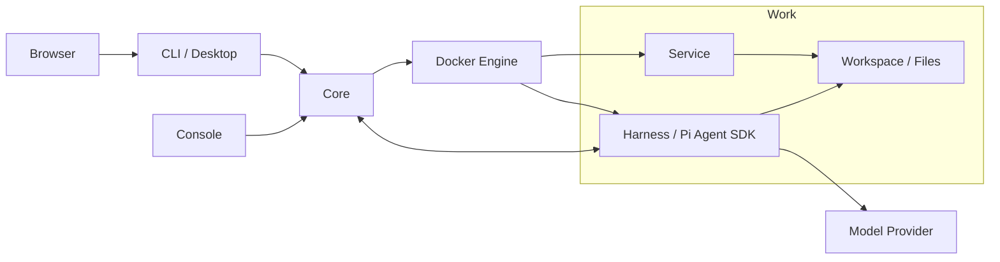

<p align="center">
  
</p>

# Piwork

[English](README.md) | **简体中文**

Piwork 是一个以 Work 为单位，整合 AI 对话、工作文件和容器服务，并支持导出与迁移的工作环境。

## Architecture 简图



Core 负责资源管理与控制，Harness 执行模型和工具，Service 提供应用，工作文件保存在 Work 的共享卷中。运行和数据边界见 [Core 运维](docs/operations.md)；实现与目录约定见 [AGENTS.md](AGENTS.md)。

## Problem

一次 AI 工作通常同时涉及对话历史、项目文件和需要持续运行的服务。Piwork 将这些内容组织为一个 Work，让用户在同一环境中对话、运行应用和管理文件，并通过启停、恢复和迁移继续使用这个环境。

## Piwork 的核心模型：Work / Service / Harness

| 模型 | 含义 |
| --- | --- |
| **Work** | 用户的工作单元，保存独立的配置、对话历史、工作文件和服务定义，可启动、停止、导出和导入。 |
| **Service** | Work 内的应用服务，由 Core 管理生命周期，通过 Work 私网通信，并按授权共享工作目录。 |
| **Harness** | Work 中的 Agent 执行层，基于 Pi Agent SDK 运行对话、模型和工具，加载 Skill 与 Pi Package。 |

每个 Work 拥有自己的 Harness。Harness 执行任务，Service 提供应用能力，两者在 Work 的环境中协作；Core 管理这些资源，CLI / Desktop 提供用户入口。

## Demo GIF / Video


Desktop 聊天界面的预览截图，来自界面验证 fixture。

## Quick Start

### 使用 Docker 试用 Core 和 CLI

<!-- docker-quickstart:start -->

### Core

使用 Linux x86-64 和 Docker Engine 28+。宿主环境中应已有 `PIWORK_ADMIN_ACCOUNT`、`PIWORK_ADMIN_PASSWORD`（至少 12 位）、`PIWORK_MODEL_PROVIDER`、`PIWORK_MODEL`、`PIWORK_API_KEY`。可选 `PIWORK_MODEL_BASE_URL` 使用 Work 可达的 HTTPS 地址；不用时保持未设置。

在宿主终端运行 Core。镜像自带发行默认值，并自动准备 Agent 和 helper：

```sh
docker run --detach --init \
    --name piwork-core-quickstart \
    --network host \
    --restart unless-stopped \
    --stop-timeout 60 \
    --env PIWORK_ADMIN_ACCOUNT \
    --env PIWORK_ADMIN_PASSWORD \
    --env PIWORK_MODEL_PROVIDER \
    --env PIWORK_MODEL \
    --env PIWORK_API_KEY \
    --env PIWORK_MODEL_BASE_URL \
    --mount type=bind,src=/var/run/docker.sock,dst=/var/run/docker.sock \
    --volume /var/lib/piwork/quickstart/core:/var/lib/piwork/quickstart/core \
    docker.io/pphboy/piwork-core:0.0.1-fc409adc1a0b-808d890c6607-dirty
```

Core 也可用 [Core-only docker-compose.yml](deploy/docker/docker-compose.yml) 单独部署（Compose 2.24+），CLI 仍使用自己的 Docker 命令。切换 Core 部署方式前先停止原容器，保留同一数据目录。Core 与 CLI 合并的可选方式见 [单机部署示例](examples/single-host/README.zh-CN.md)。

### CLI

CLI 独立运行，只需已有且可达的 Core，不需要 Core 初始化变量。下面连接同机 Core；连接其他 Core 时替换 `PIWORK_CORE_URL`。它等待完整就绪后进入终端：

```sh
docker run --rm --init --interactive --tty \
    --add-host host.docker.internal:host-gateway \
    --env PIWORK_CORE_URL=http://host.docker.internal:7171 \
    --mount type=volume,src=piwork-quickstart-client-state,dst=/var/lib/piwork/client \
    docker.io/pphboy/piwork-cli:0.0.1-fc409adc1a0b-808d890c6607-dirty
```

下面的命令在 **CLI 容器内**执行。将 `ACCOUNT` 替换为你的账号；登录时隐藏密码输入。创建 Work 会自动启动它：

```sh
piwork-cli login --account ACCOUNT
piwork-cli work create --name 'My Work' --wait
```

使用创建结果中的实际 `workId` 替换 `WORK_ID`，发送第一条消息：

```sh
piwork-cli chat WORK_ID --message 'Hello, Piwork!'
```

回复直接显示在终端。用 `exit` 离开；同样的 CLI 启动命令会复用凭证，Work 不因 CLI 退出而停止。等待失败或观察中断时，按 [终端操作说明](deploy/docker/README.zh-CN.md#terminal-operations) 查询状态或恢复原 Operation/Run，不重复提交。

<!-- docker-quickstart:end -->

Windows Docker 客户端、远端 Linux Core 地址和高级 Core-only Demo 见 [Docker 手册](deploy/docker/README.zh-CN.md#terminal-operations)。

<details>
<summary>使用原生 CLI（连接已有 Core）</summary>

<!-- native-quickstart:start -->

下载 [Linux Core / Console / CLI 包](https://github.com/pphboy/piwork/releases/download/v0.0.1/piwork-linux-amd64-0.0.1.tar.gz)或 [Windows CLI 实验性包](https://github.com/pphboy/piwork/releases/download/v0.0.1/piwork-cli-windows-amd64-0.0.1.zip)。先核对发行 SHA256 再解压；Linux CLI 位于 `bin/`。

连接已经配置完成且就绪的 Core，并与原生 CLI 版本兼容的 Core。在可执行文件所在目录，将 `CORE_URL` 替换为其地址（同机 Linux 为 `http://127.0.0.1:7171`），将 `ACCOUNT` 替换为账号；登录时隐藏输入密码。Windows PowerShell 将 `./piwork-cli` 替换为 `.\piwork-cli.exe`。

```sh
./piwork-cli --core CORE_URL login --account ACCOUNT
./piwork-cli work create --name 'My Work' --wait
```

将创建结果中的实际 `workId` 用于下一条命令：

```sh
./piwork-cli chat WORK_ID --message 'Hello, Piwork!'
```

更多命令见[用户 CLI 手册](docs/user-cli.md)，平台说明见 [CLI 平台交付](docs/cli-platforms.md)。

<!-- native-quickstart:end -->

</details>

从源码部署 Core 见 [Core 启动与初始化](docs/operations.md#从源码启动)；管理员入口见 [Console 手册](docs/serve-console.md)。

## .work Import / Export

`.work` 是 Work 的完整离线副本，包含受管卷中的文件、私有对话历史、配置、服务定义、Skill、Pi Package 和固定容器镜像。

下面使用 Linux 原生 CLI；先登录对应 Core，将 `WORK_ID` 替换为源 Work ID，将 `IMPORTED_WORK_ID` 替换为导入结果中的新 Work ID。导出路径必须尚不存在。

```sh
./piwork-cli work stop WORK_ID --wait
./piwork-cli work export WORK_ID --output ./saved.work
./piwork-cli work package inspect ./saved.work
./piwork-cli work import ./saved.work --name 'Restored Work' --wait
./piwork-cli work start IMPORTED_WORK_ID --wait
```

导出前必须停止 Work；导入会创建独立的新 Work，并保持停止状态，随后显式启动。迁移到另一台 Core 时，先在目标 Core 登录，再执行 import 和 start。离线 inspect 检查包的完整性，不代表目标安装已验证。

目标 Core 需要另行配置匹配的模型凭据；平台管理的模型 key 和安装凭证不会随包迁移，但工作文件和历史中自行保存的秘密仍会进入包。完整流程和数据边界见 [Work 快照](docs/work-snapshot.md) 与 [包格式](docs/work-package-format.md)。

## Current Status / Limitations

- **0.0.1 Preview**：用于试用与反馈。Windows 原生 CLI 为实验性附件，尚未完成全部正式验收。
- **Core**：当前为单机 Linux 部署，使用本机 Docker Engine Unix socket。
- **客户端**：原生 CLI 面向 Windows 和 Linux，提供命令行与 Desktop；Windows 原生正式验收的未完成项见 [CLI 平台交付](docs/cli-platforms.md)。
- **Docker 交付**：当前验收范围为 `linux/amd64`、Linux Core，以及 Linux / Windows Docker Desktop 的 Linux CLI 容器；要求 Docker Engine 28+；选择 Core Compose、单机部署示例或高级 Compose 部署时另需 Compose 2.24+。详情见 [交付验收](docs/docker-release-quickstart-acceptance.md)。
- **运行条件**：实际 Work 执行需要可用的 Docker Engine、模型配置与凭据。Core 正常退出会停止受管 Work 的运行容器并保留持久数据；退出 CLI 不停止 Work。
- **验证状态**：干净 clone 的安装、构建和单元测试已通过。实际覆盖范围、跳过项与平台边界见 [开源前检查记录](docs/open-source-readiness.md) 和 [测试说明](docs/testing.md)。

## Roadmap

Piwork 仍处于早期阶段。当前重点是让 Work 的生命周期可靠、可迁移且易于理解。

### 近期

- 改善首次使用体验和安装流程
- 提升 `.work` 导入 / 导出的可靠性
- 改善 Windows 客户端兼容性
- 改善 Desktop 用户体验和模型配置
- 发布更多 Work 示例和端到端演示

### 下一阶段

- 让 Work 更易于分享和复用
- 改善 Service 生命周期管理
- 扩展 Harness 能力和工具集成
- 提升跨机器和多环境的可迁移性
- 引入更完善的 Work 打包和分发机制

### 长期

- 将 Piwork 演进为可迁移的 AI 原生工作空间运行时
- 让 Harness 随 Work 适应和演进
- 让 AI 能够直接操作和修改 Service
- 探索分层 Work 打包和更丰富的分发模式

路线图将根据实际使用情况和反馈持续调整。

## Contributing

开发约定见 [AGENTS.md](AGENTS.md)，测试入口见 [测试说明](docs/testing.md)。基础构建需要 Go 1.25.5、Node 24（`.nvmrc`）/npm、Git、Make 和 Bash，在仓库根目录执行：

```sh
npm ci
make build
make test
```

`make build` 输出原生程序到 `dist/go/`，同时构建 Agent 和浏览器资源。构建与单元测试不需要真实模型 key、本机运行数据或 `.env.test`。只构建客户端可执行 `npm run build:cli`，产物位于 `dist/cli/<目标>/`。

## License

[Apache License 2.0](LICENSE)

## Discussion / Issue
