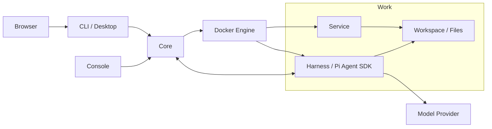

# Piwork

[English](README.md) | **简体中文**

Piwork 是一个以 Work 为单位，整合 AI 对话、工作文件和容器服务，并支持导出与迁移的工作环境。

## Problem

一次 AI 工作通常同时涉及对话历史、项目文件和需要持续运行的服务。Piwork 将这些内容组织为一个 Work，让用户在同一环境中对话、运行应用和管理文件，并通过启停、恢复和迁移继续使用这个环境。

## Piwork 的核心模型：Work / Service / Harness

| 模型 | 含义 |
| --- | --- |
| **Work** | 用户的工作单元，保存独立的配置、对话历史、工作文件和服务定义，可启动、停止、导出和导入。 |
| **Service** | Work 内的应用服务，由 Core 管理生命周期，通过 Work 私网通信，并按授权共享工作目录。 |
| **Harness** | Work 中的 Agent 执行层，基于 Pi Agent SDK 运行对话、模型和工具，加载 Skill 与 Pi Package。 |

每个 Work 拥有自己的 Harness。Harness 执行任务，Service 提供应用能力，两者在 Work 的环境中协作；Core 管理这些资源，CLI / Desktop 提供用户入口。

## Demo GIF / Video


Desktop 聊天界面的预览截图，来自界面验证 fixture。

## Quick Start

### 推荐：使用 Docker 试用

下载 [0.0.1 Preview](https://github.com/pphboy/piwork/releases/tag/v0.0.1) 的双 Docker 安装包。你启动 Core、CLI 两个入口；Core 自动准备 Agent 和 helper，并管理 Work 运行容器。

Core 运行于 Linux。CLI 容器可运行于 Linux 或 Windows Docker Desktop 的 Linux 容器；要求 `linux/amd64`、Docker Engine 28+、Compose 2.24+。Windows 客户端连接可达的 Linux Core。

Linux：在新的目录下载、校验并解压安装包：

```sh
(
    set -eu
    mkdir piwork-preview-0.0.1
    cd piwork-preview-0.0.1
    PIWORK_RELEASE_URL=https://github.com/pphboy/piwork/releases/download/v0.0.1
    curl --fail --location --output piwork-docker-0.0.1.tar.gz "$PIWORK_RELEASE_URL/piwork-docker-0.0.1.tar.gz"
    curl --fail --location --output piwork-docker-0.0.1.tar.gz.sha256 "$PIWORK_RELEASE_URL/piwork-docker-0.0.1.tar.gz.sha256"
    sha256sum --check piwork-docker-0.0.1.tar.gz.sha256
    tar -xzf piwork-docker-0.0.1.tar.gz
    cd piwork-docker
    sha256sum --check SHA256SUMS
) && cd piwork-preview-0.0.1/piwork-docker
```

接着按 [Docker 安装手册](deploy/docker/README.zh-CN.md#6-完整操作命令) 填写管理员与模型配置，启动 Core 和 CLI，再执行 `desktop open --no-open`。将输出链接粘贴到同机浏览器，在 Desktop 中输入 Core URL、账号和密码登录，然后创建并启动 Work。手册也提供完整的 Windows PowerShell 下载与启动命令。

### 连接已有 Core

原生客户端继续提供：[Linux Core / Console / CLI 包](https://github.com/pphboy/piwork/releases/download/v0.0.1/piwork-linux-amd64-0.0.1.tar.gz)、[Windows CLI 实验性包](https://github.com/pphboy/piwork/releases/download/v0.0.1/piwork-cli-windows-amd64-0.0.1.zip)。先核对发行页的 SHA256，再解压；Linux CLI 位于 `bin/`。

取得适合本机平台的 CLI 可执行文件，并确认 Core 已配置管理员、模型和运行时。在可执行文件所在目录启动 Desktop。

Linux：

```sh
./piwork-cli desktop
```

Windows PowerShell：

```powershell
.\piwork-cli.exe desktop
```

浏览器打开后，输入 Core URL、账号和密码登录。在 Work 页面创建并启动 Work，随后进入对话、Service 或 Files。默认本机端口为 `17891`；需要手动打开浏览器时使用 `desktop --no-open`。

纯命令行操作见 [用户 CLI 手册](docs/user-cli.md)，平台和安装说明见 [CLI 平台交付](docs/cli-platforms.md)。

### 部署自己的 Core

- **双 Docker**：按 [Docker 安装手册](deploy/docker/README.zh-CN.md) 配置并启动 Core、CLI 两个入口。手册包含 Linux 和 Windows Docker Desktop 客户端的完整命令；原生 CLI 继续可用。
- **从源码运行**：按 [Core 启动与初始化](docs/operations.md#从源码启动) 构建程序和镜像、初始化管理员与模型，再启动 Desktop。
- **管理员界面**：Console 的启动、TLS 配置和登录见 [Console 手册](docs/serve-console.md)。

## .work Import / Export

`.work` 是 Work 的完整离线副本，包含受管卷中的文件、私有对话历史、配置、服务定义、Skill、Pi Package 和固定容器镜像。

下面使用 Linux 原生 CLI；先登录对应 Core，将 `WORK_ID` 替换为源 Work ID，将 `IMPORTED_WORK_ID` 替换为导入结果中的新 Work ID。导出路径必须尚不存在。

```sh
./piwork-cli work stop WORK_ID --wait
./piwork-cli work export WORK_ID --output ./saved.work
./piwork-cli work package inspect ./saved.work
./piwork-cli work import ./saved.work --name 'Restored Work' --wait
./piwork-cli work start IMPORTED_WORK_ID --wait
```

导出前必须停止 Work；导入会创建独立的新 Work，并保持停止状态，随后显式启动。迁移到另一台 Core 时，先在目标 Core 登录，再执行 import 和 start。离线 inspect 检查包的完整性，不代表目标安装已验证。

目标 Core 需要另行配置匹配的模型凭据；平台管理的模型 key 和安装凭证不会随包迁移，但工作文件和历史中自行保存的秘密仍会进入包。完整流程和数据边界见 [Work 快照](docs/work-snapshot.md) 与 [包格式](docs/work-package-format.md)。

## Architecture 简图



Core 负责资源管理与控制，Harness 执行模型和工具，Service 提供应用，工作文件保存在 Work 的共享卷中。运行和数据边界见 [Core 运维](docs/operations.md)；实现与目录约定见 [AGENTS.md](AGENTS.md)。

## Current Status / Limitations

- **0.0.1 Preview**：用于试用与反馈。Windows 原生 CLI 为实验性附件，尚未完成全部正式验收。
- **Core**：当前为单机 Linux 部署，使用本机 Docker Engine Unix socket。
- **客户端**：原生 CLI 面向 Windows 和 Linux，提供命令行与 Desktop；Windows 原生正式验收的未完成项见 [CLI 平台交付](docs/cli-platforms.md)。
- **Docker 交付**：当前验收范围为 `linux/amd64`、Linux Core，以及 Linux / Windows Docker Desktop 的 Linux CLI 容器；要求 Docker Engine 28+、Compose 2.24+。详情见 [交付验收](docs/docker-delivery-acceptance.md)。
- **运行条件**：实际 Work 执行需要可用的 Docker Engine、模型配置与凭据。Core 正常退出会停止受管 Work 的运行容器并保留持久数据；退出 CLI 不停止 Work。
- **验证状态**：干净 clone 的安装、构建和单元测试已通过。实际覆盖范围、跳过项与平台边界见 [开源前检查记录](docs/open-source-readiness.md) 和 [测试说明](docs/testing.md)。

## Roadmap

## Contributing

开发约定见 [AGENTS.md](AGENTS.md)，测试入口见 [测试说明](docs/testing.md)。基础构建需要 Go 1.25.5、Node 24（`.nvmrc`）/npm、Git、Make 和 Bash，在仓库根目录执行：

```sh
npm ci
make build
make test
```

`make build` 输出原生程序到 `dist/go/`，同时构建 Agent 和浏览器资源。构建与单元测试不需要真实模型 key、本机运行数据或 `.env.test`。只构建客户端可执行 `npm run build:cli`，产物位于 `dist/cli/<目标>/`。

## License

[Apache License 2.0](LICENSE)

## Discussion / Issue
