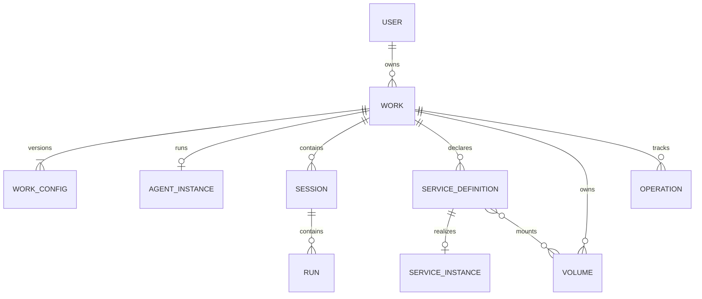
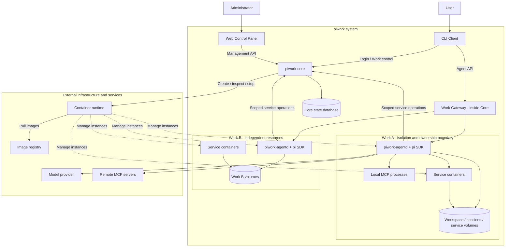
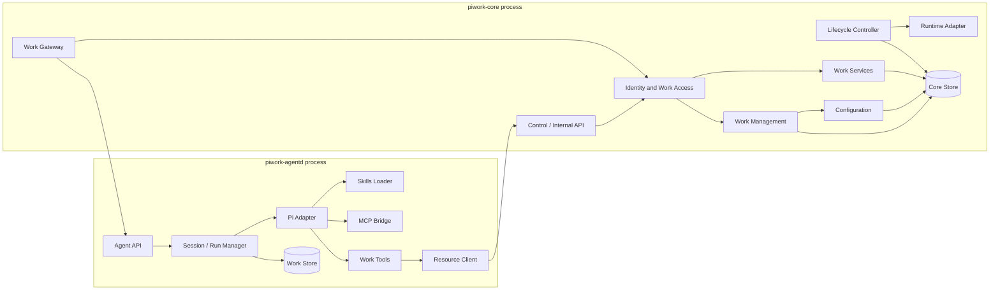
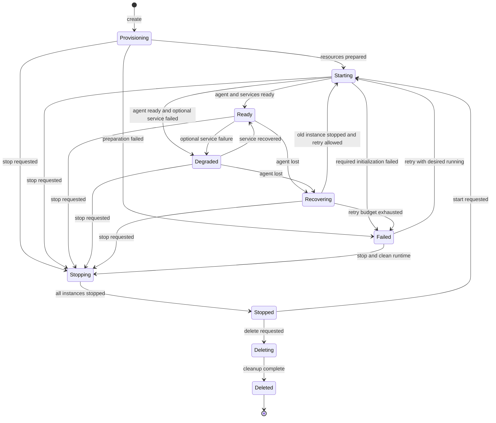
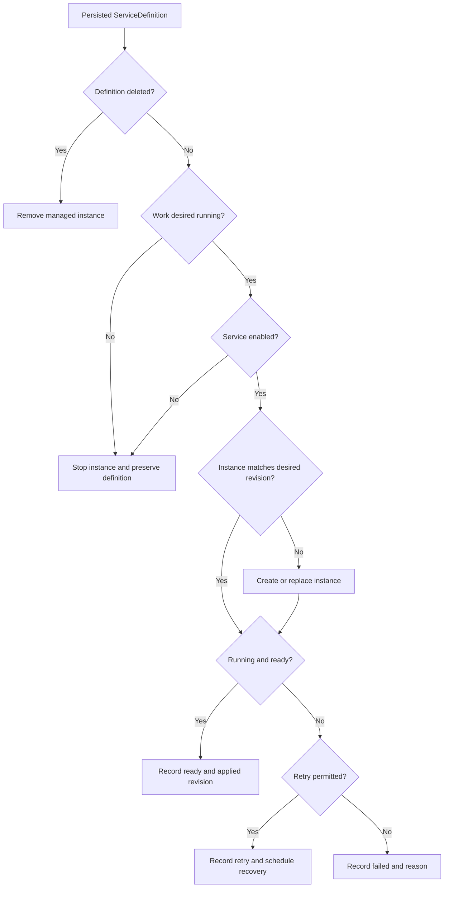
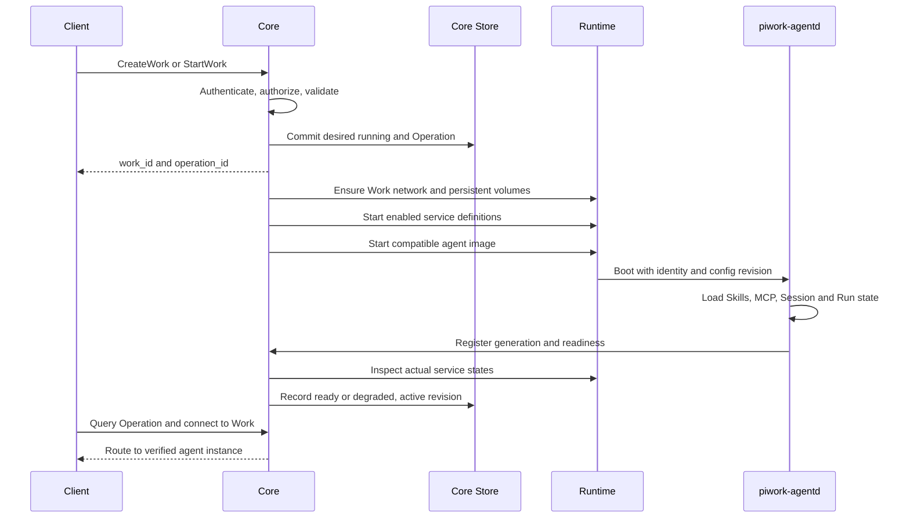
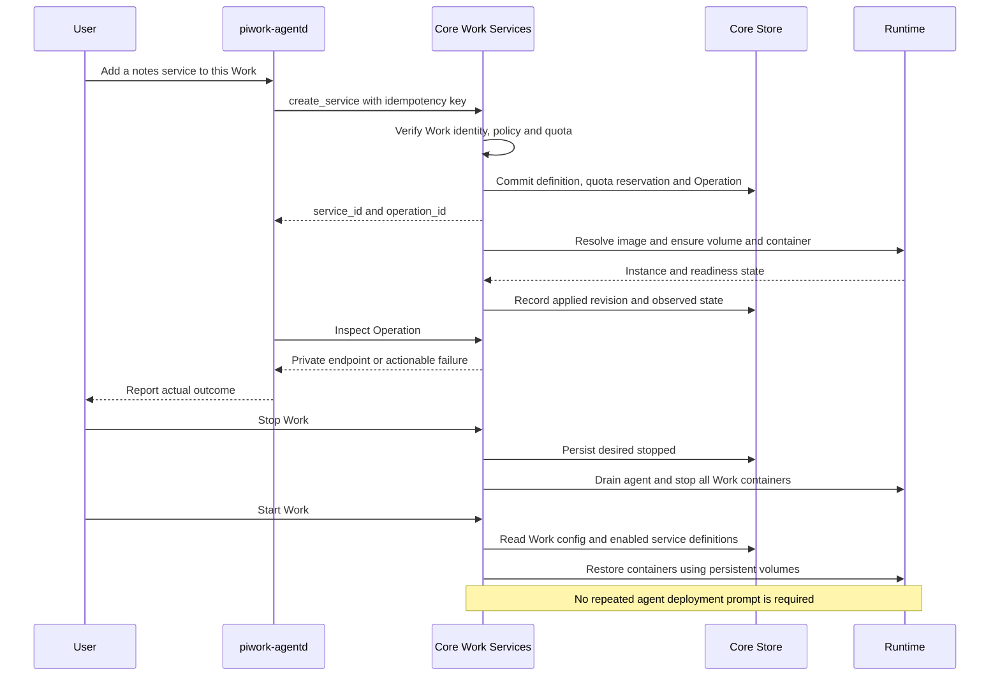
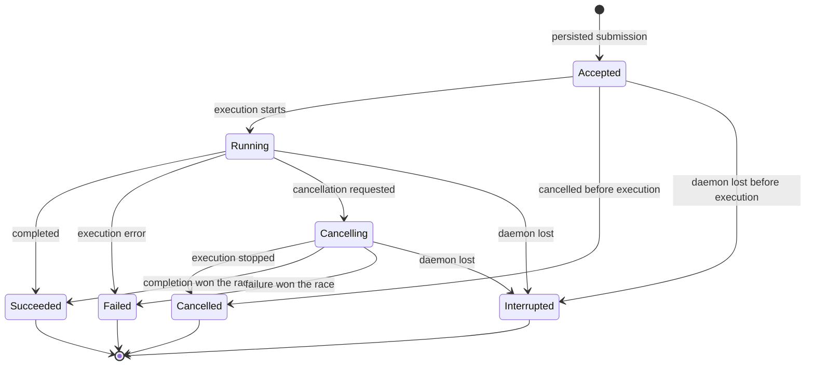
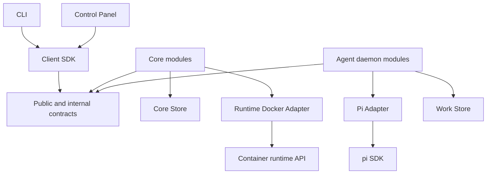

# piwork 系统架构与行为契约

本文以 [初始架构图](./piwork.excalidraw.png) 和本轮架构讨论为设计输入，整理第一版的系统边界、进程与模块、状态归属、生命周期和 OpenSpec capability model。

文档状态：架构设计草案。用户明确的产品目标与为补全闭环提出的设计建议分别记录；本文不表示这些能力已经实现，也不表示已经建立对应 OpenSpec specs。

## 1. 核心目标与第一版范围

piwork 是一个以 Work 为持久工作单元的平台。用户登录后创建 Work；每个运行中的 Work 拥有一个独立的 `piwork-agentd`，内部使用 pi SDK。远程 Client 在指定 Work 中与 agent 对话。Core 管理 Work 的生命周期。

agent 可以自主扩展自己的 Work：声明并启动其他容器服务，把服务定义持久保存为 Work 配置，在 Work 后续启动时自动恢复这些服务及其持久数据。

### 1.1 已确认的产品目标

- Core 管理 Work 的创建、启动、停止和恢复。
- 每个 Work 对应一个逻辑 agent server，内部运行 pi SDK。
- Client 必须登录，可以创建 Work、连接指定 Work 并与 agent 对话。
- Core 控制面板可以添加和管理用户。
- 每个 Work 可以定制 Skills、MCP 和基础镜像。
- agent 可以自主创建其他容器；容器服务定义成为 Work 的持久配置。
- Work 再次启动时，按照配置启动这些容器服务。
- 第一版 Client 保持简单，优先完成上述基础闭环。

### 1.2 为补全闭环提出的第一版建议

| 设计项 | 推荐默认值 | 原因 |
|---|---|---|
| 部署 | 单 Linux 主机、单 Core、多 Work | 先验证完整闭环，保留运行时适配接口 |
| 容器运行时 | Docker，由 Core 独占编排职责 | 避免 agent 和 Core 竞争操作容器 |
| 存储 | Core SQLite + 每个 Work 独立持久存储 | 控制状态与运行数据分离 |
| 客户端 | CLI；控制面板为浏览器应用 | 复用 demo 的 SDK、CLI、gRPC 接入经验 |
| Work 权限 | admin/user 角色 + Work 所有者 | 第一版不引入成员共享模型 |
| 执行并发 | 每个 Work 最多一个活动 Run | 避免多个任务同时写同一 Workspace |
| Client 断线 | 已接受 Run 继续，显式取消才请求终止 | 执行生命周期独立于连接 |
| Work 配置更新 | 镜像、Skills、MCP 在下次启动应用 | 先避免运行中的 SDK 环境热变更 |
| 服务配置更新 | Work 运行时可应用，替换过程中允许停机 | 支持 agent 自主创建和修复服务 |
| 服务启动失败 | 默认标记降级，保留 agent 修复入口 | 附属服务故障不应封死修复路径 |

这些是本文用于完成一致性推导的建议，不等于用户已经逐项确认。

### 1.3 暂不纳入第一版

跨主机调度、自动增加宿主机容量、多个主 agent、副本高可用、多人共享 Work、`.pwkg` 导入导出、完整桌面端／WebChat、公开应用域名、通用镜像构建流水线和复杂服务依赖图。

第一版自主扩展包括创建、查询、修改、启停和删除附属容器服务，并保证随 Work 恢复。服务先在 Work 私有网络内使用；公开访问作为后续独立能力。

## 2. 领域模型与核心不变量

| 对象 | 定义 | 稳定性与归属 |
|---|---|---|
| User | 登录和授权主体 | Core 管理 |
| Work | 用户拥有的持久工作单元 | 容器重建不改变 `work_id` |
| WorkConfig | agent 镜像、Skills、MCP、模型引用、限制等配置 | Core 保存版本化快照 |
| Agent daemon | Work 当前的主 agent 服务实例 | 可退出、重启、替换 |
| Session | Work 内的一段对话历史 | 可跨连接、跨 daemon 重启保存 |
| Run | 一次提交触发的 agent 执行 | 有独立身份、状态和终态 |
| ServiceDefinition | 附属容器服务的期望配置 | Core 持久保存，逻辑上属于 Work |
| ServiceInstance | 服务定义对应的实际容器 | 可销毁、重新创建 |
| Volume | Work 或服务使用的持久数据 | 生命周期独立于容器 |
| Operation | 一次异步控制操作 | 可查询、可恢复、有幂等标识 |



核心不变量：

1. 一个 Work 运行时最多存在一个有效主 daemon；替换前必须确认旧实例已停止。
2. Work 的身份、配置和持久数据不随容器退出而消失。
3. agent 决定需要什么服务；Core 保存服务定义并执行容器编排。
4. 先持久化期望配置和 Operation，再操作容器运行时。
5. 附属服务的逻辑身份使用 `service_id`，容器 ID 只代表某次运行实例。
6. Work 停止时，所有附属服务都停止；停止不删除定义和持久数据。
7. 服务实例的期望运行状态由 `Work.desired_state` 和 `ServiceDefinition.enabled` 共同决定。
8. Client、agent、模型／MCP 使用不同类型的身份或凭证。
9. 状态变化可以查询；请求重试不能默默产生重复 Work、服务或 Run。
10. 自动恢复不等于自动重放有外部副作用的 agent 工具调用。

## 3. System boundary：系统边界

piwork 负责身份与访问、Work 配置和生命周期、远程 agent 交互、服务声明与恢复、持久数据的挂载和保留。

宿主机、容器运行时、镜像仓库、模型服务和外部 MCP 服务是依赖。单机部署下，宿主机或持久磁盘损坏不在自动恢复承诺内；持久化不等于备份或高可用。



Work 是逻辑所有权与隔离边界，不是必须包含所有子容器的“大容器”。推荐 Core 在宿主运行时中创建属于同一 Work 的同级容器，并使用专用网络、资源标签和受限卷挂载组织它们。

容器不得默认获得宿主机 Docker socket、特权模式、任意宿主目录或其他 Work 的数据。Work 网络还需要明确的跨 Work 隔离和出站策略；命名或网络分组本身不替代访问控制。

## 4. Process boundary 与组件职责

### 4.1 进程划分

| 进程 | 数量 | 责任 |
|---|---|---|
| `piwork-core` | 单机 1 个 | 控制 API、权限、持久配置、生命周期协调、Gateway |
| `piwork-agentd` | 每个运行 Work 1 个 | Agent API、Session／Run、SDK、Skills、MCP、服务工具 |
| `piwork` CLI | 按需 | 登录、创建／选择 Work、对话、观察与取消 |
| 本地 MCP server | 按 Work 配置 | daemon 启动并回收的子进程 |
| 附属服务容器 | 按 ServiceDefinition | 运行 agent 为 Work 添加的应用 |

控制面板可由 Core 提供静态资源，无需独立后端。第一版 SDK 与 daemon 在同一进程中，不再增加一层 `pi-sdk-daemon` 进程。

### 4.2 Core 内部模块

| 模块 | 责任 | 不拥有的状态／职责 |
|---|---|---|
| Identity | 管理员初始化、用户管理、登录、注销、凭证失效 | 模型对话 |
| Work Access | 校验用户角色、Work 所有权、Work 运行身份 | 模型凭证校验 |
| Work Management | Work CRUD、期望状态、控制 Operation | SDK Session 内容 |
| Configuration | WorkConfig 快照、镜像解析、Skills／MCP 配置校验 | 运行中的工具执行 |
| Work Services | 服务定义、版本、幂等、配额预留、服务操作 | agent 推理和部署决策 |
| Lifecycle Controller | 根据期望状态核对实际资源，恢复未完成操作 | 通过对话重建部署步骤 |
| Runtime Adapter | 容器、网络、卷的具体操作 | 授权政策 |
| Work Gateway | 验证连接身份，定位并转发到有效 daemon | 会话和 Run 的权威状态 |
| Core Store | 持久保存控制状态和操作记录 | 直接写入 SDK 会话文件 |

### 4.3 daemon 内部模块

| 模块 | 责任 |
|---|---|
| Agent API | 提交、观察、查询、取消 Run，查询 Session |
| Session / Run Manager | 对话恢复、执行状态、Work 级并发、事件保存 |
| Pi Adapter | 唯一直接集成 pi SDK 的模块，转换事件与错误 |
| Skills Loader | 按配置快照加载 Skills，报告实际版本和错误 |
| MCP Bridge | 发现／调用 MCP 工具，管理连接和本地子进程 |
| Work Tools | 把创建、查询、修改、重启、禁用、删除服务暴露为 agent 工具 |
| Resource Client | 携带本 Work 的运行身份调用 Core，处理 Operation |
| Work Store | 保存 Session 索引、Run 和可恢复事件，与 SDK 历史关联 |

### 4.4 Client 与控制面板

Client 只负责连接和交互：保存入口地址及用户凭证，登录，创建／列出／选择 Work，提交消息、展示结果、重连、取消。不管理容器、不持有 Work 的完整运行状态。

控制面板负责用户管理、Work 查询与启停、镜像和 Skills／MCP 配置、服务及故障状态展示。用户界面只展示当前用户有权执行的操作；服务端仍独立执行授权。



## 5. Communication paths 与协议边界

| 边界 | 推荐协议 | 契约 |
|---|---|---|
| Client／Console → Core | HTTPS JSON | 登录、用户管理、Work 与服务控制、配置、Operation 查询 |
| CLI → Gateway → daemon | gRPC over TLS | Session、Run、事件、取消、状态查询 |
| daemon → Core | 经认证的内部 HTTP API | 注册／状态报告、Work 服务请求、Operation 查询 |
| Core → daemon | 私有控制接口 | readiness、drain、受控关闭 |
| Core → Runtime | Docker API，隔离在 Adapter | 创建／检查／停止／删除容器、网络和卷 |
| daemon → pi SDK | 进程内调用 | 提交、事件、工具、取消与会话加载 |
| daemon → MCP | stdio 或 MCP Streamable HTTP | 工具发现、调用、超时、连接清理 |
| daemon → 模型服务 | Provider API | 模型调用和错误转换 |
| daemon → 附属服务 | Work 私有网络上的应用协议 | 服务自己的接口 |

Client 只需要 Core 地址和 `work_id`，无需感知容器 IP。Gateway 通过 `work_id` 定位当前有效实例；内部多个容器都使用 8083 不会要求多个公网端口。

远程连接使用 TLS；内部接口需要工作负载认证，并按部署方式使用受保护的本机通道或 TLS。daemon 端口不得绕过 Gateway 暴露为未授权入口。

### 5.1 Agent API 行为

- `SubmitRun`：接收请求幂等键，持久接受后返回 `run_id`。
- `WatchRun`：按事件游标观察；连接终止仅结束观察。
- `GetRun`：查询实际状态和最终结果。
- `CancelRun`：请求取消；只有执行收尾确认后才进入 `cancelled`。
- Session 创建、列表、读取：保持在当前 Work 内，不能引用其他 Work 的会话。

事件包含 `work_id`、`session_id`、`run_id`、事件序号和类型。序号用于有界重放与去重；游标过期明确返回需要读取历史快照，不能声称可无限重放。

业务终态和传输状态分开：连接错误不能被解释为 Run 必然失败；gRPC 可以在流末通过 trailers 返回非 OK 状态。业务协议可以同时定义持久的 `failed` 事件，以便重连后查询，不能以“已发送数据后 gRPC 无法失败”为协议前提。

### 5.2 服务管理 API 行为

服务操作包含请求幂等键、目标定义版本，并返回服务 ID、Operation ID 和状态。幂等键相同但请求内容不同，应返回冲突。实例创建或启动未完成时不能提前返回“已就绪”。

典型 agent 工具：`create_service`、`list_services`、`inspect_service`、`update_service`、`restart_service`、`disable_service`、`enable_service`、`remove_service`。

身份中的 `work_id` 是授权依据，请求参数不能覆盖它。过期实例的 `runtime_generation` 不能再修改服务。

### 5.3 三种凭证

| 类型 | 用途 | 规则 |
|---|---|---|
| 用户凭证 | 登录和 Work 访问 | 可撤销；Gateway 检查角色和所有权 |
| Work 运行凭证 | daemon 调用内部控制接口 | 绑定 Work、实例代次和允许操作，不能管理用户 |
| 模型／MCP 凭证 | 调用外部服务 | 使用 secret 引用，按需注入，不返回到普通查询或日志 |

推荐禁用用户时撤销其登录会话、关闭其客户端订阅并拒绝新操作。其已经接受的 Run 和 Work 服务默认继续；管理员需要停止执行时显式停止 Work。修改密码、注销或令牌过期不等价于停止 Work。

## 6. State ownership：持久状态归属

| 状态 | 权威拥有者 | 存储／恢复方式 |
|---|---|---|
| 用户、密码摘要、登录会话、角色 | Core | Core 数据库 |
| Work 所有者、期望状态、配置版本 | Core | Core 数据库 |
| ServiceDefinition、配额预留、Operation | Core | Core 数据库；运行时操作之前提交 |
| 容器与卷绑定、已观察状态 | Core 保存控制视图 | 根据资源标签和 Runtime 实际状态核对 |
| 容器是否存在、是否运行 | Runtime | Core 检查，不只相信旧数据库记录 |
| Session 历史、Run、事件 | 对应 Work daemon | Work 持久存储；关联 SDK 历史 |
| 工作文件与服务数据 | 对应 Work | 独立卷，容器退出后保留 |
| 缓存 | 对应 Work | 可清理，不能作为唯一恢复来源 |
| 当前选择和展示缓存 | Client | 本地配置，不是服务端事实来源 |

推荐容器内约定：

| 路径 | 含义 |
|---|---|
| `/var/data` | agent 的持久工作文件 |
| `/var/session` | 对话、Run、事件和 SDK 会话文件 |
| `/var/cache` | 可重建缓存 |
| `/run/piwork` | 运行身份、配置注入和临时文件 |

服务卷挂载到应用需要的路径，例如数据库数据目录。默认各服务独立卷；确需共享 agent 工作目录时显式声明权限。数据库类服务卷不允许无约束地被多个写入者共享。

WorkConfig、服务定义和数据卷共同构成可恢复的 Work。Core 不通过解析对话历史重建服务定义；服务定义也不依赖 SDK 会话文件。

## 7. 配置、镜像、Skills 与 MCP

### 7.1 WorkConfig

包含 agent 镜像引用、Skills 固定版本、MCP 配置、模型配置引用、工具策略、资源上限和存储策略。模型至少需要一个可用的实例级默认配置，否则“创建后可对话”无法闭环。

记录 `desired_config_revision` 和 `active_config_revision`：前者是期望配置，后者是 daemon 实际加载的版本。第一版运行中修改镜像、Skills、MCP 后显示待重启应用，不隐式重启当前任务。

### 7.2 基础镜像契约

agent 镜像必须包含兼容的 Node、`piwork-agentd` 入口和所需 SDK 运行环境；Python 等工具链可以作为镜像变体。普通 Python 镜像不能直接被当作能运行 daemon 的兼容镜像。

Core 解析并记录镜像 digest，避免可变 tag 导致同一配置恢复出不同环境。附属服务可以选择符合策略的应用镜像，不要求包含 agent。

### 7.3 ServiceDefinition

| 字段组 | 内容 |
|---|---|
| 身份 | `work_id`、`service_id`、Work 内唯一名称 |
| 版本 | `revision`、已应用版本 |
| 镜像 | 原始引用与解析后的 digest |
| 启动 | command、args、working directory |
| 配置 | 普通 environment、secret 引用 |
| 数据 | 卷身份、容器挂载路径、读写权限 |
| 网络 | Work 内服务别名、内部端口 |
| 资源 | CPU、内存、存储策略；受 Work 总配额约束 |
| 生命周期 | `enabled`、有界重启策略、readiness、启动超时 |

服务版本更新先持久化新定义；停止旧实例后应用新定义。失败时保留上一个有效版本和新版本错误，第一版允许手工选择旧版本恢复，不承诺自动回滚应用数据。

### 7.4 “保存容器”与可恢复性

恢复依据是镜像、声明配置和持久卷。进入容器手工安装软件或修改可写层，不会自动进入 ServiceDefinition。需要长期保留的软件进入镜像，业务数据进入卷，临时状态允许丢弃。

第一版使用现成或预先构建的镜像。agent 从源码构建镜像及制品留存属于后续能力；不能把宿主机镜像缓存当作永久制品仓库。

### 7.5 Skills 与 MCP 的应用边界

Skills 按固定来源和版本物化到 Work，daemon 加载并报告结果。MCP Bridge 负责将 MCP 工具接入 SDK；写出 MCP 配置不等于完成工具接入。

MCP 定义区分 required／optional。本地 stdio MCP 由 daemon 启动和回收；附属容器里的 MCP 服务由 Core 管理；远程 MCP 的进程生命周期不属于 piwork。

第一版附属应用默认不是 agent readiness 的硬依赖。若 agent 的 required MCP 依赖某个附属服务，必须显式声明并验证依赖；不支持未声明的任意服务依赖图。

## 8. Lifecycle 与 startup / shutdown

### 8.1 Work 状态

期望状态为 `running`、`stopped`、`deleted`；观察状态反映实际进展。`ready` 表示 agent 能接受协议操作且必要初始化通过，`degraded` 表示 agent 可用但部分附属服务失败；每次模型请求是否成功另由 Run 反映。



任意未删除 Work 都可接收删除请求：先持久化 `desired_state=deleted` 并拒绝新工作，再沿停止、清理路径完成删除。停止超时先强制终止；无法确认 Runtime 状态时保留未完成 Operation 和错误，不能假报 `stopped` 或 `deleted`。

### 8.2 服务状态与 Work 的约束

服务应运行，当且仅当 Work 期望运行、服务已启用且未被删除。Work 临时停止不会清除服务的 `enabled`。



`restart_service` 是一次操作，不改变长期启用状态；禁用／启用修改持久配置；删除移除逻辑服务。重试计数及恢复策略必须避免因 Core 重启而无限重置。

### 8.3 Core 启动与接管

1. 打开并验证持久状态，获取单实例运行锁。
2. 验证容器运行时可访问，扫描带 piwork 管理标签的实例、网络和卷。
3. 按 `work_id`、`service_id`、定义版本、实例代次与数据库核对。
4. 接管匹配资源，继续未完成 Operation，恢复缺失资源。
5. 只有确认过身份、代次和 readiness 的 daemon 才开放路由。

未知或不一致资源先标记待处理，不自动删除无归属资源。Runtime 不可访问时报告状态未知，不猜测容器已经退出。

### 8.4 Work 启动顺序



附属服务可以并行启动。已声明的 required MCP 依赖需要先就绪。agent 不需要重新推理和重新发送历史创建命令。

### 8.5 Work 停止、Core 退出与删除

停止 Work：先提交期望停止并关闭新 Run／服务变更入口，然后让 daemon drain；给予有限收尾时间，取消仍活动的 Run，回收本地 MCP，再停止附属服务。超时由 Core 终止对应容器，保留持久卷。下一次恢复时将未正常终结的 Run 标记为 `interrupted`。

Core 正常退出默认停止接受控制请求、结束 Gateway 连接并保存操作进度，保留 Work 容器。已接受 Run 可继续；需要 Core 的资源操作返回暂时不可用。推荐只由 Core 决定 Work 的自动恢复，避免容器运行时的无限自动重启与停止状态冲突。

宿主机重启后 Core 根据数据库期望状态恢复 Work；原本停止的 Work 保持停止。

删除 Work 默认先停止并移除运行实例，持久卷保留为可识别的留存数据；显式 `purge_data` 才清理持久数据。保留数据仍计入配额，记录中保留归属和清理入口。删除服务采用同样原则，正在被其他定义使用的卷不能被清除。

## 9. agent 自主扩展的完整闭环



数据库事务与容器操作无法成为一个原子事务。闭环依靠持久 Operation、确定的资源标签、幂等创建及重启后的核对实现：

- 已保存定义但尚未创建容器：继续创建。
- 容器已创建但结果尚未保存：检查并接管，不能盲目再创建一个。
- 定义存在但镜像或启动失败：保存失败原因和可重试状态。
- Work 在创建过程中收到停止：最新期望状态优先，已创建实例收尾停止。
- 配额预留与服务定义在同一事务内保存；失败、禁用、删除后的计算规则统一，不能重复扣减或提前释放仍被占用的资源。

## 10. Run 生命周期、并发与状态一致性



| 并发关系 | 第一版规则 |
|---|---|
| 不同 Work | 并行运行，仍受宿主总容量约束 |
| 同 Work 多个 Run | 最多一个活动 Run，其余返回 `WORK_BUSY` |
| 同 Run 多个观察者 | 允许订阅，观察不抢占执行权 |
| 生命周期操作 | 每个 Work 串行推进；最新持久期望状态决定目标 |
| 服务操作 | 同 Work 由控制器排序执行，事务内核算配额 |
| 配置修改 | 携带预期 revision，旧版本写入返回冲突 |
| daemon 替换 | 旧实例确认停止后再启动新实例，禁止共享目录双写 |
| 慢速 Client | 有界发送队列，必要时断开观察并允许按游标重连 |

串行控制不意味着在等待容器启动或健康检查时长时间持有数据库锁；提交状态后执行外部操作，再检查版本并保存结果。

Run 接受与 Work 内活动执行占位需原子完成。daemon 启动时恢复索引，未有终态的旧 Run 默认转为 `interrupted`，由用户决定是否重试。请求幂等只能保证不重复接受同一 Run，不能保证外部 API、shell 或应用迁移恰好执行一次。

## 11. Failure and recovery paths

| 故障 | 检测与可观察状态 | 恢复行为 |
|---|---|---|
| Client 断线 | 观察连接结束 | Run 继续；重连查询或按游标重放 |
| 提交成功但响应丢失 | 相同请求键再次提交 | 返回已有 Work／服务／Run／Operation |
| daemon 崩溃 | 容器退出或探测失败 | 确认旧实例停止后有界重启；旧 Run 中断 |
| daemon 失联但容器仍存活 | 状态不确定 | 隔离路由；不能直接启动第二个写入者 |
| 附属服务崩溃 | 单服务 failed／recovering | 按策略有界恢复；Work 可保持 degraded |
| Core 崩溃 | 控制及网关连接不可用 | 已有容器继续；重启后核对和接管 |
| Runtime 不可访问 | observed state unknown | 拒绝假成功；依赖恢复后重新核对 |
| 镜像不可拉取 | Operation failed，定义保留 | 修复镜像／凭证后重试 |
| 必需 Skill／MCP 初始化失败 | agent not ready，具体错误 | 修正配置后重新启动 |
| 可选 MCP 失败 | 工具不可用，agent 仍可用 | 有界重连或返回明确工具错误 |
| 模型调用失败 | Run failed | Work 保持可连接，修复后新建 Run |
| 持久卷不可写或磁盘满 | storage failure | 拒绝新执行；不能报告未落盘结果已保存 |
| 配置更新失败 | desired 与 applied revision 不同 | 保留错误及旧定义，可显式恢复旧版本 |
| 服务删除／Work 删除中断 | deleting Operation 未完成 | 重启后继续处理已标记资源 |
| 宿主机重启 | 所有连接和旧进程消失 | Core 按期望状态恢复，停止的 Work 不启动 |
| 持久磁盘丢失 | 配置或数据不可恢复 | 需要备份恢复；不属于容器重启保证 |

重试需要退避、次数／时间预算和人工重试入口。日志、Operation、Work 状态和服务状态均携带对应 ID；详细运行路径、凭证来源等诊断信息仅向有权限的主体开放。

## 12. 推荐 OpenSpec capability model

capability 按稳定、可观察、可验证的行为契约划分。Core、daemon、Docker、SQLite 和 gRPC 是实现边界，不直接充当业务 capability。

| Capability | 行为契约 | 代表性验证场景 | 主要模块 |
|---|---|---|---|
| `user-administration` | 管理员初始化、创建／禁用用户、重置凭证 | 普通用户管理操作被拒绝；禁用后访问失效 | Identity、Console |
| `user-authentication` | 登录、注销、过期、撤销 | 过期凭证不能继续受保护访问 | Identity、Client |
| `work-access` | 用户及 daemon 只能操作授权 Work | 跨 Work 请求被拒绝；旧运行身份失效 | Access、Gateway、内部 API |
| `work-lifecycle` | Work 可创建、启停、删除和恢复 | 停止后不误拉起；Core 重启恢复未完成操作 | Work Management、Controller |
| `work-configuration` | 版本化环境配置可验证、应用和查询 | desired／active 可区分；无效镜像不报就绪 | Configuration、daemon 启动 |
| `work-storage` | 数据隔离，跨停止和容器替换保留，清理有定义 | 重启后数据可读；停止不删卷；purge 明确 | Storage、Runtime、Work Store |
| `skill-activation` | 指定版本 Skills 被加载并可查询结果 | 固定版本生效；无效配置可定位 | Skills Loader |
| `mcp-tool-access` | 工具可发现、调用，故障和退出有明确行为 | 超时、required 失败、本地进程回收 | MCP Bridge |
| `agent-conversation` | Session、Run、取消、历史与中断恢复 | 单 Work 并发拒绝；重启可查询旧 Run | Run Manager、Pi Adapter |
| `work-connectivity` | 稳定 Work 入口、正确实例路由、可重连 | 实例替换后可连接；断线不重复执行 | Gateway、Agent API、Client |
| `work-services` | agent 自主声明服务，定义持久化并随 Work 恢复 | 创建重试不重复；Work 重启恢复服务和数据 | Work Services、Work Tools、Controller |

后续能力：`work-sharing`、`work-portability`、`work-service-access`。跨主机资源调度在范围明确后另行建模，避免提前把所有资源管理塞进一个无限扩张的 capability。

### 12.1 规范职责归属

- Work 整体停止和恢复由 `work-lifecycle` 定义。
- 单服务 enabled、配置版本、实例恢复由 `work-services` 定义。
- 文件和卷的保留、隔离、清理由 `work-storage` 定义。
- API 访问授权由 `work-access` 定义，其他 specs 引用它。
- Run 是否继续、取消和中断语义由 `agent-conversation` 定义。
- 断线、路由、事件重连行为由 `work-connectivity` 定义。

相同规则只在一个 capability 中作为权威要求，其余通过场景引用，避免互相矛盾。

### 12.2 建议规范结构

```text
openspec/
  specs/
    user-administration/spec.md
    user-authentication/spec.md
    work-access/spec.md
    work-lifecycle/spec.md
    work-configuration/spec.md
    work-storage/spec.md
    skill-activation/spec.md
    mcp-tool-access/spec.md
    agent-conversation/spec.md
    work-connectivity/spec.md
    work-services/spec.md
  changes/
    <first-version-change>/
      proposal.md
      design.md
      tasks.md
      specs/<affected-capability>/spec.md
```

当前主 specs 为空。首次实施应先通过 OpenSpec change 建立 proposal、design、delta specs 和 tasks，再按工作流同步／归档。此目录树是推荐目标，没有在本轮创建这些文件。

每份 spec 使用 Purpose、Requirements 和 Scenarios；包含正常路径、权限拒绝、幂等／并发、故障和恢复。Mermaid、部署拓扑与实现取舍进入架构／design，API 消息格式进入协议定义，测试计划进入 tasks。

## 13. 推荐代码模块与依赖方向

建议沿用 demo 的 TypeScript 技术基础，以模块化单仓库组织：

```text
apps/
  core/src/
    identity/
    work-access/
    works/
    configuration/
    work-services/
    lifecycle/
    gateway/
    api/
    main.ts
  agentd/src/
    api/
    sessions/
    runs/
    skills/
    mcp/
    work-tools/
    resource-client/
    main.ts
  cli/src/
    auth/
    works/
    chat/
    main.ts
  console/src/
    login/
    users/
    works/
    work-config/
    services/
packages/
  contracts/
    control/
    agent/
    runtime/
  client-sdk/
  pi-adapter/
  runtime-docker/
  core-store/
  work-store/
```



`contracts` 不依赖服务实现；`pi-adapter` 集中接触 SDK；只有 Core 的 Runtime Adapter 操作容器运行时。daemon 的 Work Tools 通过内部 API 提交服务需求，不绕过 Core 修改运行时。

## 14. 端到端验收与闭环审查

### 14.1 第一版最小完整验收

1. 部署时通过本机初始化命令创建首个管理员，不提供默认公共密码。
2. 管理员登录 Console，配置一个可用的模型引用和兼容 agent 镜像，添加普通用户。
3. 用户通过 CLI 登录，选择镜像、Skills、MCP，创建 Work。
4. Core 返回 Operation，准备存储、网络和 daemon；Client 能看到创建进度与结果。
5. daemon 就绪后用户连接并对话，配置的 Skill 和 MCP 工具实际可用。
6. 用户要求添加服务，agent 自主提交 ServiceDefinition，查询操作并验证服务可用。
7. 服务写入持久数据；记录 Work ID、Service ID、配置版本和数据校验值。
8. 停止 Work，确认 daemon 与附属服务均已停止且定义、数据仍在。
9. 重启 Work，确认 Core 无需 agent 重复部署即可恢复服务，ID 不变、数据可读。
10. 分别模拟 Client 断线、daemon 崩溃、Core 在创建容器后的崩溃，验证不重复执行、不重复创建并能解释终态。
11. 用另一个普通用户和另一个 Work 的运行身份访问，确认被拒绝。
12. 禁用服务后重启 Work，确认服务保持停止；删除时验证保留数据与显式 purge 的区别。

### 14.2 闭环检查结果

| 闭环 | 判断 | 必要补充 |
|---|---|---|
| 首个管理员 → 添加用户 → Client 登录 | 设计闭环 | 本机 bootstrap、会话撤销与角色规则 |
| 创建 Work → 配置生效 → agent 可对话 | 设计闭环 | 兼容镜像、模型凭证、Skills／MCP 实际接入、readiness |
| agent 创建服务 → 容器运行 → 定义保留 | 设计闭环 | 先持久化、Operation、幂等、配额和实例标签 |
| Work 停止 → 重启 → 服务和数据恢复 | 设计闭环 | enabled 与 Work 状态分离、镜像固定引用、持久卷 |
| Core 崩溃 → 接管已有容器 | 设计闭环 | 单控制器、核对资源、继续未完成操作 |
| daemon 崩溃 → 恢复对话服务 | 设计闭环 | 旧实例停止、Session 重新加载、旧 Run 标记中断 |
| Client 断线 → 重连观察 | 设计闭环 | Run 与连接解耦、有界事件重放、查询终态 |
| 服务禁用／删除 → 后续不误启动 | 设计闭环 | 显式期望状态、清理 Operation、数据保留策略 |
| 任意容器内部修改 → 原样恢复 | 不承诺 | 需要镜像构建／快照能力，不能由配置保存自动推导 |
| 任意中断工具 → 恰好一次恢复执行 | 不承诺 | 外部副作用不可普遍回滚，保留中断和用户重试语义 |
| 宿主磁盘损坏 → 无损恢复 | 第一版范围外 | 另需备份和灾难恢复设计 |
| 服务公开访问／分享／导出 | 后续能力 | 独立权限、入口与迁移契约 |

结论：核心产品逻辑在本文建议的边界和策略下已经形成设计闭环。第一版能够覆盖“登录、创建 Work、对话、自主声明服务、持久配置、停止、恢复”的完整链路。尚不能把设计闭环表述为实现验证通过。

### 14.3 实现前必须验证的技术假设

- 当前 pi SDK 版本如何加载指定 Skills、注册 MCP 桥接工具、取消执行以及按 Session ID 恢复历史。
- agent 镜像中应用配置的路径、入口和 readiness 契约是否一致。
- Gateway 对 gRPC 流、认证、连接撤销和背压的支持。
- Runtime 的标签、容器接管、停止确认、网络隔离、挂载权限和配额执行。
- 目标存储后端能否落实磁盘容量限制；暂不支持时要明确拒绝相关配置，不能静默忽略。
- Work Store 与 SDK 历史之间的关联及崩溃恢复，避免两个独立会话事实来源。

这些是实现验证任务；具体超时、重试预算、资源默认值和事件保留窗口需要在对应 spec 中固定成可测试的参数或配置规则。

### 14.4 现有 demo 与目标架构的差距

历史原型已经由根 workspace 的 Core、CLI、agentd、contracts 与 Pi SDK adapter 实现取代。

demo 已提供 CLI、gRPC 流式对话和 pi SDK 适配的参考实现。Session 注册表位于内存，尚未建立重启后的历史 ID 加载；gRPC 取消会传播到 SDK abort；协议中的模型 authenticated 字段不表示用户登录。以上行为需要按产品契约演进。

Core、用户登录、Work 所有权与编排、持久服务定义、MCP Bridge、容器恢复和控制面板尚需实现。本文只新增架构文档，没有修改 demo 或创建 OpenSpec change。
