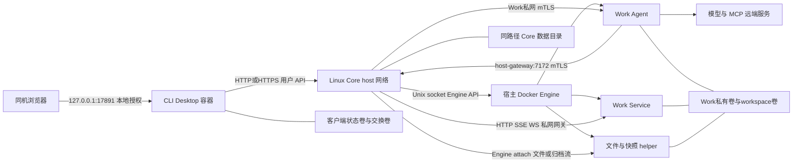

# Piwork Docker 安装与使用

[English](README.md) | **简体中文**

Core 和 CLI 分别启动；Agent、helper、Service 与 Work 存储由 Core 管理。原生 CLI 继续独立交付。

## Terminal Docker Quick Start

<!-- docker-quickstart:start -->

### Core

使用 Linux x86-64 和 Docker Engine 28+。宿主环境中应已有 `PIWORK_ADMIN_ACCOUNT`、`PIWORK_ADMIN_PASSWORD`（至少 12 位）、`PIWORK_MODEL_PROVIDER`、`PIWORK_MODEL`、`PIWORK_API_KEY`。可选 `PIWORK_MODEL_BASE_URL` 使用 Work 可达的 HTTPS 地址；不用时保持未设置。

在宿主终端运行 Core。镜像自带发行默认值，并自动准备 Agent 和 helper：

```sh
docker run --detach --init \
    --name piwork-core-quickstart \
    --network host \
    --restart unless-stopped \
    --stop-timeout 60 \
    --env PIWORK_ADMIN_ACCOUNT \
    --env PIWORK_ADMIN_PASSWORD \
    --env PIWORK_MODEL_PROVIDER \
    --env PIWORK_MODEL \
    --env PIWORK_API_KEY \
    --env PIWORK_MODEL_BASE_URL \
    --mount type=bind,src=/var/run/docker.sock,dst=/var/run/docker.sock \
    --volume /var/lib/piwork/quickstart/core:/var/lib/piwork/quickstart/core \
    docker.io/pphboy/piwork-core:0.0.1-fc409adc1a0b-808d890c6607-dirty
```

Core 也可用 [Core-only docker-compose.yml](docker-compose.yml) 单独部署（Compose 2.24+），CLI 仍使用自己的 Docker 命令。切换 Core 部署方式前先停止原容器，保留同一数据目录。Core 与 CLI 合并的可选方式见 [单机部署示例](../../examples/single-host/README.zh-CN.md)。

### CLI

CLI 独立运行，只需已有且可达的 Core，不需要 Core 初始化变量。下面连接同机 Core；连接其他 Core 时替换 `PIWORK_CORE_URL`。它等待完整就绪后进入终端：

```sh
docker run --rm --init --interactive --tty \
    --add-host host.docker.internal:host-gateway \
    --env PIWORK_CORE_URL=http://host.docker.internal:7171 \
    --mount type=volume,src=piwork-quickstart-client-state,dst=/var/lib/piwork/client \
    docker.io/pphboy/piwork-cli:0.0.1-fc409adc1a0b-808d890c6607-dirty
```

下面的命令在 **CLI 容器内**执行。将 `ACCOUNT` 替换为你的账号；登录时隐藏密码输入。创建 Work 会自动启动它：

```sh
piwork-cli login --account ACCOUNT
piwork-cli work create --name 'My Work' --wait
```

使用创建结果中的实际 `workId` 替换 `WORK_ID`，发送第一条消息：

```sh
piwork-cli chat WORK_ID --message 'Hello, Piwork!'
```

回复直接显示在终端。用 `exit` 离开；同样的 CLI 启动命令会复用凭证，Work 不因 CLI 退出而停止。等待失败或观察中断时，按 [终端操作说明](#terminal-operations) 查询状态或恢复原 Operation/Run，不重复提交。

<!-- docker-quickstart:end -->

## Core Compose Demo

<!-- core-compose-demo:start -->

这是可选的高级 Core-only Demo，使用独立的 `/var/lib/piwork/core`，CLI 仍用同版 Docker 终端。与默认示例共用 7171/7172 端口，切换前先正常停止原 Core。宿主仍使用上面的初始化环境；新空目录由挂载和安全初始化创建，已有目录保留原所有者和权限。

```sh
PIWORK_CORE_IMAGE=docker.io/pphboy/piwork-core:0.0.1-fc409adc1a0b-808d890c6607-dirty \
    docker compose -f compose.core.yaml up --detach --wait --wait-timeout 600 core
```

在同一宿主运行下列 CLI 命令，然后在容器内按 Quick Start 登录这个 Demo 的账号、创建 Work 并聊天。就绪等待在镜像入口内完成：

```sh
docker run --rm --init --interactive --tty \
    --add-host host.docker.internal:host-gateway \
    --env PIWORK_CORE_URL=http://host.docker.internal:7171 \
    --mount type=volume,src=piwork-quickstart-client-state,dst=/var/lib/piwork/client \
    docker.io/pphboy/piwork-cli:0.0.1-fc409adc1a0b-808d890c6607-dirty
```

<!-- core-compose-demo:end -->

## Terminal operations

<!-- terminal-operations:start -->

宿主终端中检查默认 Docker run Core。完整就绪不同于进程健康；修正环境、socket、镜像或端口问题后重试 CLI：

```sh
docker exec piwork-core-quickstart piwork-serve --json status
docker logs --tail 100 piwork-core-quickstart
```

Core 使用单独的 Compose 部署时改用：

```sh
docker compose -f docker-compose.yml exec -T core piwork-serve --json status
docker compose -f docker-compose.yml logs --tail 100 core
```

下面在 CLI 容器内使用原返回值，恢复已经接受的 Operation/Run，不重复创建或发送消息：

```sh
piwork-cli operation show OPERATION_ID
piwork-cli run watch WORK_ID RUN_ID --after SEQUENCE
```

`--wait` 观察预算为 120 秒。聊天的 Ctrl+C 按既有规则请求取消；继续会话使用原 `SESSION_ID`。登录凭证保存在独立卷，`exit` 和重建 CLI 不停止 Work；同样的 CLI 启动命令可以重新进入。合法初始化值变化不覆盖已保存的管理员或模型，修改使用既有 operator 命令。

正常停止默认 Core，并核对退出成功。受管 Work 停止，原 ID、历史、卷和运行意图保留；失败时保留日志，不宣称已确认关闭：

```sh
docker stop --time 60 piwork-core-quickstart
test "$(docker inspect --format '{{.State.ExitCode}}' piwork-core-quickstart)" = 0
```

复用数据重新启动：

```sh
docker start piwork-core-quickstart
```

Compose 的停止/重启使用下面命令。常规操作不使用 `down -v` 或全局 prune。备份包括一致的 Core 目录和匹配的 Work 卷；只备份 SQLite 或镜像不能恢复完整 Work。升级/回退固定发行引用，保留旧 Compose 与清单，并先核对格式兼容。文件交换与自定义 CA 是可选高级步骤，首次聊天不需要交换卷。

```sh
docker compose -f docker-compose.yml stop core
docker compose -f docker-compose.yml up --detach --wait --wait-timeout 600 core
```

Windows Docker Desktop 使用 Linux 容器，终端 CLI 连接可达的 Linux Core。PowerShell 中 `CORE_URL` 替换为实际地址；密码仍在容器内隐藏输入：

```powershell
docker run --rm --init --interactive --tty `
    --env PIWORK_CORE_URL=CORE_URL `
    --mount type=volume,src=piwork-quickstart-client-state,dst=/var/lib/piwork/client `
    docker.io/pphboy/piwork-cli:0.0.1-fc409adc1a0b-808d890c6607-dirty
if ($LASTEXITCODE -ne 0) { throw 'CLI container failed' }
```

远端 Linux 客户端同样替换 Core URL。HTTPS 保持证书验证；模型/MCP 地址须从 Core 的 Work 网络可达，CLI 的宿主别名不能替代它。

<!-- terminal-operations:end -->

## Legacy 0.0.1 installer

<details>
<summary>旧版安装包与可选 Desktop 操作</summary>

以下命令仅用于已校验的 0.0.1 旧包；使用它自己的 release.env 和 YAML，不替换为仓库中的新 Demo。这些步骤不属于新的默认 Quick Start。

<!-- legacy-docker-quickstart:start -->

本例在同一台 Linux 电脑运行，要求本机 rootful Docker Engine 28+ 和 `linux/amd64` 镜像。准备模型提供方、模型 ID 和 API key；模型服务须从 Work 容器可达。完成每一步后再继续；命令失败时先停下，按[终端故障处理](README.zh-CN.md#terminal-operations)解决问题。

**1. 下载并校验安装包。**

在宿主机终端执行，从新的目录开始：

```sh
(
    set -eu
    mkdir piwork-preview-0.0.1 || exit
    cd piwork-preview-0.0.1 || exit
    PIWORK_RELEASE_URL=https://github.com/pphboy/piwork/releases/download/v0.0.1
    curl --fail --location \
        --output piwork-docker-0.0.1.tar.gz \
        "$PIWORK_RELEASE_URL/piwork-docker-0.0.1.tar.gz" || exit
    curl --fail --location \
        --output piwork-docker-0.0.1.tar.gz.sha256 \
        "$PIWORK_RELEASE_URL/piwork-docker-0.0.1.tar.gz.sha256" || exit
    sha256sum --check --strict piwork-docker-0.0.1.tar.gz.sha256 || exit
    tar -xzf piwork-docker-0.0.1.tar.gz || exit
    cd piwork-docker || exit
    sha256sum --check --strict SHA256SUMS || exit
) && cd piwork-preview-0.0.1/piwork-docker
```

**2. 配置并启动 Core。**

在解压后的安装目录创建私有 `core.run.env`。新版安装包提供 run 模板；缺少该模板的已发行 `0.0.1` 安装包使用下面的空白配置分支：

```sh
(
    set -eu
    test ! -e core.run.env
    if [ -f core.run.env.example ]; then
        cp core.run.env.example core.run.env
    else
        cat > core.run.env <<'EOF'
# Docker run only. Enter raw values without surrounding syntax quotes; do not source.
# Administrator password: at least 12 characters. Keep this file private (0600).
PIWORK_ADMIN_ACCOUNT=
PIWORK_ADMIN_PASSWORD=
PIWORK_MODEL_PROVIDER=
PIWORK_MODEL=
PIWORK_API_KEY=
# Optional HTTPS endpoint reachable from Work containers; omit instead of leaving empty.
# PIWORK_MODEL_BASE_URL=https://your-model-endpoint.example/v1
EOF
    fi
    chmod 600 core.run.env
    ${EDITOR:-vi} core.run.env
)
```

填写五个空白值，管理员密码至少 **12 位**。直接填写原始值，不要为了配置语法在值外加引号，不要 source 此文件，也不要混用 Compose 专用的 `core.env` 格式。自定义模型地址时，取消 HTTPS `PIWORK_MODEL_BASE_URL` 示例的注释，填写 Work 容器可达的地址；使用提供方默认地址时保持省略。

在同一个宿主机终端，从已校验的 `release.env` 读取固定镜像引用：

```sh
PIWORK_CORE_IMAGE=$(
    sed -n '/^PIWORK_CORE_IMAGE=.*@sha256:[0-9a-f]\{64\}$/s/^PIWORK_CORE_IMAGE=//p' release.env
)
PIWORK_CLI_IMAGE=$(
    sed -n '/^PIWORK_CLI_IMAGE=.*@sha256:[0-9a-f]\{64\}$/s/^PIWORK_CLI_IMAGE=//p' release.env
)
test -n "$PIWORK_CORE_IMAGE" && test -n "$PIWORK_CLI_IMAGE"
```

启动 Core。Docker 创建数据挂载目录，Core 将新的空安装设为私有；两端挂载必须使用相同绝对路径。Core 监听 `7171`、`7172`，沿用已有认证的 HTTP 与控制接口；远程 HTTPS 部署见安装手册。

```sh
docker run --detach --init \
    --name piwork-core-quickstart \
    --user 0:0 \
    --network host \
    --env-file release.env \
    --env-file core.run.env \
    --env DOCKER_HOST=unix:///var/run/docker.sock \
    --env DOCKER_CONTEXT= \
    --env PIWORK_DATA_DIR=/var/lib/piwork/quickstart/core \
    --env PIWORK_CORE_URL=http://127.0.0.1:7171 \
    --env PIWORK_LISTEN=0.0.0.0:7171 \
    --env PIWORK_AGENT_GRPC_LISTEN=0.0.0.0:7172 \
    --env PIWORK_AGENT_GRPC_ADVERTISE=piwork-core:7172 \
    --mount type=bind,src=/var/run/docker.sock,dst=/var/run/docker.sock \
    --volume /var/lib/piwork/quickstart/core:/var/lib/piwork/quickstart/core \
    --stop-timeout 60 \
    "$PIWORK_CORE_IMAGE" serve --allow-insecure-remote
```

Core 自动准备 Agent 和 helper 镜像。安装数据保存在 `/var/lib/piwork/quickstart/core`，Work 数据由 Core 管理。

**3. 进入 CLI 容器。**

在同一个宿主机终端执行。命令进入交互 shell，状态卷会跨容器保留登录凭证：

```sh
docker run --rm --init -it \
    --add-host host.docker.internal:host-gateway \
    --env PIWORK_CORE_URL=http://host.docker.internal:7171 \
    --mount type=volume,src=piwork-quickstart-client-state,dst=/var/lib/piwork/client \
    --entrypoint /bin/sh \
    "$PIWORK_CLI_IMAGE" -i
```

**4. 登录、创建 Work 并收到回复。**

以下命令都在 **CLI 容器内**执行。先等待 Core 和依赖完整就绪，最多等待十分钟：

```sh
timeout 600 curl \
    --fail --silent --show-error \
    --output /dev/null --max-time 3 \
    --retry 120 --retry-delay 5 --retry-all-errors \
    "${PIWORK_CORE_URL}/readyz?profile=docker-delivery"
```

等待成功后，将 `ACCOUNT` 替换为 `core.run.env` 中配置的账号。登录时隐藏输入密码。创建 Work 会自动启动，`--wait` 等待该操作成功：

```sh
piwork-cli login --account ACCOUNT
piwork-cli work create --name 'My Work' --wait
```

将 `WORK_ID` 替换为创建结果中实际的 `workId`，发送第一条消息：

```sh
piwork-cli chat WORK_ID --message 'Hello, Piwork!'
```

模型回复直接显示在终端。用 `exit` 退出容器，登录卷和 Work 会保留；再次执行相同的 CLI 容器启动命令即可进入。Work 操作或消息流中断时，按[终端操作手册](README.zh-CN.md#terminal-operations)使用原 ID 恢复。

<!-- legacy-docker-quickstart:end -->

## 高级安装与 Desktop

## 1. 平台和发行文件

首发仅支持 linux/amd64：Core 运行于 Linux rootful Docker Engine，CLI 可运行于 Linux 或 Windows Docker Desktop 的 Linux 容器，使用可选 Desktop 时，浏览器与 CLI 容器运行在同一台用户电脑。要求 Engine 28+，仅 Core Demo 或高级 Compose 部署另需 Compose 2.24+；Core 和 CLI 可以分处两台电脑。Windows 不部署 Core，不加载 Linux 网络覆盖文件。

发行包包含 release.env、release-manifest.json、SHA256SUMS、三份 Compose、Compose/客户端 env 示例和本手册。新版候选还包含 core.run.env.example；已发行 0.0.1 包缺少它时使用上方的空白配置分支。release.env 的镜像引用已经固定为实际发行 digest，无需用户查找 Agent/helper。确认发行页的平台和验收结果后按第 6 节操作。

`0.0.1 Preview` 的发行入口为 [GitHub Release](https://github.com/pphboy/piwork/releases/tag/v0.0.1)，镜像位于 `docker.io/pphboy`。发行包名为 `piwork-docker-0.0.1.tar.gz`，校验文件为同名 `.sha256`；第 6 节提供完整安装命令。已取得本地包的用户可以选择本地包入口。安装包不包含离线镜像，后续拉取需要网络及 registry 可读。

## 2. 初始化和后台准备

首次完整 env 只填补缺失管理员/runtime，不创建 Work。已有合法持久值不被重启时 env 覆盖；非法已提供输入仍会拒绝。省略整个管理员或 runtime 初始化组时 Core 保持健康并报告缺项；已提供的同组字段必须完整。

Core 同时执行至多两个准备任务，同一引用的拉取合并，每次镜像/上下文准备最多十分钟。Engine、网络和拉取失败按 1、5、15、30、60 秒退避，之后每次最多等待 60 秒；修复外部故障后自动重试。引用、架构、平台和协议不兼容时为 failed，需纠正配置。helper 仅成功时捕获不可变身份；file/snapshot 未就绪单独降级，保留恢复意图，其余 Work/Service 可继续可用。

现有 status 输出新增 preparation.version=1；components 固定为 docker、agent、packageHelper、defaultContext、fileHelper、snapshotHelper。state 为 unconfigured/pending/preparing/ready/retrying/failed，attempt 为尝试次数，retryAfterSeconds 为剩余重试秒数或 null，code 只给安全失败类型。未配置为 RUNTIME_UNCONFIGURED；Engine 故障为 DOCKER_UNAVAILABLE，镜像缺失/不兼容分别为 IMAGE_UNAVAILABLE/IMAGE_INCOMPATIBLE，上下文失败为 CONTEXT_PREPARATION_FAILED，关闭为 SHUTTING_DOWN。状态不输出 registry 原文、镜像身份或秘密。

/healthz 表示 Core 能响应；默认 /readyz 继续表示基础 Work 可用；/readyz?profile=docker-delivery 只有基础 ready 和六个组件都 ready 时为 200。helper 降级时默认 probe 可以为 200，交付 probe 为 503；基础 ready 时 reason 为 DEPENDENCIES_PREPARING 或 DEPENDENCY_FAILED。探针不调用模型。Engine 健康每两秒检查，单次最多三秒，依赖丢失最多五秒撤销 readiness。

有效 operator config set 已确认保存时成功退出，后台准备结果用 status/probe 查询。已保存的身份与默认模型修改见 6.4；未成功保存仍按原错误返回。默认 brain 只 seed 一次，管理员禁用、移除或改默认值后不会重置；新默认值不替换已有 Work 的捕获身份。

## 3. 网络与 Docker socket

Core 通过挂载的 /var/run/docker.sock 直接调用 Go Engine API，自动管理本安装的运行资源，不需要 Docker CLI。Linux host 网络让 Core 直连 Work 私网 IP；Agent 使用 piwork-core:host-gateway 回连 7172，沿用安装、Work、generation 和角色的 mTLS 校验。Core 数据在容器和宿主必须挂在同一个绝对路径，Agent 的 bind source 才能由宿主 Engine 找到。7171 使用既有用户/operator 认证，示例显式允许远程明文；需要 HTTPS 时接入已有 HTTPS 入口。

终端 CLI 仅持久化登录状态，不启动本机服务或发布端口；exchange 按文件操作需要添加。可选 Desktop 使用独立 bridge 和独立状态/交换卷，不挂载 socket、Core 或 Work 数据。Desktop 容器内监听 0.0.0.0，宿主仅发布 127.0.0.1:17891（可选 proxy 为 17890）。Linux 同机 Core 使用 host.docker.internal:host-gateway，Windows 保留 Docker Desktop 内建别名；Windows 客户端填写其可达的 Linux Core 地址。localhost 在容器中指当前容器，CLI 的宿主别名不会改变 Agent 的模型连接。

## 4. 本机授权与持久数据

Desktop 主启动日志只输出安全 origin，不输出 ticket，也不在容器内启动浏览器。通过同一运行容器、同 UID 的 exec desktop open 获取五分钟单次票据，粘贴到同机浏览器。另一个只共享凭证卷的临时容器没有此实例私有控制通道。重建后必须重新 open；旧浏览器会话和票据失效，Core 持久 token 按原规则保留。

Core 目录权限 0700、秘密文件 0600，保存 SQLite/WAL/SHM、格式标记、operator 凭证、runtime/模型 secret、上下文和各资源意图。Work 的私有 /var/data 与 /var/data/workspace 是两个独立卷；CLI 状态卷保存凭证与用户偏好，exchange 只用于导入导出。卷内容不会由新容器自动重置。不要用交换卷当作 Work 存储或安装备份。

## 5. 数据流




| 流程 | 完整路径与完成条件 |
| --- | --- |
| 首次启动 | env → Core 私有 store/secret → socket 检查/镜像准备/协议检查/默认上下文/恢复 → profile ready；不预建 Work |
| 本机浏览器授权 | 同容器 exec open → 一次性本地 ticket → 宿主浏览器兑换 HttpOnly 会话；未兑换不能借用已保存 Core 凭证 |
| Core 登录 | 浏览器本地会话+CSRF → CLI → Core login → Core 保存 token digest，CLI 私有卷保存用户 token；浏览器不获得 Core token |
| 创建 Work/Run | CLI 用户 API → Core 所有权/幂等检查与 Operation → Engine Agent/卷/私网 → Agent ready → Session/Run；ID 保存在 Core，断开观察不取消任务 |
| 模型与 MCP | Agent 从只读受限运行配置/secret 使用当前 Work 模型及 MCP 出站地址；并非浏览器/CLI 代调用；目标必须从 Work 网络可达 |
| Service | Agent MCP → 7172 mTLS → Core 创建/管理 Service → Desktop 本地应用入口 → Core 用户网关 → Work 私网 Service；应用的 Cookie/Authorization 与平台凭证隔离 |
| 浏览器 Files | 浏览器本地授权 → CLI 转 Core WebDAV/用户 token → 所有权检查 → Engine attach 文件 helper → 仅 workspace 卷 → 原路返回 |
| 浏览器导出/导入 | 已确认 stopped → Core snapshot helper 流归档 → CLI/浏览器下载；上传 → Core 校验/导入新 stopped Work → 明确 start；不自动 apply pending |
| 无 Desktop 文件命令 | 宿主 docker cp → `/exchange` → CLI import/inspect/export → Core；再 cp 回宿主，交换卷本身不构成安装备份 |
| 重建 | 保留 Core store、受管卷、客户端状态卷；Core 核验原安装对象并恢复，CLI 重建后重新 open，不复用旧本地实例授权 |

数据分布如下。Core 目录含 SQLite/WAL、安装身份、operator credential、模型 secret、TLS、上下文/catalog/任务记录；权限仍为根目录 0700/私密文件 0600。Work 有 `/var/data` 私有卷与 `/var/data/workspace` 工作卷，Agent/Service 使用既有 UID 10001 规则。file helper 只看到 workspace，snapshot helper 按原任务授权读取归档所需卷；CLI 看不到这些卷。

`.work` 包括现有两卷、Work 独立配置/上下文、AGENTS、Skill/package、Service 和历史；不包含平台模型 key、用户 token 或安装证书，但用户自己写入文件的秘密仍可能包含。导入产生新 Work 且停止；模型引用/兼容镜像可用性按现有 portable-work 契约校验。快照下载结果保留 24 小时，不支持断点续传，输出路径必须不存在；不要用同名旧文件重试。

现有文件限额保持：单文件 10 GiB、树/目录项 10000、Core/用户/Work helper 并发 16/8/4、Work 写者 1。浏览器/CLI 在宿主交换卷新增文件不影响这些 Work 配额。Engine 的 bind source 在 Engine 宿主解析，因此不能用 `/srv/core:/data` 替代同路径挂载。[Docker bind mount](https://docs.docker.com/engine/storage/bind-mounts/)

外部访问分清三个环境：CLI 的公网请求走其 bridge 默认出站；CLI 访问同机服务用平台对应 host.docker.internal；Agent 的模型/MCP 请求走 Linux Core 宿主的 Work bridge。当前模型 Base URL 不接受 `http://host.docker.internal:...`，不在本变更里放开；使用从 Work 可达的 HTTPS 服务。Windows 本机服务若供远端 Agent 调用，需已有的可达 HTTPS/LAN 服务地址，而非 Windows CLI 的本机别名。


## 6. 完整操作命令

命令按执行机器标注。大写 ID、source 等占位符须从实际查询取得；可选操作各自选择，不按整张命令表一次性执行。

#### 6.1 获取发行包与前置检查

按手中材料选择 Release 下载入口或已有本地包入口。每次使用新的安装目录；不要在已有 `piwork-docker` 目录上解压或覆盖本机 env。已有本地包时直接输入发行页提供的可信预期 SHA256，不需要再次下载。校验文件只有一行，形如 `64位SHA256  原始压缩包文件名`；下载命令把文件统一命名为 `piwork-docker.tar.gz`，因此只提取该行的预期 hash 来比较本地文件。

Linux Bash 下载入口（Core 主机及 Linux 客户端分别执行）：

```bash
(
    set -euo pipefail
    test ! -e piwork-docker
    test ! -e piwork-docker.tar.gz
    test ! -e piwork-docker.tar.gz.sha256
    PIWORK_DOCKER_ARCHIVE_URL=https://github.com/pphboy/piwork/releases/download/v0.0.1/piwork-docker-0.0.1.tar.gz
    PIWORK_DOCKER_CHECKSUM_URL="$PIWORK_DOCKER_ARCHIVE_URL.sha256"
    curl --fail --location --output piwork-docker.tar.gz "$PIWORK_DOCKER_ARCHIVE_URL"
    curl --fail --location --output piwork-docker.tar.gz.sha256 "$PIWORK_DOCKER_CHECKSUM_URL"
    read -r PIWORK_DOCKER_EXPECTED_SHA256 PIWORK_DOCKER_ORIGINAL_NAME < piwork-docker.tar.gz.sha256
    [[ "$PIWORK_DOCKER_EXPECTED_SHA256" =~ ^[0-9a-fA-F]{64}$ ]] || { echo 'SHA256 校验文件格式错误' >&2; exit 1; }
    printf '%s  piwork-docker.tar.gz\n' "$PIWORK_DOCKER_EXPECTED_SHA256" | sha256sum --check -
    tar -xzf piwork-docker.tar.gz
    (cd piwork-docker && sha256sum --check SHA256SUMS)
)
PIWORK_DOCKER_INSTALL_EXIT=$?
if [[ "$PIWORK_DOCKER_INSTALL_EXIT" -eq 0 ]]; then
    cd piwork-docker
else
    (exit "$PIWORK_DOCKER_INSTALL_EXIT")
fi
```

Linux Bash 已取得本地包入口（不下载，路径可以是绝对路径）：

```bash
(
    set -euo pipefail
    test ! -e piwork-docker
    read -r -p '本机已有发行压缩包路径：' PIWORK_DOCKER_ARCHIVE_PATH
    read -r -p '交付者提供的可信 SHA256（64位十六进制）：' PIWORK_DOCKER_EXPECTED_SHA256
    [[ "$PIWORK_DOCKER_EXPECTED_SHA256" =~ ^[0-9a-fA-F]{64}$ ]] || { echo '预期 SHA256 格式错误' >&2; exit 1; }
    PIWORK_DOCKER_ACTUAL_SHA256=$(sha256sum < "$PIWORK_DOCKER_ARCHIVE_PATH")
    [[ "${PIWORK_DOCKER_ACTUAL_SHA256%% *}" == "${PIWORK_DOCKER_EXPECTED_SHA256,,}" ]] || { echo '压缩包 SHA256 不匹配，停止安装' >&2; exit 1; }
    tar -xzf "$PIWORK_DOCKER_ARCHIVE_PATH"
    (cd piwork-docker && sha256sum --check SHA256SUMS)
)
PIWORK_DOCKER_INSTALL_EXIT=$?
if [[ "$PIWORK_DOCKER_INSTALL_EXIT" -eq 0 ]]; then
    cd piwork-docker
else
    (exit "$PIWORK_DOCKER_INSTALL_EXIT")
fi
```

Windows PowerShell 下载入口（在用户电脑执行）：

```powershell
& {
    $ErrorActionPreference = 'Stop'
    if ((Test-Path .\piwork-docker) -or (Test-Path .\piwork-docker.tar.gz) -or (Test-Path .\piwork-docker.tar.gz.sha256)) { throw '请在新的安装目录执行' }
    $PIWORK_DOCKER_ARCHIVE_URL = 'https://github.com/pphboy/piwork/releases/download/v0.0.1/piwork-docker-0.0.1.tar.gz'
    $PIWORK_DOCKER_CHECKSUM_URL = "$PIWORK_DOCKER_ARCHIVE_URL.sha256"
    curl.exe --fail --location --output piwork-docker.tar.gz "$PIWORK_DOCKER_ARCHIVE_URL"
    if ($LASTEXITCODE -ne 0) { throw '压缩包下载失败，停止安装' }
    curl.exe --fail --location --output piwork-docker.tar.gz.sha256 "$PIWORK_DOCKER_CHECKSUM_URL"
    if ($LASTEXITCODE -ne 0) { throw 'SHA256 文件下载失败，停止安装' }
    $PIWORK_DOCKER_CHECKSUM_LINE = (Get-Content -LiteralPath .\piwork-docker.tar.gz.sha256 -Raw).Trim()
    if ($PIWORK_DOCKER_CHECKSUM_LINE -notmatch '\A([0-9a-fA-F]{64})\s+[^\r\n]+\z') { throw 'SHA256 校验文件格式错误' }
    $PIWORK_DOCKER_EXPECTED_SHA256 = $Matches[1]
    if ((Get-FileHash -LiteralPath .\piwork-docker.tar.gz -Algorithm SHA256).Hash -ine $PIWORK_DOCKER_EXPECTED_SHA256) { throw '压缩包 SHA256 不匹配，停止安装' }
    tar -xzf piwork-docker.tar.gz
    if ($LASTEXITCODE -ne 0) { throw '解压失败，停止安装' }
    Set-Location piwork-docker
    Get-Content -LiteralPath .\SHA256SUMS | ForEach-Object {
        if ($_ -notmatch '\A([0-9a-fA-F]{64})\s+\*?(.+)\z') { throw '包内校验清单格式错误' }
        $PIWORK_DOCKER_FILE_SHA256 = $Matches[1]
        $PIWORK_DOCKER_FILE_NAME = $Matches[2]
        if ((Get-FileHash -LiteralPath $PIWORK_DOCKER_FILE_NAME -Algorithm SHA256).Hash -ine $PIWORK_DOCKER_FILE_SHA256) { throw "文件校验失败：$PIWORK_DOCKER_FILE_NAME" }
    }
}
```

Windows PowerShell 已取得本地包入口（不下载）：

```powershell
& {
    $ErrorActionPreference = 'Stop'
    if (Test-Path .\piwork-docker) { throw '请在新的安装目录执行' }
    $PIWORK_DOCKER_ARCHIVE_PATH = Read-Host '本机已有发行压缩包路径'
    $PIWORK_DOCKER_EXPECTED_SHA256 = Read-Host '交付者提供的可信 SHA256（64位十六进制）'
    if ($PIWORK_DOCKER_EXPECTED_SHA256 -notmatch '\A[0-9a-fA-F]{64}\z') { throw '预期 SHA256 格式错误' }
    if ((Get-FileHash -LiteralPath $PIWORK_DOCKER_ARCHIVE_PATH -Algorithm SHA256).Hash -ine $PIWORK_DOCKER_EXPECTED_SHA256) { throw '压缩包 SHA256 不匹配，停止安装' }
    tar -xzf "$PIWORK_DOCKER_ARCHIVE_PATH"
    if ($LASTEXITCODE -ne 0) { throw '解压失败，停止安装' }
    Set-Location piwork-docker
    Get-Content -LiteralPath .\SHA256SUMS | ForEach-Object {
        if ($_ -notmatch '\A([0-9a-fA-F]{64})\s+\*?(.+)\z') { throw '包内校验清单格式错误' }
        $PIWORK_DOCKER_FILE_SHA256 = $Matches[1]
        $PIWORK_DOCKER_FILE_NAME = $Matches[2]
        if ((Get-FileHash -LiteralPath $PIWORK_DOCKER_FILE_NAME -Algorithm SHA256).Hash -ine $PIWORK_DOCKER_FILE_SHA256) { throw "文件校验失败：$PIWORK_DOCKER_FILE_NAME" }
    }
}
```

校验或下载失败时不要执行后续步骤；修正来源或重新取得正确文件后，在新的目录重试。内部 SHA256SUMS 检查包内文件一致性，不能替代解压前的压缩包校验。上述入口成功后已经进入 `piwork-docker`；接着完成以下共同前置检查。

Linux Bash：

```bash
(
    set -euo pipefail
    docker version
    docker compose version
    docker info --format '{{.OSType}}/{{.Architecture}}'
)
```

Windows PowerShell：

```powershell
$ErrorActionPreference = 'Stop'
docker version
if ($LASTEXITCODE -ne 0) { throw 'Docker 不可用' }
docker compose version
if ($LASTEXITCODE -ne 0) { throw 'Compose 不可用' }
docker info --format '{{.OSType}}/{{.Architecture}}'
if ($LASTEXITCODE -ne 0) { throw 'Docker 信息查询失败' }
```

Docker 输出必须为 Linux/amd64（Architecture 可能显示 x86_64），Engine 必须为 28+、Compose 为 2.24+；Windows 先在 Docker Desktop 切换 Linux 容器。不符合时先修正环境，再继续。Core 主机执行 6.2，用户电脑执行 6.3；只有 Linux 同机部署才在同一电脑执行两节。不运行 `docker compose config` 输出含秘密的 Core 完整配置到日志。

#### 6.2 Linux Core 首次安装

```bash
cp core.env.example core.env
chmod 600 core.env
${EDITOR:-vi} core.env
sudo install -d -m 0700 -o 0 -g 0 /var/lib/piwork/core
sudo install -d -m 0700 -o 0 -g 0 /var/lib/piwork/core-exchange
test -S /var/run/docker.sock
docker compose --env-file release.env --env-file core.env -f compose.core.yaml pull core
docker compose --env-file release.env --env-file core.env -f compose.core.yaml up -d --wait --wait-timeout 600 core
docker compose --env-file release.env --env-file core.env -f compose.core.yaml exec -T core piwork-serve --json status
docker compose --env-file release.env --env-file core.env -f compose.core.yaml exec -T core curl --fail --silent --show-error 'http://127.0.0.1:7171/readyz?profile=docker-delivery'
docker compose --env-file release.env --env-file core.env -f compose.core.yaml logs --tail 100 core
```

填写 Core env 的真实初始化值和监听字段；若自定义数据目录，env 和两个 bind 端路径相同，先按相同绝对路径创建。运行前确认 7171/7172 可用，允许 Work bridge 回连 7172；不对整个磁盘作权限重置。已有非 root 安装必须使用匹配 UID 的覆盖文件和相应 socket group，不能直接套用新安装的目录创建命令。

等待超时后根据 status 的准备组件与日志修正网络/镜像/配置，再重复同一 `up -d --wait --wait-timeout 600 core`。Core 自动 pull/retry，不添加手动 Agent/helper pull 步骤。若初始化值格式错误，先修正 core.env 再 `up --force-recreate`；已保存值的修改用 6.4。

#### 6.3 启动 CLI Desktop、重新打开和注销

Linux 用户电脑：

```bash
cp client.env.example client.env
chmod 600 client.env
${EDITOR:-vi} client.env
docker compose --env-file release.env --env-file client.env -f compose.cli.yaml -f compose.cli.linux.yaml pull cli
docker compose --env-file release.env --env-file client.env -f compose.cli.yaml -f compose.cli.linux.yaml up -d --wait --wait-timeout 60 cli
docker compose --env-file release.env --env-file client.env -f compose.cli.yaml exec -T cli piwork-cli desktop open --no-open
```

Windows 用户电脑：

```powershell
Copy-Item .\client.env.example .\client.env
$PIWORK_CORE_URL = Read-Host 'Reachable Linux Core origin'
[System.IO.File]::WriteAllText((Join-Path (Get-Location) 'client.env'), "PIWORK_CORE_URL=$PIWORK_CORE_URL`n", [System.Text.UTF8Encoding]::new($false))
docker compose --env-file release.env --env-file client.env -f compose.cli.yaml pull cli
docker compose --env-file release.env --env-file client.env -f compose.cli.yaml up -d --wait --wait-timeout 60 cli
docker compose --env-file release.env --env-file client.env -f compose.cli.yaml exec -T cli piwork-cli desktop open --no-open
```

Windows client.env 必须填可达的 Linux Core 地址。将 open 输出的完整链接粘贴到**同机宿主浏览器**，兑换本地授权后输入 Core 账号和密码；在 Desktop 登录页可以直接输入 Core URL、账号和密码；无有效 Core 登录时可使用本地 Inspect，不能访问 Work。链接过期执行同一 open；容器日志只用于诊断，不用于寻找授权链接。

以下命令 Bash/PowerShell 都可直接执行；它们使用同一 Compose project，exec/cp/ps 不重建已有容器，因此 Linux 不需要在每次 exec 再加网络覆盖文件：

```text
docker compose --env-file release.env --env-file client.env -f compose.cli.yaml ps
docker compose --env-file release.env --env-file client.env -f compose.cli.yaml logs --tail 100 cli
docker compose --env-file release.env --env-file client.env -f compose.cli.yaml exec -T cli piwork-cli desktop open --no-open
docker compose --env-file release.env --env-file client.env -f compose.cli.yaml exec -T cli piwork-cli desktop logout
docker compose --env-file release.env --env-file client.env -f compose.cli.yaml restart cli
docker compose --env-file release.env --env-file client.env -f compose.cli.yaml exec -T cli piwork-cli desktop open --no-open
docker compose --env-file release.env --env-file client.env -f compose.cli.yaml stop cli
docker compose --env-file release.env --env-file client.env -f compose.cli.yaml down
```

restart 用于原环境下的新进程；改变 client.env/release.env 后，Linux 重复带 `compose.cli.linux.yaml` 的 `up -d --force-recreate --wait --wait-timeout 60 cli`，Windows 用基本配置的相同 up 命令。完整重建命令见 6.7。新进程都执行 open。`desktop logout` 和普通 `logout` 作用不同：前者清理指定运行 Desktop 的内存身份/派生访问，后者只操作本次业务客户端保存的会话。

#### 6.4 Core operator 完整命令

在 **Linux Core 发行包目录**执行，全部调用目标容器内已有 `piwork-serve` 和 operator credential。密码/key 默认 TTY 提示不回显；非交互可用各命令已有 `--password-stdin`/`--api-key-stdin` 与 `exec -T`，不把秘密写进参数。首管理员 bootstrap 仅适用于初始化未提供管理员的空安装；常规首次启动已由 env 完成。

下面清单中的 `USER_ID` 来自 users list，`OPERATION_ID` 来自 mutation 返回，`AGENT_IMAGE_REF` 为发行镜像或管理员选定的兼容 Docker ref，`PROVIDER`/`MODEL` 为实际模型值。Skill 目录和包文件先按紧随清单的 cp 步骤取得；同一组 clear/set、enable/disable/remove 是可选操作。

```bash
AGENT_IMAGE_REF=$(sed -n 's/^PIWORK_AGENT_IMAGE=//p' release.env)
read -r -p '实际模型 provider：' PROVIDER
read -r -p '实际模型 ID：' MODEL
```

```text
docker compose --env-file release.env --env-file core.env -f compose.core.yaml exec core piwork-serve --help
docker compose --env-file release.env --env-file core.env -f compose.core.yaml exec core piwork-serve --version
docker compose --env-file release.env --env-file core.env -f compose.core.yaml exec core piwork-serve --json status
docker compose --env-file release.env --env-file core.env -f compose.core.yaml exec core piwork-serve admin bootstrap --account admin
docker compose --env-file release.env --env-file core.env -f compose.core.yaml exec core piwork-serve admin users list
docker compose --env-file release.env --env-file core.env -f compose.core.yaml exec core piwork-serve admin users create --account demo-user --role user
docker compose --env-file release.env --env-file core.env -f compose.core.yaml exec core piwork-serve admin users create --account second-admin --role admin
docker compose --env-file release.env --env-file core.env -f compose.core.yaml exec core piwork-serve admin users enable USER_ID
docker compose --env-file release.env --env-file core.env -f compose.core.yaml exec core piwork-serve admin users disable USER_ID
docker compose --env-file release.env --env-file core.env -f compose.core.yaml exec core piwork-serve admin users reset-credential USER_ID
docker compose --env-file release.env --env-file core.env -f compose.core.yaml exec core piwork-serve config show
docker compose --env-file release.env --env-file core.env -f compose.core.yaml exec core piwork-serve config set --agent-image "$AGENT_IMAGE_REF" --model-provider "$PROVIDER" --model "$MODEL"
docker compose --env-file release.env --env-file core.env -f compose.core.yaml exec core piwork-serve config set --agent-image "$AGENT_IMAGE_REF" --model-provider "$PROVIDER" --model "$MODEL" --model-base-url https://models.example.com/v1 --api-key-file /var/lib/piwork/core-exchange/model-api-key
docker compose --env-file release.env --env-file core.env -f compose.core.yaml exec core piwork-serve config default-work show
docker compose --env-file release.env --env-file core.env -f compose.core.yaml exec core piwork-serve config default-work set --base-image "$AGENT_IMAGE_REF" --skill my-skill --package my-package --agents-md-file /var/lib/piwork/core-exchange/AGENTS.md
docker compose --env-file release.env --env-file core.env -f compose.core.yaml exec core piwork-serve config default-work set --no-skills --no-packages
docker compose --env-file release.env --env-file core.env -f compose.core.yaml exec core piwork-serve skills list
docker compose --env-file release.env --env-file core.env -f compose.core.yaml exec core piwork-serve skills show my-skill
docker compose --env-file release.env --env-file core.env -f compose.core.yaml exec core piwork-serve skills add --path /var/lib/piwork/core-exchange/my-skill
docker compose --env-file release.env --env-file core.env -f compose.core.yaml exec core piwork-serve skills update my-skill --path /var/lib/piwork/core-exchange/my-skill
docker compose --env-file release.env --env-file core.env -f compose.core.yaml exec core piwork-serve skills enable my-skill
docker compose --env-file release.env --env-file core.env -f compose.core.yaml exec core piwork-serve skills disable my-skill
docker compose --env-file release.env --env-file core.env -f compose.core.yaml exec core piwork-serve skills remove my-skill
docker compose --env-file release.env --env-file core.env -f compose.core.yaml exec core piwork-serve packages list
docker compose --env-file release.env --env-file core.env -f compose.core.yaml exec core piwork-serve packages show my-package
docker compose --env-file release.env --env-file core.env -f compose.core.yaml exec core piwork-serve packages install /var/lib/piwork/core-exchange/my-package.zip --default --wait --verbose
docker compose --env-file release.env --env-file core.env -f compose.core.yaml exec core piwork-serve packages install npm:PACKAGE_SPEC --wait
docker compose --env-file release.env --env-file core.env -f compose.core.yaml exec core piwork-serve packages install git+https://GIT_REPOSITORY#REF --wait
docker compose --env-file release.env --env-file core.env -f compose.core.yaml exec core piwork-serve packages update my-package --source /var/lib/piwork/core-exchange/my-package-v2.zip --wait --verbose
docker compose --env-file release.env --env-file core.env -f compose.core.yaml exec core piwork-serve packages enable my-package
docker compose --env-file release.env --env-file core.env -f compose.core.yaml exec core piwork-serve packages disable my-package
docker compose --env-file release.env --env-file core.env -f compose.core.yaml exec core piwork-serve packages remove my-package
docker compose --env-file release.env --env-file core.env -f compose.core.yaml exec core piwork-serve operation show OPERATION_ID
```

输入文件复制和权限准备：

```bash
docker compose --env-file release.env --env-file core.env -f compose.core.yaml cp ./my-skill core:/var/lib/piwork/core-exchange/my-skill
docker compose --env-file release.env --env-file core.env -f compose.core.yaml cp ./my-package.zip core:/var/lib/piwork/core-exchange/my-package.zip
docker compose --env-file release.env --env-file core.env -f compose.core.yaml cp ./my-package-v2.zip core:/var/lib/piwork/core-exchange/my-package-v2.zip
docker compose --env-file release.env --env-file core.env -f compose.core.yaml cp ./AGENTS.md core:/var/lib/piwork/core-exchange/AGENTS.md
docker compose --env-file release.env --env-file core.env -f compose.core.yaml cp ./model-api-key core:/var/lib/piwork/core-exchange/model-api-key
docker compose --env-file release.env --env-file core.env -f compose.core.yaml exec -T core chmod 600 /var/lib/piwork/core-exchange/model-api-key
docker compose --env-file release.env --env-file core.env -f compose.core.yaml exec -T core rm /var/lib/piwork/core-exchange/model-api-key
```

最后一行仅在完成使用后执行；secret 输入优先使用 TTY，以免产生临时 secret 文件。Skill 需为实际有效目录，package 的名字由元数据决定，查询 list 后替换 my-package；npm/git 示例需替换真实可安装 source。Core config/default-work 变更只影响后续新 Work。operator 的 base-image 是 Docker ref，而用户 work create 的 base-image 是 Core 返回的 catalog ID，两者不能互换。

#### 6.5 无 Desktop CLI Docker：完整业务命令

此节列出完整业务操作；首次终端试用与恢复验证见独立的 Quick Start 验收记录，完整业务端到端不属于该检查范围。使用同一 CLI 镜像/状态卷，每条命令结束即移除临时容器；无需启动 Desktop，CLI 镜像没有 Desktop HEALTHCHECK。镜像预建状态目录为 0700，并创建 /exchange，确保命名卷初次挂载与私有文件检查相容。

首次创建命名卷与独立命令网络；如果 Desktop 已创建状态/交换卷，volume create 可重复，网络已有时先 inspect 并跳过 create。

```text
docker volume create piwork-client-state
docker volume create piwork-client-exchange
docker network create piwork-cli-commands
docker network inspect piwork-cli-commands
```

Linux Bash 取得实际镜像，输入可从客户端容器直接访问的 Core LAN/HTTPS 地址：

```bash
CLI_IMAGE=$(sed -n 's/^PIWORK_CLI_IMAGE=//p' release.env)
read -r -p '实际可达的 Core HTTP/HTTPS origin：' CORE_URL
```

Windows PowerShell：

```powershell
$CLI_IMAGE = (Get-Content .\release.env | Where-Object { $_.StartsWith('PIWORK_CLI_IMAGE=') } | Select-Object -First 1).Substring('PIWORK_CLI_IMAGE='.Length)
$CORE_URL = Read-Host '实际可达的 Linux Core HTTP/HTTPS origin'
```

这两个变量都是现有 Docker 参数值，不是新增命令概念。下列各行可在两种 shell 使用；显式 env 覆盖 client.env 的 Core URL。Linux 同机 Core 若没有 LAN 名称，可将 CORE_URL 设为实际 Engine host-gateway 地址：

```bash
CORE_GATEWAY=$(docker network inspect bridge --format '{{(index .IPAM.Config 0).Gateway}}')
CORE_URL="http://${CORE_GATEWAY}:7171"
```

此替代仅适用于上述 Linux Core host 网络和默认 Engine host-gateway；Windows 仍使用远端 Linux Core。网络选择改变不修改 Agent 的模型/MCP 配置。普通业务命令也可在已运行 Desktop 容器用同一原生命令执行，但登录账号/Core 变更后应按 6.3 重启 Desktop。

ID 取得规则：work create/list/show 提供 WORK_ID 和 OPERATION_ID；session create/list 提供 SESSION_ID；chat/run 结果提供 RUN_ID；work service list 提供 SERVICE_ID；export 返回快照及 Operation 信息。用原 ID 查询，不能为了检查接受结果重新提交 mutation。IMAGE_CATALOG_ID 从默认/Work 配置的 configuration.agentImage.catalogId 取得，不填写镜像 tag。

```text
docker run --rm --init -it --network piwork-cli-commands --env-file client.env --env PIWORK_CORE_URL="$CORE_URL" --mount type=volume,src=piwork-client-state,dst=/var/lib/piwork/client --mount type=volume,src=piwork-client-exchange,dst=/exchange "$CLI_IMAGE" help
docker run --rm --init -it --network piwork-cli-commands --env-file client.env --env PIWORK_CORE_URL="$CORE_URL" --mount type=volume,src=piwork-client-state,dst=/var/lib/piwork/client --mount type=volume,src=piwork-client-exchange,dst=/exchange "$CLI_IMAGE" --version
docker run --rm --init -it --network piwork-cli-commands --env-file client.env --env PIWORK_CORE_URL="$CORE_URL" --mount type=volume,src=piwork-client-state,dst=/var/lib/piwork/client --mount type=volume,src=piwork-client-exchange,dst=/exchange "$CLI_IMAGE" --json status
docker run --rm --init -it --network piwork-cli-commands --env-file client.env --env PIWORK_CORE_URL="$CORE_URL" --mount type=volume,src=piwork-client-state,dst=/var/lib/piwork/client --mount type=volume,src=piwork-client-exchange,dst=/exchange "$CLI_IMAGE" login --account demo-user
docker run --rm --init -it --network piwork-cli-commands --env-file client.env --env PIWORK_CORE_URL="$CORE_URL" --mount type=volume,src=piwork-client-state,dst=/var/lib/piwork/client --mount type=volume,src=piwork-client-exchange,dst=/exchange "$CLI_IMAGE" whoami
docker run --rm --init -it --network piwork-cli-commands --env-file client.env --env PIWORK_CORE_URL="$CORE_URL" --mount type=volume,src=piwork-client-state,dst=/var/lib/piwork/client --mount type=volume,src=piwork-client-exchange,dst=/exchange "$CLI_IMAGE" logout
docker run --rm --init -it --network piwork-cli-commands --env-file client.env --env PIWORK_CORE_URL="$CORE_URL" --mount type=volume,src=piwork-client-state,dst=/var/lib/piwork/client --mount type=volume,src=piwork-client-exchange,dst=/exchange "$CLI_IMAGE" skills list
docker run --rm --init -it --network piwork-cli-commands --env-file client.env --env PIWORK_CORE_URL="$CORE_URL" --mount type=volume,src=piwork-client-state,dst=/var/lib/piwork/client --mount type=volume,src=piwork-client-exchange,dst=/exchange "$CLI_IMAGE" skills show my-skill
docker run --rm --init -it --network piwork-cli-commands --env-file client.env --env PIWORK_CORE_URL="$CORE_URL" --mount type=volume,src=piwork-client-state,dst=/var/lib/piwork/client --mount type=volume,src=piwork-client-exchange,dst=/exchange "$CLI_IMAGE" packages list
docker run --rm --init -it --network piwork-cli-commands --env-file client.env --env PIWORK_CORE_URL="$CORE_URL" --mount type=volume,src=piwork-client-state,dst=/var/lib/piwork/client --mount type=volume,src=piwork-client-exchange,dst=/exchange "$CLI_IMAGE" packages show my-package
docker run --rm --init -it --network piwork-cli-commands --env-file client.env --env PIWORK_CORE_URL="$CORE_URL" --mount type=volume,src=piwork-client-state,dst=/var/lib/piwork/client --mount type=volume,src=piwork-client-exchange,dst=/exchange "$CLI_IMAGE" work create --name docker-demo --wait --idempotency-key docker-demo-create-1
docker run --rm --init -it --network piwork-cli-commands --env-file client.env --env PIWORK_CORE_URL="$CORE_URL" --mount type=volume,src=piwork-client-state,dst=/var/lib/piwork/client --mount type=volume,src=piwork-client-exchange,dst=/exchange "$CLI_IMAGE" work create --name docker-configured --base-image IMAGE_CATALOG_ID --skill my-skill --package my-package --agents-md-file /exchange/AGENTS.md --wait --idempotency-key docker-demo-create-2
docker run --rm --init -it --network piwork-cli-commands --env-file client.env --env PIWORK_CORE_URL="$CORE_URL" --mount type=volume,src=piwork-client-state,dst=/var/lib/piwork/client --mount type=volume,src=piwork-client-exchange,dst=/exchange "$CLI_IMAGE" work create --name docker-empty-context --no-skills --no-packages --config /exchange/work-config.json --wait
docker run --rm --init -it --network piwork-cli-commands --env-file client.env --env PIWORK_CORE_URL="$CORE_URL" --mount type=volume,src=piwork-client-state,dst=/var/lib/piwork/client --mount type=volume,src=piwork-client-exchange,dst=/exchange "$CLI_IMAGE" work list
docker run --rm --init -it --network piwork-cli-commands --env-file client.env --env PIWORK_CORE_URL="$CORE_URL" --mount type=volume,src=piwork-client-state,dst=/var/lib/piwork/client --mount type=volume,src=piwork-client-exchange,dst=/exchange "$CLI_IMAGE" work show WORK_ID
docker run --rm --init -it --network piwork-cli-commands --env-file client.env --env PIWORK_CORE_URL="$CORE_URL" --mount type=volume,src=piwork-client-state,dst=/var/lib/piwork/client --mount type=volume,src=piwork-client-exchange,dst=/exchange "$CLI_IMAGE" work start WORK_ID --wait --idempotency-key demo-start-1
docker run --rm --init -it --network piwork-cli-commands --env-file client.env --env PIWORK_CORE_URL="$CORE_URL" --mount type=volume,src=piwork-client-state,dst=/var/lib/piwork/client --mount type=volume,src=piwork-client-exchange,dst=/exchange "$CLI_IMAGE" work stop WORK_ID --wait --idempotency-key demo-stop-1
docker run --rm --init -it --network piwork-cli-commands --env-file client.env --env PIWORK_CORE_URL="$CORE_URL" --mount type=volume,src=piwork-client-state,dst=/var/lib/piwork/client --mount type=volume,src=piwork-client-exchange,dst=/exchange "$CLI_IMAGE" work retry WORK_ID --wait --idempotency-key demo-retry-1
docker run --rm --init -it --network piwork-cli-commands --env-file client.env --env PIWORK_CORE_URL="$CORE_URL" --mount type=volume,src=piwork-client-state,dst=/var/lib/piwork/client --mount type=volume,src=piwork-client-exchange,dst=/exchange "$CLI_IMAGE" work delete WORK_ID --wait --idempotency-key demo-delete-1
docker run --rm --init -it --network piwork-cli-commands --env-file client.env --env PIWORK_CORE_URL="$CORE_URL" --mount type=volume,src=piwork-client-state,dst=/var/lib/piwork/client --mount type=volume,src=piwork-client-exchange,dst=/exchange "$CLI_IMAGE" operation show OPERATION_ID
docker run --rm --init -it --network piwork-cli-commands --env-file client.env --env PIWORK_CORE_URL="$CORE_URL" --mount type=volume,src=piwork-client-state,dst=/var/lib/piwork/client --mount type=volume,src=piwork-client-exchange,dst=/exchange "$CLI_IMAGE" work config show WORK_ID
docker run --rm --init -it --network piwork-cli-commands --env-file client.env --env PIWORK_CORE_URL="$CORE_URL" --mount type=volume,src=piwork-client-state,dst=/var/lib/piwork/client --mount type=volume,src=piwork-client-exchange,dst=/exchange "$CLI_IMAGE" work config set WORK_ID --config /exchange/work-config.json
docker run --rm --init -it --network piwork-cli-commands --env-file client.env --env PIWORK_CORE_URL="$CORE_URL" --mount type=volume,src=piwork-client-state,dst=/var/lib/piwork/client --mount type=volume,src=piwork-client-exchange,dst=/exchange "$CLI_IMAGE" work config set WORK_ID --config /exchange/work-config.json --no-packages
docker run --rm --init -it --network piwork-cli-commands --env-file client.env --env PIWORK_CORE_URL="$CORE_URL" --mount type=volume,src=piwork-client-state,dst=/var/lib/piwork/client --mount type=volume,src=piwork-client-exchange,dst=/exchange "$CLI_IMAGE" work config apply WORK_ID --wait --idempotency-key demo-apply-1
docker run --rm --init -it --network piwork-cli-commands --env-file client.env --env PIWORK_CORE_URL="$CORE_URL" --mount type=volume,src=piwork-client-state,dst=/var/lib/piwork/client --mount type=volume,src=piwork-client-exchange,dst=/exchange "$CLI_IMAGE" work config skills list WORK_ID
docker run --rm --init -it --network piwork-cli-commands --env-file client.env --env PIWORK_CORE_URL="$CORE_URL" --mount type=volume,src=piwork-client-state,dst=/var/lib/piwork/client --mount type=volume,src=piwork-client-exchange,dst=/exchange "$CLI_IMAGE" work config skills set WORK_ID --skill my-skill
docker run --rm --init -it --network piwork-cli-commands --env-file client.env --env PIWORK_CORE_URL="$CORE_URL" --mount type=volume,src=piwork-client-state,dst=/var/lib/piwork/client --mount type=volume,src=piwork-client-exchange,dst=/exchange "$CLI_IMAGE" work config skills set WORK_ID --no-skills
docker run --rm --init -it --network piwork-cli-commands --env-file client.env --env PIWORK_CORE_URL="$CORE_URL" --mount type=volume,src=piwork-client-state,dst=/var/lib/piwork/client --mount type=volume,src=piwork-client-exchange,dst=/exchange "$CLI_IMAGE" work config packages list WORK_ID
docker run --rm --init -it --network piwork-cli-commands --env-file client.env --env PIWORK_CORE_URL="$CORE_URL" --mount type=volume,src=piwork-client-state,dst=/var/lib/piwork/client --mount type=volume,src=piwork-client-exchange,dst=/exchange "$CLI_IMAGE" work config packages set WORK_ID --package my-package
docker run --rm --init -it --network piwork-cli-commands --env-file client.env --env PIWORK_CORE_URL="$CORE_URL" --mount type=volume,src=piwork-client-state,dst=/var/lib/piwork/client --mount type=volume,src=piwork-client-exchange,dst=/exchange "$CLI_IMAGE" work config packages set WORK_ID --no-packages
docker run --rm --init -it --network piwork-cli-commands --env-file client.env --env PIWORK_CORE_URL="$CORE_URL" --mount type=volume,src=piwork-client-state,dst=/var/lib/piwork/client --mount type=volume,src=piwork-client-exchange,dst=/exchange "$CLI_IMAGE" work config agents show WORK_ID
docker run --rm --init -it --network piwork-cli-commands --env-file client.env --env PIWORK_CORE_URL="$CORE_URL" --mount type=volume,src=piwork-client-state,dst=/var/lib/piwork/client --mount type=volume,src=piwork-client-exchange,dst=/exchange "$CLI_IMAGE" work config agents set WORK_ID --file /exchange/AGENTS.md
docker run --rm --init -it --network piwork-cli-commands --env-file client.env --env PIWORK_CORE_URL="$CORE_URL" --mount type=volume,src=piwork-client-state,dst=/var/lib/piwork/client --mount type=volume,src=piwork-client-exchange,dst=/exchange "$CLI_IMAGE" work packages list WORK_ID
docker run --rm --init -it --network piwork-cli-commands --env-file client.env --env PIWORK_CORE_URL="$CORE_URL" --mount type=volume,src=piwork-client-state,dst=/var/lib/piwork/client --mount type=volume,src=piwork-client-exchange,dst=/exchange "$CLI_IMAGE" work packages show WORK_ID my-package
docker run --rm --init -it --network piwork-cli-commands --env-file client.env --env PIWORK_CORE_URL="$CORE_URL" --mount type=volume,src=piwork-client-state,dst=/var/lib/piwork/client --mount type=volume,src=piwork-client-exchange,dst=/exchange "$CLI_IMAGE" work packages install WORK_ID /exchange/my-package.zip --wait --verbose
docker run --rm --init -it --network piwork-cli-commands --env-file client.env --env PIWORK_CORE_URL="$CORE_URL" --mount type=volume,src=piwork-client-state,dst=/var/lib/piwork/client --mount type=volume,src=piwork-client-exchange,dst=/exchange "$CLI_IMAGE" work packages install WORK_ID npm:PACKAGE_SPEC --wait
docker run --rm --init -it --network piwork-cli-commands --env-file client.env --env PIWORK_CORE_URL="$CORE_URL" --mount type=volume,src=piwork-client-state,dst=/var/lib/piwork/client --mount type=volume,src=piwork-client-exchange,dst=/exchange "$CLI_IMAGE" work packages install WORK_ID git+https://GIT_REPOSITORY#REF --wait
docker run --rm --init -it --network piwork-cli-commands --env-file client.env --env PIWORK_CORE_URL="$CORE_URL" --mount type=volume,src=piwork-client-state,dst=/var/lib/piwork/client --mount type=volume,src=piwork-client-exchange,dst=/exchange "$CLI_IMAGE" work packages install WORK_ID --from-core my-package --wait --verbose
docker run --rm --init -it --network piwork-cli-commands --env-file client.env --env PIWORK_CORE_URL="$CORE_URL" --mount type=volume,src=piwork-client-state,dst=/var/lib/piwork/client --mount type=volume,src=piwork-client-exchange,dst=/exchange "$CLI_IMAGE" work packages update WORK_ID my-package --source /exchange/my-package-v2.zip --wait --verbose
docker run --rm --init -it --network piwork-cli-commands --env-file client.env --env PIWORK_CORE_URL="$CORE_URL" --mount type=volume,src=piwork-client-state,dst=/var/lib/piwork/client --mount type=volume,src=piwork-client-exchange,dst=/exchange "$CLI_IMAGE" work packages update WORK_ID my-package --from-core --wait --verbose
docker run --rm --init -it --network piwork-cli-commands --env-file client.env --env PIWORK_CORE_URL="$CORE_URL" --mount type=volume,src=piwork-client-state,dst=/var/lib/piwork/client --mount type=volume,src=piwork-client-exchange,dst=/exchange "$CLI_IMAGE" work packages enable WORK_ID my-package
docker run --rm --init -it --network piwork-cli-commands --env-file client.env --env PIWORK_CORE_URL="$CORE_URL" --mount type=volume,src=piwork-client-state,dst=/var/lib/piwork/client --mount type=volume,src=piwork-client-exchange,dst=/exchange "$CLI_IMAGE" work packages disable WORK_ID my-package
docker run --rm --init -it --network piwork-cli-commands --env-file client.env --env PIWORK_CORE_URL="$CORE_URL" --mount type=volume,src=piwork-client-state,dst=/var/lib/piwork/client --mount type=volume,src=piwork-client-exchange,dst=/exchange "$CLI_IMAGE" work packages remove WORK_ID my-package
docker run --rm --init -it --network piwork-cli-commands --env-file client.env --env PIWORK_CORE_URL="$CORE_URL" --mount type=volume,src=piwork-client-state,dst=/var/lib/piwork/client --mount type=volume,src=piwork-client-exchange,dst=/exchange "$CLI_IMAGE" session create WORK_ID
docker run --rm --init -it --network piwork-cli-commands --env-file client.env --env PIWORK_CORE_URL="$CORE_URL" --mount type=volume,src=piwork-client-state,dst=/var/lib/piwork/client --mount type=volume,src=piwork-client-exchange,dst=/exchange "$CLI_IMAGE" session list WORK_ID
docker run --rm --init -it --network piwork-cli-commands --env-file client.env --env PIWORK_CORE_URL="$CORE_URL" --mount type=volume,src=piwork-client-state,dst=/var/lib/piwork/client --mount type=volume,src=piwork-client-exchange,dst=/exchange "$CLI_IMAGE" session show WORK_ID SESSION_ID
docker run --rm --init -it --network piwork-cli-commands --env-file client.env --env PIWORK_CORE_URL="$CORE_URL" --mount type=volume,src=piwork-client-state,dst=/var/lib/piwork/client --mount type=volume,src=piwork-client-exchange,dst=/exchange "$CLI_IMAGE" chat WORK_ID --session SESSION_ID --message "请说明当前 workspace 内容"
docker run --rm --init -it --network piwork-cli-commands --env-file client.env --env PIWORK_CORE_URL="$CORE_URL" --mount type=volume,src=piwork-client-state,dst=/var/lib/piwork/client --mount type=volume,src=piwork-client-exchange,dst=/exchange "$CLI_IMAGE" chat WORK_ID --session SESSION_ID
docker run --rm --init -it --network piwork-cli-commands --env-file client.env --env PIWORK_CORE_URL="$CORE_URL" --mount type=volume,src=piwork-client-state,dst=/var/lib/piwork/client --mount type=volume,src=piwork-client-exchange,dst=/exchange "$CLI_IMAGE" run show WORK_ID RUN_ID
docker run --rm --init -it --network piwork-cli-commands --env-file client.env --env PIWORK_CORE_URL="$CORE_URL" --mount type=volume,src=piwork-client-state,dst=/var/lib/piwork/client --mount type=volume,src=piwork-client-exchange,dst=/exchange "$CLI_IMAGE" run watch WORK_ID RUN_ID --after 0
docker run --rm --init -it --network piwork-cli-commands --env-file client.env --env PIWORK_CORE_URL="$CORE_URL" --mount type=volume,src=piwork-client-state,dst=/var/lib/piwork/client --mount type=volume,src=piwork-client-exchange,dst=/exchange "$CLI_IMAGE" run cancel WORK_ID RUN_ID
docker run --rm --init -it --network piwork-cli-commands --env-file client.env --env PIWORK_CORE_URL="$CORE_URL" --mount type=volume,src=piwork-client-state,dst=/var/lib/piwork/client --mount type=volume,src=piwork-client-exchange,dst=/exchange "$CLI_IMAGE" work service list WORK_ID
docker run --rm --init -it --network piwork-cli-commands --env-file client.env --env PIWORK_CORE_URL="$CORE_URL" --mount type=volume,src=piwork-client-state,dst=/var/lib/piwork/client --mount type=volume,src=piwork-client-exchange,dst=/exchange "$CLI_IMAGE" work service show WORK_ID SERVICE_ID
docker run --rm --init -it --network piwork-cli-commands --env-file client.env --env PIWORK_CORE_URL="$CORE_URL" --mount type=volume,src=piwork-client-state,dst=/var/lib/piwork/client --mount type=volume,src=piwork-client-exchange,dst=/exchange "$CLI_IMAGE" work service start WORK_ID SERVICE_ID --wait --idempotency-key demo-service-start-1
docker run --rm --init -it --network piwork-cli-commands --env-file client.env --env PIWORK_CORE_URL="$CORE_URL" --mount type=volume,src=piwork-client-state,dst=/var/lib/piwork/client --mount type=volume,src=piwork-client-exchange,dst=/exchange "$CLI_IMAGE" work service stop WORK_ID SERVICE_ID --wait --idempotency-key demo-service-stop-1
docker run --rm --init -it --network piwork-cli-commands --env-file client.env --env PIWORK_CORE_URL="$CORE_URL" --mount type=volume,src=piwork-client-state,dst=/var/lib/piwork/client --mount type=volume,src=piwork-client-exchange,dst=/exchange "$CLI_IMAGE" work service restart WORK_ID SERVICE_ID --wait --idempotency-key demo-service-restart-1
docker run --rm --init -it --network piwork-cli-commands --env-file client.env --env PIWORK_CORE_URL="$CORE_URL" --mount type=volume,src=piwork-client-state,dst=/var/lib/piwork/client --mount type=volume,src=piwork-client-exchange,dst=/exchange "$CLI_IMAGE" work service retry WORK_ID SERVICE_ID --wait --idempotency-key demo-service-retry-1
docker run --rm --init -it --network piwork-cli-commands --env-file client.env --env PIWORK_CORE_URL="$CORE_URL" --mount type=volume,src=piwork-client-state,dst=/var/lib/piwork/client --mount type=volume,src=piwork-client-exchange,dst=/exchange "$CLI_IMAGE" work service remove WORK_ID SERVICE_ID --wait --idempotency-key demo-service-remove-1
docker run --rm --init -it --network piwork-cli-commands --env-file client.env --env PIWORK_CORE_URL="$CORE_URL" --mount type=volume,src=piwork-client-state,dst=/var/lib/piwork/client --mount type=volume,src=piwork-client-exchange,dst=/exchange "$CLI_IMAGE" work service logs WORK_ID SERVICE_ID --tail 100
docker run --rm --init -it --network piwork-cli-commands --env-file client.env --env PIWORK_CORE_URL="$CORE_URL" --mount type=volume,src=piwork-client-state,dst=/var/lib/piwork/client --mount type=volume,src=piwork-client-exchange,dst=/exchange "$CLI_IMAGE" work export WORK_ID --output /exchange/docker-demo.work --idempotency-key demo-export-1
docker run --rm --init -it --network piwork-cli-commands --env-file client.env --env PIWORK_CORE_URL="$CORE_URL" --mount type=volume,src=piwork-client-state,dst=/var/lib/piwork/client --mount type=volume,src=piwork-client-exchange,dst=/exchange "$CLI_IMAGE" work snapshot download SNAPSHOT_ID --output /exchange/docker-demo-redownload.work
docker run --rm --init -it --network piwork-cli-commands --env-file client.env --env PIWORK_CORE_URL="$CORE_URL" --mount type=volume,src=piwork-client-state,dst=/var/lib/piwork/client --mount type=volume,src=piwork-client-exchange,dst=/exchange "$CLI_IMAGE" work package inspect /exchange/docker-demo.work
docker run --rm --init -it --network piwork-cli-commands --env-file client.env --env PIWORK_CORE_URL="$CORE_URL" --mount type=volume,src=piwork-client-state,dst=/var/lib/piwork/client --mount type=volume,src=piwork-client-exchange,dst=/exchange "$CLI_IMAGE" work import /exchange/docker-demo.work --name imported-demo --wait --idempotency-key demo-import-1
```

普通命令的 `--json` 和 `--core` 放在业务子命令之前；清单已经用 --json status 演示。需要幂等重试时复用原 key 和内容，新操作换 key。一个名称数组可重复指定 --skill/--package；--no-* 表示明确清空，不与同类 name 混用。package 的 enable/disable/remove 没有 --wait；package --verbose 只和 --wait 配合；update 的 --from-core 是布尔 flag，不再跟 Core 包名。包、Skill、AGENTS/config 变更写入 desired，完成变更后执行清单中的 `work config apply WORK_ID --wait` 才激活到当前 Work。export 自带有界等待，不增加 --wait。import 返回的新 Work 默认 stopped，需要另行 start。登录使用实际已有账号；demo-user 是 6.4 可选创建的示例，首次初始化只有管理员时改用该管理员账号。

work config set 的 JSON 必须是 config show 中的 desired 对象，不能把整份包含 active/desired 的投影传回。读取、提取和重新复制的完整例子（WORK_ID 替换为实际 ID）。两种 shell 都让容器内执行重定向和 JSON 提取，宿主无需 Python/jq，也没有 PowerShell UTF-8 BOM 或 TTY 换行问题：

```text
docker run --rm --init -i --network piwork-cli-commands --env-file client.env --env PIWORK_CORE_URL="$CORE_URL" --mount type=volume,src=piwork-client-state,dst=/var/lib/piwork/client --mount type=volume,src=piwork-client-exchange,dst=/exchange --entrypoint sh "$CLI_IMAGE" -c 'piwork-cli --json work config show $1 > /exchange/work-config-view.json' sh WORK_ID
docker run --rm --init -i --network piwork-cli-commands --env-file client.env --env PIWORK_CORE_URL="$CORE_URL" --mount type=volume,src=piwork-client-state,dst=/var/lib/piwork/client --mount type=volume,src=piwork-client-exchange,dst=/exchange --entrypoint sh "$CLI_IMAGE" -c 'jq .desired /exchange/work-config-view.json > /exchange/work-config.json'
```

用 6.6 的停止复制容器将 `/exchange/work-config.json` 复制回宿主，在 Linux 编辑器或 Windows Notepad 中修改后复制回来，再执行上表的 config set/apply。镜像中的 jq 是文件处理工具，不增加产品命令或宿主安装要求。新 JSON 保持现有完整 WorkConfig 格式，package/Skill 选择必须来自可用 catalog；不能用旧示例 JSON 猜测当前 schema。

#### 6.6 文件输入输出、proxy 和 Service 创建

无需 Desktop 时，创建一个仅用于 docker cp 的停止容器，两个卷与真实 CLI 相同；若 Desktop 正在运行，可直接对 Compose 的 cli cp，无需额外容器。

```text
docker create --name piwork-cli-files --network none --mount type=volume,src=piwork-client-state,dst=/var/lib/piwork/client --mount type=volume,src=piwork-client-exchange,dst=/exchange "$CLI_IMAGE" help
docker cp ./AGENTS.md piwork-cli-files:/exchange/AGENTS.md
docker cp ./work-config.json piwork-cli-files:/exchange/work-config.json
docker cp ./my-package.zip piwork-cli-files:/exchange/my-package.zip
docker cp ./my-package-v2.zip piwork-cli-files:/exchange/my-package-v2.zip
docker cp ./incoming.work piwork-cli-files:/exchange/incoming.work
docker cp piwork-cli-files:/exchange/work-config.json ./work-config.json
docker cp piwork-cli-files:/exchange/docker-demo.work ./docker-demo.work
docker rm piwork-cli-files
```

Docker cp 支持停止容器；目标父目录必须已存在，已有宿主文件会被覆盖，因此先选择未存在的输出文件。容器内部 export/download 仍会拒绝已有输出路径。通过 Compose 的完整对应操作：

```text
docker compose --env-file release.env --env-file client.env -f compose.cli.yaml cp ./incoming.work cli:/exchange/incoming.work
docker compose --env-file release.env --env-file client.env -f compose.cli.yaml exec -T cli piwork-cli work package inspect /exchange/incoming.work
docker compose --env-file release.env --env-file client.env -f compose.cli.yaml exec -T cli piwork-cli work import /exchange/incoming.work --name imported-demo --wait
docker compose --env-file release.env --env-file client.env -f compose.cli.yaml exec -T cli piwork-cli work show IMPORTED_WORK_ID
docker compose --env-file release.env --env-file client.env -f compose.cli.yaml exec -T cli piwork-cli work start IMPORTED_WORK_ID --wait
docker compose --env-file release.env --env-file client.env -f compose.cli.yaml exec -T cli piwork-cli work stop WORK_ID --wait
docker compose --env-file release.env --env-file client.env -f compose.cli.yaml exec -T cli piwork-cli work export WORK_ID --output /exchange/desktop-export.work
docker compose --env-file release.env --env-file client.env -f compose.cli.yaml cp cli:/exchange/desktop-export.work ./desktop-export.work
```

浏览器用户直接使用 Desktop upload/download，不需要上述 cp。停止容器只作为命名卷的复制目标，不成为第三个常驻组件。[Docker cp](https://docs.docker.com/reference/cli/docker/container/cp/)

无 Desktop 外部 proxy 可使用同镜像前台运行，只发布宿主 127.0.0.1:17890；设置 logging=none 避免临时 WebDAV 密码进入 Docker 持久日志，终端启动输出仍提供当前密码。Ctrl+C 停止 proxy，不停止 Work。[Docker logging driver](https://docs.docker.com/engine/logging/configure/)

```text
docker run --rm --init -it --name piwork-cli-proxy --log-driver none --network piwork-cli-commands --publish 127.0.0.1:17890:17890 --env-file client.env --env PIWORK_CORE_URL="$CORE_URL" --mount type=volume,src=piwork-client-state,dst=/var/lib/piwork/client --mount type=volume,src=piwork-client-exchange,dst=/exchange "$CLI_IMAGE" proxy --port 17890
```

在另一个宿主终端访问真实 Service；Linux 使用 curl，Windows 使用 curl.exe：

```bash
curl --proxy http://127.0.0.1:17890 http://SERVICE_NAME.WORK_DNS_NAME.work/
curl --user piwork --request PROPFIND --header 'Depth: 1' http://127.0.0.1:17890/works/WORK_ID/files/
```

```powershell
curl.exe --proxy http://127.0.0.1:17890 http://SERVICE_NAME.WORK_DNS_NAME.work/
curl.exe --user piwork --request PROPFIND --header 'Depth: 1' http://127.0.0.1:17890/works/WORK_ID/files/
```

用 service show 返回的真实默认域名替换示例域名，Work ID 不是默认域名中的 DNS name；curl --user piwork 会提示临时 WebDAV 密码，不传平台密码/token。浏览器 PAC 填 http://127.0.0.1:17890/proxy.pac，WebDAV 直连文件 URL 无需 PAC。Desktop Service/Files 使用自己入口，无需启动 proxy。

现有 CLI 不提供 service create/update；通过已就绪 Work 的 chat 或 Desktop Chat 请求 Agent 创建。完整例子使用现有 chat：

```text
docker run --rm --init -it --network piwork-cli-commands --env-file client.env --env PIWORK_CORE_URL="$CORE_URL" --mount type=volume,src=piwork-client-state,dst=/var/lib/piwork/client --mount type=volume,src=piwork-client-exchange,dst=/exchange "$CLI_IMAGE" chat WORK_ID --message "请在 workspace 创建一个有持久文件的 HTTP 示例，监听 0.0.0.0:8000，提供 HTTP 与 WebSocket 路径，通过现有 Service MCP 声明端口和 readiness 并启动；返回 Service ID。"
docker run --rm --init -it --network piwork-cli-commands --env-file client.env --env PIWORK_CORE_URL="$CORE_URL" --mount type=volume,src=piwork-client-state,dst=/var/lib/piwork/client --mount type=volume,src=piwork-client-exchange,dst=/exchange "$CLI_IMAGE" work service list WORK_ID
```

Agent 选择具体应用实现，Core 管理 Service 生命周期；用户不再手动 docker run Service。验收使用固定受控 fixture 保证实际 HTTP/WS，不能只以这句自然语言提示等同验证。

#### 6.7 外部连通性、自定义 CA、更新与恢复

Linux、Windows 都可在现有 CLI 容器检查实际配置的 Core；诊断不提供平台 token：

```text
docker compose --env-file release.env --env-file client.env -f compose.cli.yaml exec -T cli sh -c 'curl --fail --silent --show-error "$PIWORK_CORE_URL/healthz"'
docker compose --env-file release.env --env-file client.env -f compose.cli.yaml exec -T cli piwork-cli --json status
docker compose --env-file release.env --env-file client.env -f compose.cli.yaml exec -T cli piwork-cli whoami
```

第一行验证容器 DNS/网络/TLS；status 验证 Core 当前状态；whoami 验证已登录会话。Desktop 本地 healthy 不代表 Core 就绪，模型真实调用仍通过 Work/Run 确认。代理/VPN/企业网络按 Docker 本身出站配置，不复制浏览器的 localhost 代理地址进容器。

自签 Core HTTPS 的 CA 由管理员提供，先复制再在 client.env 增加 `SSL_CERT_FILE=/exchange/core-ca.pem`；此文件应为满足部署需要的 PEM 信任 bundle，不能用跳过 TLS 校验替代：

```text
docker compose --env-file release.env --env-file client.env -f compose.cli.yaml cp ./core-ca.pem cli:/exchange/core-ca.pem
```

Linux 编辑与完整重建：

```bash
${EDITOR:-vi} client.env
docker compose --env-file release.env --env-file client.env -f compose.cli.yaml -f compose.cli.linux.yaml up -d --force-recreate --wait --wait-timeout 60 cli
docker compose --env-file release.env --env-file client.env -f compose.cli.yaml exec -T cli piwork-cli desktop open --no-open
```

Windows 编辑与完整重建：

```powershell
$PIWORK_CORE_URL = Read-Host 'Reachable Linux Core origin'
[System.IO.File]::WriteAllText((Join-Path (Get-Location) 'client.env'), "PIWORK_CORE_URL=$PIWORK_CORE_URL`n", [System.Text.UTF8Encoding]::new($false))
docker compose --env-file release.env --env-file client.env -f compose.cli.yaml up -d --force-recreate --wait --wait-timeout 60 cli
docker compose --env-file release.env --env-file client.env -f compose.cli.yaml exec -T cli piwork-cli desktop open --no-open
```

Core 连接 Engine 和 Work 私网的 mTLS 通道直接访问选定 socket/IP；外部 HTTP 代理不能改变这些内部连接。Core/Agent 访问模型等服务的 CA 配置继续使用其既有运行镜像/环境能力，不能以 CLI 的 CA 文件已经可用推断 Agent 同样可用。

升级前从新发行页取得并校验完整新包，保存其为相邻 `../piwork-docker-next` 目录。同名示例不覆盖本机 core.env/client.env。查看 manifest 的数据格式兼容声明及 changelog；需要回退保障时，先对每个需保留 Work 完成 6.5/6.6 或 Desktop 的停机、导出、inspect 和宿主保存。`.work` 保证 Work 级迁移，不等于保留原 ID 的安装快照。

Linux Core 升级（已按 manifest 确认可升级后）：

```bash
cp release.env release.env.previous
cp compose.core.yaml compose.core.yaml.previous
cp ../piwork-docker-next/release.env release.env
cp ../piwork-docker-next/compose.core.yaml compose.core.yaml
docker compose --env-file release.env --env-file core.env -f compose.core.yaml pull core
docker compose --env-file release.env --env-file core.env -f compose.core.yaml up -d --force-recreate --wait --wait-timeout 600 core
docker compose --env-file release.env --env-file core.env -f compose.core.yaml exec -T core piwork-serve --json status
docker compose --env-file release.env --env-file core.env -f compose.core.yaml exec -T core curl --fail --silent --show-error 'http://127.0.0.1:7171/readyz?profile=docker-delivery'
```

Core helper 使用新发行 env，持久 runtime/默认 Agent 不被 env 强制覆盖。若管理员决定为新 Work 采用新 Agent，按 6.4 重新 `config set` 并提供完整模型/key；已有 Work 保持捕获镜像。发布前验证此版本组合的兼容性，不让升级偷偷切换已有 Work。

Linux 客户端升级：

```bash
cp release.env release.env.previous
cp compose.cli.yaml compose.cli.yaml.previous
cp compose.cli.linux.yaml compose.cli.linux.yaml.previous
cp ../piwork-docker-next/release.env release.env
cp ../piwork-docker-next/compose.cli.yaml compose.cli.yaml
cp ../piwork-docker-next/compose.cli.linux.yaml compose.cli.linux.yaml
docker compose --env-file release.env --env-file client.env -f compose.cli.yaml -f compose.cli.linux.yaml pull cli
docker compose --env-file release.env --env-file client.env -f compose.cli.yaml -f compose.cli.linux.yaml up -d --force-recreate --wait --wait-timeout 60 cli
docker compose --env-file release.env --env-file client.env -f compose.cli.yaml exec -T cli piwork-cli desktop open --no-open
```

Windows 客户端升级：

```powershell
Copy-Item .\release.env .\release.env.previous
Copy-Item .\compose.cli.yaml .\compose.cli.yaml.previous
Copy-Item ..\piwork-docker-next\release.env .\release.env
Copy-Item ..\piwork-docker-next\compose.cli.yaml .\compose.cli.yaml
docker compose --env-file release.env --env-file client.env -f compose.cli.yaml pull cli
docker compose --env-file release.env --env-file client.env -f compose.cli.yaml up -d --force-recreate --wait --wait-timeout 60 cli
docker compose --env-file release.env --env-file client.env -f compose.cli.yaml exec -T cli piwork-cli desktop open --no-open
```

升级已经保存旧引用和 Compose。下列回退命令恢复完整旧配置，仅限 manifest 确认当前数据可由旧版本读取。

Linux Core 兼容回退：

```bash
cp release.env.previous release.env
cp compose.core.yaml.previous compose.core.yaml
docker compose --env-file release.env --env-file core.env -f compose.core.yaml pull core
docker compose --env-file release.env --env-file core.env -f compose.core.yaml up -d --force-recreate --wait --wait-timeout 600 core
docker compose --env-file release.env --env-file core.env -f compose.core.yaml exec -T core piwork-serve --json status
```

Linux 客户端兼容回退：

```bash
cp release.env.previous release.env
cp compose.cli.yaml.previous compose.cli.yaml
cp compose.cli.linux.yaml.previous compose.cli.linux.yaml
docker compose --env-file release.env --env-file client.env -f compose.cli.yaml -f compose.cli.linux.yaml pull cli
docker compose --env-file release.env --env-file client.env -f compose.cli.yaml -f compose.cli.linux.yaml up -d --force-recreate --wait --wait-timeout 60 cli
docker compose --env-file release.env --env-file client.env -f compose.cli.yaml exec -T cli piwork-cli desktop open --no-open
```

Windows 客户端兼容回退：

```powershell
Copy-Item .\release.env.previous .\release.env
Copy-Item .\compose.cli.yaml.previous .\compose.cli.yaml
docker compose --env-file release.env --env-file client.env -f compose.cli.yaml pull cli
docker compose --env-file release.env --env-file client.env -f compose.cli.yaml up -d --force-recreate --wait --wait-timeout 60 cli
docker compose --env-file release.env --env-file client.env -f compose.cli.yaml exec -T cli piwork-cli desktop open --no-open
```

若数据格式不兼容，流程在恢复旧镜像之前停止，不冒险试启动。只允许管理员恢复其已有且经过验证的同一时点安装级备份（Core 目录、匹配 Work 卷及捕获镜像），或在兼容的新安装按 6.5/6.6 import `.work` 恢复为新 Work；本变更不新增安装级一键备份/任意卷恢复工具。只有 Core SQLite 或镜像时不能恢复丢失的 Work 卷。

停止/保留数据卸载 Core 的完整操作：

```bash
(
    set -euo pipefail
    docker compose --env-file release.env --env-file core.env -f compose.core.yaml stop core
    PIWORK_CORE_CONTAINER_ID=$(docker compose --env-file release.env --env-file core.env -f compose.core.yaml ps --all --quiet core)
    test -n "$PIWORK_CORE_CONTAINER_ID"
    PIWORK_CORE_EXIT_CODE=$(docker inspect --format '{{.State.ExitCode}}' "$PIWORK_CORE_CONTAINER_ID")
    docker compose --env-file release.env --env-file core.env -f compose.core.yaml logs --tail 100 core
    [[ "$PIWORK_CORE_EXIT_CODE" == 0 ]] || { echo "Core 关闭未确认，exit=$PIWORK_CORE_EXIT_CODE；保留容器与诊断，停止卸载" >&2; exit 1; }
    docker compose --env-file release.env --env-file core.env -f compose.core.yaml down
)
```

Core 优雅退出按既有关闭预算排空执行并停止 Agent/Service，保留 Work 的 desiredState 和数据；Core 重启会恢复 desiredState=running 的 Work 及启用的 Service。需要保持业务停机时，先按现有 Desktop/CLI `work stop --wait` 将目标 Work 明确停止，再执行上面命令。CLI 的 stop/down 见 6.3，不停止 Work。状态卷、交换卷和 Core/Work 数据均保留，不提供全局清理命令。恢复服务重新执行首次安装的 up/open；业务数据由原 ID 核对。[Compose up 与挂载保留](https://docs.docker.com/reference/cli/docker/compose/up/)

Core 正常关闭成功前必须确认本安装全部受管 Work 的 Agent 和附属 Service 已停止，不要求 Work 在 Core 退出期间继续运行。关闭同时停止新任务及调度、撤销 readiness，并收尾文件、快照和 package 任务；默认 drain 30 秒、终止确认 10 秒、Core 总预算 45 秒，Compose 留 60 秒。某个 Work 失败仍尝试停止其他 Work；无法确认全部停止或预算耗尽时 Core 非零退出并提供未完成诊断，不能报告关闭成功。容器处于 exited 本身不能证明关闭成功，上面的完整操作在 stop 后、down 前核对退出码与日志，非零时保留容器和诊断，不继续卸载。

正常关闭 exit 0；非零时保留原数据和诊断，恢复原 Engine 连通性后由 Core 按原安装身份收尾恢复。SIGKILL、崩溃或断电不执行完整正常关闭流程，不保证当时已停所有 Work，后续启动核对原资源和持久意图；本版没有进程外监护组件。CLI 关闭不触发上述 Core 关闭流程，也不停止 Work。

#### 6.8 用户新增操作清单

| 新增交付操作 | 执行位置 | 用已有命令完成 |
| --- | --- | --- |
| 下载并校验 Docker 包 | Core 主机/用户电脑 | curl、tar、SHA 校验 |
| 填写 env | Core 主机/用户电脑 | 编辑 core.env/client.env |
| 创建 Core 私有目录并挂 socket | Linux Core 主机 | install、Core Compose |
| 使用 Linux 宿主别名覆盖 | Linux 用户电脑 | 指定 compose.cli.linux.yaml |
| 等待自动准备完成 | Core 主机 | compose up --wait、原 status/readyz profile |
| 取得 Desktop 启动授权 | 用户电脑 | 同容器 exec desktop open --no-open |
| 交换配置/包/快照/CA 文件 | 各自机器 | compose cp / docker cp |
| 无 Desktop 一次性执行 | 用户电脑，可选 | docker run 同一个 CLI 镜像 |
| 固定版本重建/兼容回退 | 各自机器 | 保存发行引用、pull、up --force-recreate、open |

这些是 Docker 交付需要的具体操作，不新增产品命令名；正常 Desktop 用户完成 6.1–6.3 后在页面使用 Work/Service/Files，无需执行 operator 全表或 headless 全表。


</details>
