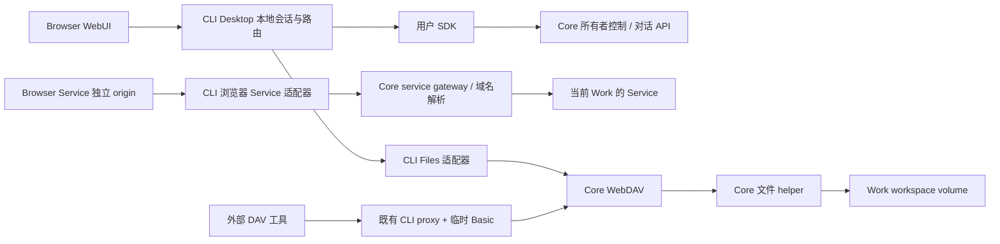

# Design

## Context

动机与范围见 proposal。以下为已经核对的代码基础：

| 现有位置 | 可复用行为 / 约束 |
| --- | --- |
| `apps/cli/src/main.ts` | 用户 CLI 命令、Core 地址优先级、Work 创建参数；尚无 desktop 命令 |
| `apps/cli/src/service-proxy.ts` | loopback forward proxy、HTTP/SSE/WS 转发、能力探测；Core 会话失效会退出进程，这一生命周期不能直接用于 WebUI |
| `apps/cli/src/work-file-proxy.ts` | 同 Work Destination/Location/DAV href 映射与有界 XML；可提取纯映射函数 |
| `packages/client-sdk/src/index.ts` | 用户 API、`resolveService` / `gatewayRequest` / `fileRequest`、包传输、NDJSON Run 观察；含 Node 依赖，只用于本地服务端 |
| `apps/core/src/work-services/service-gateway.ts` | 每次请求检查 owner、当前目标与声明端口；上游 Host 固定为逻辑 `.work`，活动资格每 2 秒复核；不替浏览器改写 Cookie/Origin/Location |
| `apps/cli/src/work-snapshot.ts`、`packages/work-package` | 完整检查、hash、上传/下载流及冷快照语义；最大包 100 GiB，不可用整包 Buffer/Blob |
| `apps/console` | 管理员专用产品，有 TypeScript DOM 浏览器构建、Cookie/CSRF、multipart 和浏览器测试先例；不能复用其 admin 授权/上传路径作为用户能力 |
| `openspec/specs/desktop-ui-language`、`docs/design/piwork-desktop-prototype.md` | DUL-001—016 与 36 帧的产品基线；此前交付为静态规范 |

首版由用户确认仅验收桌面 Chrome/Edge 当前稳定版。规划阶段用仓库现有 Playwright Chromium 做了无文件修改的 loopback 探针：`ui.p-probe.localhost`、`s-a.p-probe.localhost` 可解析；HTTP 上 `isSecureContext=true`，各自的 `__Host-` + Secure + HttpOnly Cookie 可建立。此探针不是完整产品验收，也没有验证 Edge、跨源嵌入和真实应用。

## Goals / Non-Goals

**Goals:**

- 在 `apps/cli` 内交付一个本地服务端与浏览器客户端，沿用 Core 所有者 API 和现有 Work 数据语义。
- 以三个独立适配分支连接控制/对话、Service 流量与文件 WebDAV；浏览器不持有平台 token。
- 将原型转换为可执行工作流和验证矩阵，保持统一样式、可用状态与恢复入口。

**Non-Goals:**

- 不为 WebUI 新建 Docker 访问路径、另一套 Work 状态机、代理进程编排或管理员 API。
- 不重写任意应用 HTML/JS，不保证所有 SSO/硬编码外部域名/跨父域 Cookie 应用透明兼容。
- 不将浏览器关闭、观察超时或本地退出映射为 Core 取消/停止。

## Decisions

### 1. 交付结构与启动

新增 `apps/cli/src/desktop/` 下的 server、session、routes、service-access、files、transfers、operation-records 模块；浏览器源码放 `apps/cli/src/desktop/browser/`，静态资源放 `apps/cli/public/desktop/`。采用仓库已有的 TypeScript DOM + CSS 构建模式，浏览器单独 tsconfig（DOM types，无 Node imports），构建时复制到 CLI 的 dist。共用表单、按钮、菜单、状态、弹层、列表和语义 CSS 变量，不引入另一个 UI 框架或复制整个 console。

`desktop` 默认 17891，前台运行，监听 `127.0.0.1`。浏览器主地址为 `http://desktop.localhost:<port>/`；使用 `desktop.localhost` 而非随机外壳域名，保证同端口复制链接与已知操作入口可复用。精确 Host 校验只接受实际端口的主域名或已登记应用域名，拒绝尾点/重复 Host/任意后缀匹配。`127.0.0.1` 不作为认证界面的第二个 origin。Chrome/Edge 的 localhost 特殊解析不要求公网 DNS；不配置代理、系统 DNS 或证书。

按参数校验 → 校验资源存在 → 监听 → 输出启动地址 → 打开系统浏览器顺序执行。打开使用固定平台程序与参数数组（Linux xdg-open / macOS open / Windows 系统 URL 打开调用），不能拼接 shell。`--no-open` 跳过打开；失败只提示手动地址。帮助与语法错误不读凭证。SIGINT/SIGTERM 停止接受、销毁本地 streams/sockets 并清理本次暂存；SIGINT 为 130，SIGTERM 为 143。

选择理由：与现有 CLI 发行、Node 运行时和 console 工具链一致。独立 Electron/前端服务会增加发行与进程负担；直接托管在 Core 会改变已确认的本地入口边界。

### 2. 数据路径与职责

Service 路由始终保存 `{coreIdentity,userId,workId,serviceId,logicalHostname,port}`，不保存容器 IP 为授权依据。Core gateway 的解析、labels/代次检查和撤销边界不变。文件通过 SDK `fileRequest` 到 Core，helper 与 pi-agentd 独立；只有显式挂载 workspace 的 Service 与 Agent 共享这些字节。浏览器 Files 不经过用户 Service，也不要求临时 Basic。

### 3. 本地授权、Core 会话与请求边界

仅绑定 loopback 不足以让任意网页使用已保存 CLI 凭证。启动生成 32 随机字节的一次性本地引导票据，5 分钟有效，放自动打开/终端启动 URL 的 fragment；引导页先 `history.replaceState` 清除 fragment，再同源 POST 交换。票据不作为普通复制链接，不落日志/磁盘。过期或已用票据提示重新启动获取入口，不自动授予已保存身份。

交换建立不透明的 `__Host-piwork-desktop-<port>` Cookie（HttpOnly、Secure、SameSite=Strict、Path=/、无 Domain），服务端存内存会话与独立 CSRF token，最长 12 小时/进程期。端口进入 Cookie 名避免同机两个端口互相覆盖。此会话证明用户从本机 CLI 启动，不等于 Core 已登录；允许 Core 离线时 Inspect、输入账号和连接地址。CSRF 只在同源受保护 bootstrap JSON 中交给外壳内存，不持久化。

Core token 只留服务端并沿用 `FileCredentialStore` 的受限文件规则。只在保存记录的规范化 Core URL 与目标一致时尝试 `me()`；不把 A 的 token 探测性发送到 B。新登录采用显式表单，成功后保存用户 CLI 凭证。一个 desktop 进程当前连接一个 Core/用户；切换全局撤销内容授权，所有窗口收到会话代次变化并清空内容/草稿。后到达的旧代次响应不渲染。

Core 401 清除内容授权及派生 Service grants，保留本地引导会话供重新登录；普通网络失败不删除 token。登出先撤销本地内容访问，再尝试 Core logout 并清理匹配凭证；失败显示远端未确认撤销。不能清除另一个进程新写入的不同凭证记录，写/清除前重新核对 Core、用户及 token 身份。显式登出撤销共享 Core token 可能影响原 CLI proxy，界面说明此账号会话影响。

外壳只提供精确 API allowlist，无通用 URL fetch。JSON/control 读请求需要 Cookie 与同源来源约束；mutation、上传、Inspect 还需 CSRF，自定义头防普通跨站表单提交，检查 Origin 与 Fetch Metadata，拒绝不明来源。普通文档 GET 可提供无内容的启动/登录壳，不能触发 mutation。敏感响应 `Cache-Control:no-store`、`Referrer-Policy:no-referrer`；外壳 CSP 禁止任意 script/connect/object，frame-src 仅登记应用 origin；不开放跨源 CORS。响应文本/消息/文件名使用文本节点，Markdown 通过受限渲染，不执行 HTML。保留 Cookie、票据与网关头使用专门解析/过滤，不能用包含匹配。

### 4. Service origin、授权与转发

每个当前身份、Service/端口分配随机 route ID 与 `http://s-<routeId>.desktop.localhost:<port>/`，在进程内稳定。外壳与应用同 site、不同 origin：避免首版普通应用 Cookie 因第三方 iframe 策略失效，同时利用同源策略隔离 DOM/localStorage。不能仅按端口隔离 Cookie，也不能把任意应用直接放在外壳 `/services/id/` 下。不同 Service/端口的响应 Cookie 全部去掉 Domain，变为各自 host-only；保留 Path、HttpOnly、Secure、SameSite、有效期，支持多个 Set-Cookie，不合并为一个头。平台保留 `__Host-piwork-*` Cookie 从上游响应丢弃、从上游请求剥离。

外壳 `POST /_desktop/api/service-entries` 提交 `{workId,serviceId,port?}`；服务端读取当前 service metadata，校验声明入口并调用 resolveService，返回无秘密的描述与一次性 30 秒 entry ticket。票据绑定本地会话代次、精确应用 host/port 和目标，只能使用一次。外壳在应用 origin 的保留路径 `/.well-known/piwork-local/enter#ticket=...` 打开极小引导页，同源 POST 换取 `__Host-piwork-route` HttpOnly Cookie 后跳转 `/` 或受校验的相对路径。应用端保留路径是唯一不能转发给用户应用的命名空间；其他路径全部原样转发。该保留路径不能提供 Core API、任意目标或通用重定向。

route Cookie 仅为本地授权句柄，不含 Core token；请求必须同时匹配精确 Host、存活本地会话、该路由身份及 Core 当前准入。票据兑换最多存活 30 秒，route grant 最长到本地/平台会话失效，进程重启全部失效。无 grant 的应用入口返回本地授权提示与外壳链接，不匿名代理。登出/切换立即撤销所有派生 grants 和本地 streams。

应用请求 Origin 若为当前应用本地 origin，映射为逻辑 `.work` origin；Referer 仅同 origin 对应替换；外部/其他 Service Origin 不得重写成当前应用。非安全方法及 WS Upgrade 必须带当前应用 Origin，拒绝不明/跨应用 origin；来自外壳的授权由 entry 流程完成，不直接发送应用 mutation。移除 Proxy/保留平台/逐跳头；普通应用 Authorization 与 Cookie 保留。调用 SDK gatewayRequest，由 Core 设置实际上游 Host。只识别可信 Core 的错误标记，不能把应用 401 当平台过期。

相对 Location 保持；绝对或协议相对 Location 仅在等于本路由逻辑 origin 时映射成本地 origin。其他 `.work` 域名跳转不自动授予目标：返回可解释的“从 Service 选择器打开目标”页，跨服务直跳不列为透明兼容项。外部 URL 原样离开，不转发平台身份。不改写 HTML/JS/JSON 中 URL，也不注入通用脚本。应用需要公开 base URL 时配置为实际本地入口；硬编码内部绝对 URL 由兼容说明指出。

HTTP 请求/响应背压流式传递；SSE 不压缩缓冲，WS 转发 Upgrade、head 和双向字节，关闭/错误释放计数。不提供通用 CONNECT。采用与原 proxy 相同的连接/头部边界，头上限 32 KiB；每个本地会话最多 64 条活动 Service 连接，与 Core 限额共同生效，不把本地重连做成请求重放。原 forward proxy 不改浏览器规则，依旧处理它自己的 PAC/绝对形式请求。

**隔离的具体边界：**同 site 并不是 hostile-site 沙箱。响应 Cookie 域收窄可以隔离正常应用，但主动用脚本设置共享父域 Cookie 的应用可能干扰同 site 的其他应用 Cookie，因此该用法不在透明兼容范围；不能宣传完全隔离恶意应用的一切浏览器状态。外壳的 `__Host-` Cookie、精确 Origin/CSRF、独立 origin 和 `Origin-Agent-Cluster: ?1` 仍必须防止借用平台身份。所有 Service 内容均视为不可信，不能以 same-site 放行控制请求。应用要向外壳发消息时默认拒绝，本次没有页面内容同步消息协议。

### 5. Service UI 与独立打开

普通 `Copy local link` 返回 `http://desktop.localhost:<port>/works/<workId>/services/<serviceId>?port=...`，没有 route ticket。该外壳路径经过登录后重新获取当前 entry；进程重启仍可从同端口路由进入。工作面板工具栏展示 Core 域名，文案明确复制身份与本机链接不同。入口端口选择读取 Core web endpoint；无默认时列出声明 TCP 候选并提示需要 HTTP，UDP 不提供预览；失败不改变 Service 健康结论。

普通 Pop out 在点击时先打开空白外壳标签以避免异步弹窗被拦截，随后进入独立 Service 外壳，复用同一应用 origin，保持应用正常 Cookie/localStorage。应用 iframe 不能与外壳同源；限制顶层导航、opener，表单/脚本/下载和用户触发弹窗按应用必要范围启用 sandbox。窗口 `noopener`，外壳使用 COOP same-origin；不靠 opener 同步平台权限。

嵌入响应的 X-Frame-Options/CSP 由服务端记录为 entry 的安全加载状态，外壳查询该状态；保留原安全头，不剥离 frame-ancestors。跨源 iframe load 事件不被当作实际成功证明；无肯定结果时显示预览未确认与重试/直接打开入口。禁止嵌入时以用户点击直接打开应用 origin 为回退。

**对 DUL-004 的明确细化：**正常独立外壳有 Work 身份、2 秒状态复查和 Back to Work。禁止嵌入的原应用标签不能同时有可信外壳导航，亦不能可靠清除已渲染/Service Worker 缓存页面；返回入口留在原 Work 外壳，下一次真正到达代理且准入失败的文档导航返回带 Work/Back 的错误页。活动网络仍按 Core 边界撤销。此替代避免破坏应用 CSP 或注入导航栏；BSA-005 固化该例外，不承诺外壳控制任意应用的旧画面。

### 6. 本地 API 契约与 UI 状态

本地 API 命名空间 `/_desktop/api`，鉴权/普通错误统一 `{code,message,details?}`；仅给安全字段，保留 Core 状态码及 operationId。绝不允许前端传入任意 Core path。

| 本地路由（相对 API 前缀） | 方法与职责 |
| --- | --- |
| `/bootstrap`、`/session`、`/login`、`/logout`、`/connection` | POST 引导；GET 本地/平台状态；POST 登录/登出；PUT 显式切换 Core，均使用专用 schema |
| `/status`、`/skills`、`/skills/:name`、`/packages`、`/packages/:name` | GET，用户可读健康/能力与 catalog，不暴露 admin 信息 |
| `/works`、`/works/:id`、`/works/:id/{start,stop,retry,delete}` | GET/POST 列表与创建；GET 详情；POST 生命周期，仅列明动作 |
| `/works/:id/services`、`/.../services/:sid`、`/.../services/:sid/logs`、`/.../services/:sid/:action` | 列表/详情/有界日志；POST action 映射用户 SDK 的 start/stop/restart/retry/remove |
| `/service-entries`、`/service-entries/:entryId` | POST 获取绑定本地会话的 entry；GET 真实资格/加载状态，无容器地址 |
| `/works/:id/sessions`、`/.../sessions/:sid`、`/.../runs`、`/.../runs/:rid`、`/.../runs/:rid/events`、`/.../runs/:rid/cancel` | 对应现有 SDK，events 保持 NDJSON，`after` 为安全整数，cancel 为 POST |
| `/works/:id/configuration` 及 `/skills`、`/packages`、`/agents`、`/apply` | GET/PUT 精确配置子路由；Apply POST，不开放任意 patch 到 Core |
| `/works/:id/packages` 及 `/:name`、`/:name/update`、`/:name/enable`、`/:name/disable` | GET/POST 安装、详情、POST 更新/启停、DELETE 移除；selection 与 installed 不混用 |
| `/works/:id/package-uploads` | POST multipart，本地目录或 ZIP → 用户 work scope uploadPiPackage |
| `/operations/:id`、`/known-operations` | GET 当前用户操作 / 本地已知记录；DELETE 指定本地记录只影响显示 |
| `/work-packages`、`/work-packages/:transferId`、`/work-imports` | POST 本地暂存与 Inspect；GET 进度/摘要、DELETE 取消本地暂存；POST 导入已检查包 |
| `/works/:id/exports`、`/work-snapshots/:id`、`/work-snapshots/:id/downloads` | POST 导出；GET 快照状态；POST 本地校验下载准备 |
| `/downloads/:transferId`、`/downloads/:transferId/content` | GET 进度；本地认证 GET 已验证内容、attachment/no-store；无凭据 query 参数 |

文件字节入口单独为 `/_desktop/files/works/:id/<path>`，仅 WebDAV allowlist 方法，应用 host 上此路径仍是应用自己的路径，不落文件路由。下载可用同源 Cookie 的文档请求；mutation 需 CSRF。控制 JSON 请求上限 1 MiB，按既有字段 schema 再限额，不能让任意巨大文本进入内存。文件、包走独立流式接口，不受控制 JSON 的 1 MiB 限额。

前端以 Core+用户+Work 为 store 分区：selection/drafts 仅页面内存；服务端权威结果带取得时间，异步请求附本地会话/页面代次。页面切换取消读观察，提交一旦发出不假装撤销。所有按钮按所关联对象状态而非全局 ready 控制。创建表单不自行深合并配置：传与 CLI 相同的 `{name,configuration?,baseImage?,skills?,packages?,agentsMd?,idempotencyKey}`，让 Core 执行既有优先级；未选字段省略，显式空数组保留。

Run 使用原 `watchRun` 的 NDJSON 语义与 sequence；分段响应上限触发后从最后游标继续观察，不重新 submit。先查询真实 Run，再恢复事件；过期读结果/Session。渲染按序去重并把终态优先于本地 cancelling。选中 Service 的“Include service context”以可见的服务名/ID/域名作为消息附加上下文，说明没有页面数据；用户可以取消此上下文。消息要求 Agent 只引用实际读取来源，UI 不把提示文字当已读取证据。

### 7. Files 的适配与并发

复用原 file proxy 的严格路径规范化、同 Work Destination/Location/XML href 映射；SDK `fileRequest` 剥离浏览器 Cookie/Authorization 和保留头后附 Core Bearer。PROPFIND 只用 Depth 0/1；XML 禁用 DTD/外部实体，响应最多 16 MiB，映射失败不显示伪空列表。普通文件字节不经 XML/text decoder。

Files 默认逐文件上传，每个 Work 仅一个本地待完成 mutation，不排无限队列；Core 的 409/busy 保持可见。覆盖前 Depth 0 读取目标，未确认覆盖的 COPY/MOVE 使用 Overwrite:F；PUT 新建使用 Core 支持的条件请求，已有修改时间保存使用 If-Unmodified-Since，412 留草稿。秒级时间戳不能保证检测所有并发写入，确认文案不承诺完整冲突保护。文本解码 fatal UTF-8，至多 1 MiB，保持 BOM/换行，不做静默格式化；不能编辑则下载。

沿用 Core 限额：文件 10 GiB、递归复制 10 GiB、10,000 项、请求 XML 64 KiB、总请求 30 分钟、空闲 60 秒、连接/helper 10 秒。请求取消只关闭本地传输，已获 Core 提交许可的写入可能已经成功。未知结果先重新列目录/读取，拒绝自动 PUT/COPY/MOVE/DELETE 重放。207 XML 逐 href 解析并按成功/失败展示；绝不把部分失败描述为整体回滚。外部 DAV 辅助页显示 `piwork-cli proxy` 及 `http://127.0.0.1:<proxyport>/works/<fullWorkId>/files/`，端口默认17890可改，密码只从该进程终端取得，不由 Desktop 探测或读取。

### 8. 包传输、暂存与快照下载

本地包采用受保护的 transfer job，浏览器用 File/multipart 流发送，本地在用户配置目录的 desktop 临时子目录暂存，目录0700/文件0600、随机名称、拒绝符号链接/路径穿越。API 只接 transferId，不接任意宿主绝对路径。活跃本地大包任务全进程最多 2 个；总暂存上限 200 GiB，单包继承 100 GiB 上限，启动/接收前检查可用空间并保留 1 GiB 余量，写入中处理 ENOSPC。完成/取消/登出清理；待提交或待下载成品最长保留 1 小时，GET 不延长；正常退出清理，重启只清理明确属于已退出实例的私有暂存，不能删除其他实例文件。

Inspect job 流式计算 hash/长度，完整运行现有 `.work` verifier，返回安全摘要，不解包运行。包可含私有内容，上传前提示它将暂存在运行 CLI 的本机。已验证文件固定后只读，Import 重验文件身份/hash，SDK 上传至 Core，再 submit import；空名称不传。进度区分 receiving/validating/uploading/submitting 与 Core accepted。用户取消仅在 Core 提交前中止本地步骤；已发送提交的未知结果标 unknown，不能自动重提。失去本地暂存需重新选文件，不从活动记录假装续传。

Export Operation succeeded 后准备下载 job：SDK 拉取原 snapshot 到受限暂存，检查 MIME/length/hash 并完整验证包，成功才开放 attachment 下载。浏览器以原生下载读取流，不构造全文件 Blob；提示浏览器 Download started，并保留“再次下载原 snapshot”。该方案付出一次本地磁盘暂存，换取损坏包不在验证前开始交给浏览器。空间不足显示清楚，可使用既有 CLI snapshot download 到用户选择的位置；不能删 Core 快照或自动重 Export。传输空闲60秒中止，总持续时间不设低于 Core 合法传输窗口的固定两分钟上限；状态记录 transferred/total/阶段，字节不进入 JSON。

Pi Package 目录选择用 `webkitdirectory` 相对路径，以流式 multipart 接收后调用现有打包器；ZIP 用现有校验器，用户 scope `uploadPiPackage(...,{kind:'work',workId})`，不能使用 console 的 adminUploadPiPackage。继承压缩256 MiB/展开1 GiB/单文件64 MiB/条目100,000/路径深度64等包约束。目录选择不能保留完整 POSIX 模式和符号链接，页面说明需要保持这些信息时选择已打包 ZIP；不绕过路径校验。npm/Git 来源保留既有 schema 和安全诊断，不输出凭据化来源或第三方原始 stdout。

### 9. Operation、恢复记录与错误

mutation 请求生成一次 UUID 幂等键，同一用户动作及对应 acceptance 使用同一键。收到 acceptance 立即登记，再观察；服务端提交已成功但浏览器响应丢失时可从服务端已登记记录恢复。若 Core 响应也丢失，标未知，不以自动提交找回。只读观察指数退避 250ms → 最多5秒；有结果后恢复常规1秒轮询，页面不可见降至5秒，活动连接资格保持 Core 自身2秒复核。404/410/鉴权错误终止该观察重试并给明确动作。

已知操作记录写在 CLI 配置目录独立 desktop 子目录，每个实例追加自己的记录文件，单条只含 Core 标识、userId、type、Work/Service/Operation/snapshot ID 和时间；恢复时按归属合并去重，避免多进程覆盖。权限0600/0700，不跟随符号链接，最多每身份500条终态记录，先淘汰最旧终态，未终态不自动丢弃；只有登录核实身份后返回记录。读回的记录不是权威状态，每次重新问 Core。清除已知记录只加本地删除标记，不影响远端。

| 错误 | 外壳处理 |
| --- | --- |
| 本地认证/CSRF失败 | 本地401/403；不访问Core、不误删CLI平台登录 |
| 确认平台401 | 撤销内容授权/流，登录恢复；不退出监听 |
| 应用401/403/404 | 保留应用响应，不进入平台登录恢复 |
| Work/File404 | 资源不可见/不存在，不回退管理员身份 |
| busy/409、条件412 | 保留表单/草稿，解释冲突，不自动取消或覆盖 |
| File207 | 逐路径结果，刷新确认真实状态 |
| snapshot410 | 原快照过期，需新的用户 Export 意图 |
| 网络/502/503/观察超时 | 最后已知+unknown/时间+Check status，不伪造任务终态 |
| 本地空间/校验/限额错误 | 指向传输阶段及恢复方法，清理局部暂存，不改Core任务结果 |

### 10. 交付验证与能力映射

单元/进程测试沿用 Node test；浏览器测试在 CLI workspace 增加 Playwright 配置，以 Chromium 做自动回归，真实 Chrome/Edge 稳定版作为发布验收，记录 OS/版本。真实 Core 测试需受控 Work、Service、workspace 和测试模型，使用现有 acceptance 生命周期清理。不得将 API mock 或本次探针标为真实端到端通过。

| 交付模块 | Spec | 原型帧 | 关键实测 |
| --- | --- | --- | --- |
| 启动/身份/布局 | CLI-DESKTOP-001、DWUI-001/002、WACC-DESKTOP-001 | 01、09、32 | 无登录启动、过期重登、Host/CSRF、长列表与360px |
| Work创建/生命周期 | DWUI-003 | 05、10、27—29 | defaults/empty、superseded、停止失败、删除后恢复 |
| Chat/Run | DWUI-004/005 | 02、11—14 | 工具事件、busy、cancel竞态、断线/游标恢复 |
| Service控制/访问 | DWUI-005、BSA-001—006 | 02、03、15—17、33 | 根路径、认证Cookie、重定向、SSE/WS、两Service、拒绝嵌入、跨用户撤销 |
| Files | DWUI-006 | 04、18—21、34 | 方法链、中文/隐藏文件、边界、207、未知写入、外部DAV对照 |
| 配置/Packages | DWUI-007 | 22—26、35、36 | 五种来源、保存/Apply分离、busy、回退/新编辑 |
| Inspect/迁移 | DWUI-008/009 | 06—08、30、31 | 离线完整校验、损坏包、名称冲突、workspace字节往返、原快照重试 |
| 操作恢复 | DWUI-010 | 08、24、27—31、36 | 重载、多窗口、切换身份、无ID未知状态 |

## Risks / Trade-offs

- 同 site 多 origin 的 Cookie 兼容不等于恶意应用全站隔离 → 明确父域脚本 Cookie 限制，平台使用 __Host/CSRF/Origin/OAC；跨源安全用负向测试验收，不宣传超出边界的安全保证。
- HTTP localhost 对 Secure Cookie 的特殊待遇和浏览器策略可能变化 → Chrome/Edge 稳定版验收为硬门槛，不通过不得静默退回不安全 Cookie、用户 PAC 或关闭安全检查；需修正规划后再交付。
- 任意应用 CSP、绝对 URL、SSO 不可通用透明改写 → 保留策略、直接打开回退并呈现兼容范围；用户无需先配置浏览器代理。
- 大包暂存消耗磁盘 → 明确限额、余量、错误与自动清理；包不进入常驻内存，原 snapshot 可重用。
- 已知操作不能发现所有其他客户端任务 → 明确是本机已知活动，提供 ID 查询，不伪造全局历史。
- 仓库要求 Node24，而本次环境探针运行于 Node25 → 实现验证必须使用声明支持的 Node24，探针不替代构建/验收。

## Migration Plan

1. 构建时随 CLI 包分发新增资源与运行依赖；不迁移 Core 数据库、`.work` 格式或 Service 定义。
2. 新命令启动后按 capability 逐项启用；旧 Core 缺文件能力时只降级 Files，service gateway 缺失时保留控制与本地 Inspect 并说明无法预览。
3. 验收通过后更新用户指南及能力矩阵的运行证据，保留静态规范历史，不将旧 change 标为实现者。
4. 回退到旧 CLI 不改变 Work/数据，新增本地临时会话自然失效；可清理 desktop 自己的记录/暂存，不改共享 CLI 凭证格式或停止 Core 任务。
