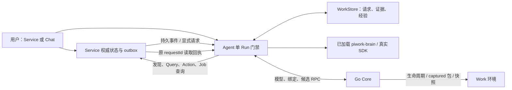

# Design

## Context

动机与功能边界见 [proposal.md](proposal.md)。实施基线固定为 master `a980c189be074c2a6d87cc88d7f942fbab7998c4`，功能来源为 `1608098987617eca8a277a4676d26265f9b7f0f3`。本 change 在 master 的独立工作树中编写；尚未合并代码。master 已具备 Go Core、原生 CLI/helper、包准备和快照、安装范围/代次鉴权，以及较新的 Desktop 生命周期、授权恢复和对象反馈逻辑。功能来源包含可复用的 Agent CoreFlow/CoreLoop、WorkStore、PiSDK 适配与 brain extension，但其中的平台实现、平台脚本和旧格式兼容不能直接搬入。

已确认的关键差异：master 的协议源位于根 `proto/`；Go 历史校验目前只认识 schema 3 的七张表；原生 package-helper 合约已是 2；默认部署能力目前由 Go 内嵌的独立 Skill 提供；源码边界 gate 当前没有扫描 scripts。源候选历史还允许缺少 verificationTarget，这与本次只支持当前 MVP 格式的决定冲突，必须剔除。

## Goals / Non-Goals

**Goals:**

- 把平台职责落到 master 现有 Go 模块，保留 Agent 与 Service 的直接业务交互；让当前版本的存储、协议、包、镜像和浏览器端一致。
- 固定从首次创建到自反馈、自更新、重启恢复、独立分享的状态与验证边界，让实施阶段可以逐项执行已有决定。
- 每次“完成”都有与原目标关联的真实结果；保留未知结果、已提交数据和原标识，恢复不依靠重发模型 prompt。

**Non-Goals:**

- 不迁移旧 TS Core 数据，不升级 schema 3，不接受缺字段候选，不保留双实现、旧平台启动入口或兼容测试。
- 不替换目标架构的 TS Agent/PiSDK、extension 和浏览器；不增加 broker、跨 Work 编排、通用工作流解释器或技术栈限制。

## Decisions

### 1. 从 Go 基线迁入功能，平台与业务职责明确分离

采用逐项移植，保持 master 的 Go 文件、鉴权、控制版本和 UI 流程。复用来源的 Agent/WorkStore/adapter/extension 及有价值的测试断言；原 TS Core 只用于阅读功能行为，其源码、导出类型和运行入口不进入目标依赖图。整支分支覆盖会恢复已移除的目录并丢失 master 的并发修复，因此不作为实施方式。

| 责任 | 所有者 | 持久事实 / 接口 |
| --- | --- | --- |
| Work、Service 定义与生命周期、模型权限、包与快照 | Go Core | 现有 CoreStore、HTTP、WorkServices mTLS RPC、原生 helper |
| 单 Run 门禁、CoreFlow/CoreLoop、业务查询和反馈收件 | TS Agent | 现有 Run/Session API、私网交互接口、WorkStore |
| 请求、证据、经验、Session 偏好与实际模型 | WorkStore | 当前 MVP history schema 4 |
| 默认认知、部署 Skill、业务和脑包工具 | piwork-brain | Work 本地包源及 captured active 包；extension 只调用 Agent |
| 用户业务状态、Action/Job、outbox | Service | Service 自己的数据库和 `/pi/v1` 交互契约 |
| 用户入口与执行观察 | master Desktop / Go CLI | 现有工作区及 Go 公共 API；不承担执行调度 |

Go Core 不接收业务事件用于再调度，不维护第二份业务数据库。它仅提供受管身份和当前端点、控制准入、准备包以及转发经过授权的用户查询。Service 不获得 Go Core 的管理证书。

### 2. 单个工作站示例完整运行两条业务路径

参考 Service 使用 Python/NiceGUI/SQLite，实现 Todo、个人复盘和异步导出。依赖和镜像在 fixture 中固定；Pi 通过真实 SDK 写入/修改代码并通过 MCP 部署。示例位于 Work 的 `apps/<name>` 与 `data/<name>`，不内嵌进 Desktop，也不成为其他 Service 的语言约束。

**Pi → Service：** 读取当前绑定 → 发现 capabilities → 查询实际状态和版本 → 按目标调用声明的 Action → 保存原 Action/Job 引用 → 等待或核对结果 → 查询实际业务/产物 → 回写证据与结果。业务状态始终以 Service 为准；Run 成功或 HTTP 接受不是业务完成。

**Service → Pi：** 用户业务提交与 outbox 一起持久化 → 按原 eventId 投递 → Agent 验证身份与来源并持久收件 → 返回原 requestId/回执 → 普通事件只入事实；明确的 `agent.requested` 进入 pending → 正式 ready、空闲且准入开放后运行同一 CoreFlow → Service 按 requestId 读取等待/终态与结果。Agent 的回答、Action 结果和学习记录不反向触发新的目标。

“用户发起的 Run”就是 Chat 的一次已受理执行。Service 的请求是业务目标记录，可关联零到四个自动 Run；待处理和等待阶段没有活跃 Run。两者共用一个执行槽，UI 不把请求队列称作手动消息队列。

Service API 保留来源实现的当前契约：`GET /pi/v1/capabilities`、`POST /pi/v1/queries/{name}`、`POST /pi/v1/actions/{name}`、`GET /pi/v1/actions/{actionId}`、`GET /pi/v1/jobs/{jobId}`。Agent 的反馈接口为 `POST /pi/v1/events`、`GET /pi/v1/requests/{requestId}`、`POST /pi/v1/requests/{requestId}/cancel`。查询响应携带状态/代码版本和取得时间；Action 携带稳定身份、输入、必要 expectedStateVersion 及来源目标；异步回执包含原 Job。

Chat 发起的脑包更新等目标也可以保存为 chat 来源请求并在等待之后自动续接验证；保留原手动 Run 关联，没有 Service 时不伪造 Service 来源。它与 Service 请求共用期限、预算、取消及证据门禁。

outbox 只记录 Service 主动提供的 pathname 和业务动作，不包含表单正文、敏感 query、DOM 或录屏。普通事件与明确请求均去重，同来源同 eventId 异内容冲突。外部 Service 使用现有状态/日志/端点，不要求改造业务代码。

### 3. Go 提供运行模型解析，Agent 在受理时固定实际选择

根 `proto/agent.proto` 扩展模型、偏好、反馈查询/取消/重试 RPC；根 `proto/work-services.proto` 增加五个私有 RPC：`ListRunModels`、`ResolveRunModel`、`GetServiceInteractionBindings`、`PrepareBrainCandidate`、`GetBrainCandidateState`。Go 与 TS 从同一源生成；公开 DTO 加入 `internal/contracts/schemas.json` 及保留的 contracts，拒绝未知字段。不能引用原 TS Core 导出类型。

| Go 公共 API（均在 `/api/v1/works/{workId}` 下） | 行为 |
| --- | --- |
| `GET /models` | 返回实际 SDK 可执行的安全模型列表及默认选择，不返回 secret/baseUrl/私有路径 |
| `PATCH /sessions/{sessionId}/model` | 严格 `{modelRef: string \| null}`，保存下一次手动 Run 偏好 |
| 现有 `POST /runs` | 新增可选 modelRef；省略、null、具体引用三种语义保持区分 |
| `GET /agent-requests` | 当前 Work 请求分页，可按来源 Service/状态过滤 |
| `GET /agent-requests/{requestId}` | 请求详情及证据分页；limit/cursor 沿用当前 contracts |
| `POST /agent-requests/{requestId}/cancel` | 明确取消，请求体为空对象 |
| `POST /agent-requests/{requestId}/retry` | 严格 submissionKey，持久幂等的新关联请求 |
| `GET /agent-evidence/{evidenceId}` | 已授权的单条安全证据 |

沿用 Go 的 Work conversation 授权、当前 runtime 路由和 transient mutation/snapshot 门禁；stopped、初始化、draining 或身份不匹配不绕过门禁读取私有历史。Desktop 本地 Go 后端投影同一接口，保留 Cookie/CSRF、安装与用户身份及并发凭证保护。

模型列表由 Go catalog 的启用/凭据条件和 Agent 的实际 SDK 支持共同筛选。Run 受理顺序为：查询 submissionKey 原记录 → 新请求解析 selector 和当前 Session 偏好 → 私有 RPC 确认模型/权限 → 固定非秘密 actualModel、selector 和当前经验版本 → 原子持久受理并占槽。重复同键返回原 Run，不以新偏好重新解析；同键异 prompt/selector 冲突。

Go 请求 DTO 和 protobuf 必须表达字段 presence：省略取 Session 偏好，null 显式取 Work active 默认，字符串取指定模型。自动 Run 使用该 Run 受理时 active 默认值，不继承手动偏好。执行时 Go 私有解析只为既有实际描述提供凭据，描述/权限变化或失效明确失败，不换模型。历史公开 provider/model/label 等安全描述；模型凭据仅经当前 Agent 的 mTLS 私有链路获得，不进 Run、SDK历史、事件、包、快照或浏览器。

不新增 CLI 顶层反馈命令或工作流控制台。既有 Go chat 参数保持可用，省略模型时由 Session 偏好决定；Run show 使用更新后的实际模型/来源投影。

### 4. Service 身份由 Go 生命周期绑定，业务传输保持直接

在 Go `workruntime`、`dockerengine`、`internaltls` 中提供 Work 内当前 Service 的逻辑名、真实运行容器/网络、定义版本、声明端口及私有交互身份。私有绑定记录放受管控制路径；凭据不放公开 Service definition，也不导出为可复用身份。Agent 每次使用/认证时核对当前绑定，不接受 capabilities 里的任意 URL。

Service 后端使用受限的每 Service Bearer 身份与 Work CA，经 TLS 连接同 Work Agent 的反馈端口 7444；当前契约中的反向业务连接使用 Go 提供的绑定和凭据。绑定中的端口、模式与 logical identity 是唯一解析来源。浏览器只访问 Service 自己的业务 API，不获得投递身份；Service 只能投递、读取、取消自己的请求。

Stop/Remove/Service 实例更换撤销旧身份，Restart 按当前实例重新绑定，跨 Work、旧实例凭据和源 Work outbox 不获得新权限。Agent-only Apply 使用稳定私网入口和仍有效的 Service 身份；仅替换 Agent 不强制重部署所有 Service。私有文件更新保持固定受限挂载位置并原子替换，来源身份与证书实际关系必须通过真实容器验证。

事件 origin 使用持久 Work ID / Service ID，认证 token 则绑定当前运行容器。原 Work 同一 Service 重启可用新 token 继续投递旧 outbox，保持原 origin/eventId；删除后新建及导入副本不认领该 origin。轮换凭据不改变已持久请求的业务来源。

候选初始化可以加载绑定和资源以验证 ready，但不开自动执行。Go Stop/Delete/Apply 首先关闭 Run 准入并 fence 当前代次；完成激活或恢复 prior active、验证正式 ready 后才开放。持续等待查询本身不占 Run 槽，但推进也必须复查当前请求、代次及期限。

### 5. 默认脑包归属 Go 资源，编辑源与运行制品分离

资源移入 Go 内嵌的 `internal/coreassets/piwork-brain/`，保持 Pi package manifest、extension、认知、Skill、Tools 及支持文件。新默认选择为独立 skills 空集合和 piwork-brain package；包内 `deploy-work-service` Skill 承担已有部署认知，不保留第二个自动播种的同名独立资源。

Go 在已有默认 agent 环境可用后通过现有原生包准备流程播种普通 catalog 包。CoreStore 一次性 metadata、catalog 制品与初始默认选择原子发布；失败保留真实包 Operation，Core 健康和配置修复入口可用，但不能伪造默认创建成功。播种前已有管理员默认配置/catalog 定制时不覆盖；播种完成后重启不重新加入被清空、禁用或移除的默认项。显式 packages=[] 保持空，skills=[] 只移除独立 Skills。

首次 materialize Work 时从该 Work 已捕获的包源建立 `.pi/packages/piwork-brain/` 编辑副本；后续 Start/Apply 不覆盖已存在的用户编辑，非空目录不能被默认拷贝覆盖。运行 extension 始终来自 active context 的不可变制品。仅编辑文件或普通重启不加载新代码。真正发布走 Package Update，真正采用走显式 Apply。

extension 保持薄层：`brain_service` 提供发现/查询/Action/Job/验证，`brain_feedback` 提供事实/回执/等待/完成/取消，`brain_experience` 提供经验阶段与提交，`brain_package_update` 提供候选准备和状态；通过 Agent 受限 Unix socket 调用固定宿主能力，不在 extension 里实现另一个调度器或访问 Core 管理目录。默认认知注入每个新建或恢复执行上下文，权限仍由 Work 策略裁剪。

当前目标镜像及握手统一声明 history schema=4、runModelContractVersion=1、workFeedbackContractVersion=1，沿用 master 的 agent protocol、安装范围/SAN/代次校验和 package-helper contract=2。缺少本版必需契约即明确拒绝，不增加旧 Agent/TS Core 适配分支。必要工具被 deny、包禁用或能力损坏时对应请求明确收尾；不伪造默认能力、不无限等待。

### 6. 固定 CoreFlow/CoreLoop 与严格的等待恢复

沿用来源的宿主 CoreFlow/CoreLoop，经当前协议接入，不把业务调度搬进 Go。调度扫描 live 请求，手动提交让位窗口固定一秒；已有 Run 不抢占。一个请求的 phases 为 handling → verifying → adopting；公开状态为 pending、running、waiting_result、waiting_apply、cancelling、completed、failed、cancelled、needs_attention。

| 情况 | 下一步 |
| --- | --- |
| 有效 pending + ready/空闲/权限完整 | 受理一次当前 active context 自动 Run，最多四次，每次最多三十分钟 |
| Action/Job 已接受但未终态 | 保存原对象及验证条件，waiting_result，释放 Run |
| 原业务结果已核对为终态 | 原子续接同一目标 verifying；不再次 mutation |
| 验证通过 | 回写结果/证据并提交有效经验，达到所需阶段后 completed |
| 候选已发布但未采用 | waiting_apply，释放 Run，用户显式 Apply |
| 已加载且固定行为验收通过 | 记录匹配 SDK 证明后完成；加载本身不足以完成 |
| 结果未知、非法来源、验证失败或预算耗尽 | failed 或 needs_attention，保留依据，不自动重试 |
| Cancel request / 有关联请求的 Run 被取消 | 阻止后续续接，执行中请求 SDK 中止并等待 Run 实际收尾 |

每 Work 最多一百个 live 非终态请求，事件最多 64 KiB。普通请求默认二十四小时到期；Job 等待不超过声明值、二十四小时和原请求期限的适用边界。首次合法进入 Apply 等待可按当前契约进入最多七天的采用期限，原期限在进入事务前必须仍有效；之后轮询不重设期限。每个已登记等待对象五秒内最多查询一次，事件只唤醒核对，不替代真实结果查询。

所有外部查询返回后重新读取 live 状态、当前 waitRef、来源和代次。在同一 WorkStore 事务中确认原对象匹配且适用期限均大于当前时间，才写入 pending/验证阶段；先提交取消或终态保持。期限相等视为到期。未知副作用或等待的到期统一 needs_attention/REQUEST_EXPIRED，保留原对象和业务数据，不表示业务失败/撤销；尚无副作用的 pending 到期可以 failed。合法续接后的旧 waitRef 仅作历史依据，不再误伤已续接阶段。

显式 Retry 查询原 Action、Job、capabilities 或验证 Query 后同样执行最新状态、生命周期与当前时刻检查；登记原对象等待的事务使用查询返回后的时间，不能传入 tick 开始时的时间。新 Retry 使用自身 expiresAt 与原业务对象仍有效的期限，旧请求 waitRef 只作为历史依据；恰到或超过适用期限立即 needs_attention/REQUEST_EXPIRED，不等下一 tick，不新建等待或验证 Run。先提交的取消、终态和 historical 保持。

恢复先把旧非终态 Run 记 interrupted；正式 ready 后对有持久 Action/Job/候选引用但没有 waitRef 的请求进行有界只读核对。已终态且期限有效进入验证；仍执行登记同一对象等待；无法证明进入 needs_attention。候选按原 submissionKey/Operation 查询，不再次 prepare。只读核对不增加 autoRunCount，真正受理验证 Run 才占槽并计数。当前版本损坏、能力缺失、停机越过期限均不能被默认值或新期限掩盖。

### 7. 已验证经验与实际 SDK 行为证明形成两层采用

经验使用独立 revisions/head，不进入 immutable AGENTS 或 Service DB。阶段记录引用原请求及有效 evidence；仅业务或脑包行为验证通过后事务提交新有效 head。失败记录保留，原有效版本不变。每次模型执行之前从当前 head 读取快照，记录 adoptedExperienceVersion；已有兼容 Session 和新 Session 都使用它，进行中的 Run 不热更新。最多一百条有效规则、每条 4 KiB，超限明确失败并要求合并/替换；读取损坏阻止依赖 brain 的执行。

脑包更新流程固定为：修改编辑源 → 固定原目标及验收项 → 准备/捕获 → 发布 desired → 等待显式 Apply → 新 active 的资源加载确认 → 新兼容 Session 的真实 SDK 调用 → 检查原验收项 → 原请求完成。旧 Session 不改绑 context，不在 Apply 初始化里调用模型。

验收项为 `contractVersion=1`、目标 package toolName、业务 input、一到八个唯一 checkNames；input 最多 8 KiB，整体最多 16 KiB，拒绝秘密、宿主路径和越界工具，不能用 feedback/package-update 通用状态来证明新行为。原 requestId、候选内容、工具、规范化输入、必要 checks 和 SDK Run 共同关联。宿主只核验当前 SDK 工具输出中的 checks，不执行用户提供的平台检查脚本；修改验收项等同修改幂等内容。

实际 loaded 成功且匹配工具/input 的必要 checks 全通过才完成。无关成功、模型文字、旧 Run 证明、同名不同内容、失败/缺少 checks 均不通过；失败时包真实 active/loaded 保持，不假称回退或提交已验证经验。候选内容与当前已验证 active 相同也执行原验收项，不制造不存在的 Apply 等待。

### 8. Go 候选捕获复用原生包流水线与持久幂等

私有 `PrepareBrainCandidate` 只接受当前 Work 的 piwork-brain，固定 `.pi/packages/piwork-brain/`；descriptor 使用当前严格字段：submissionKey、requestId、verificationGoal、verificationTarget、expectedSourceDigest、activeDigest、desiredDigest、activeContextId。禁止 LegacyBrainCandidateSubmissionSchema 或缺字段补造。

Go CoreStore 以稳定 `work-agent:{workId}` actor 而非瞬时代次受理；规范化 descriptor 的摘要参与幂等。同键同内容先返回原 Operation，不重新捕获、准备或因新当前源内容而改变原结果；同键异内容冲突。新请求仍必须通过当前 Agent mTLS 与生命周期门禁。Operation 的私有 source descriptor 使用 Work 文件来源，公开视图仅输出安全来源/目标/阶段，不公开 digest、宿主路径或凭据。

原生 package-helper contract 2 增加固定受控 `source-capture` 动作，只读挂载当前 Work workspace，拒绝链接逃逸、非法路径/manifest、文件数/体积超限。捕获产物完整落入现有 spool、其摘要与 expectedSourceDigest 一致后才进入依赖准备；已经受理却尚未捕获时源变化造成明确冲突，不能偷偷采用新内容。依赖准备读取 captured 源而不是实时 workspace，执行隔离、资源和三十分钟 Operation 时限沿用 master。所有 helper 仍是 Go，不复制旧 TS package-helper。

准备完成时事务检查同名 active/desired 基线及 Work 控制门禁，从最新 desired 只合并该包；无关新编辑保留，同名替换/禁用/移除、代次控制冲突和 Stop/Delete 不晚写回。准备可以在当前合法 Run 中进行，Apply 仍遵守 busy 与独立 Operation 规则，不主动取消当前 Run。持久包任务恢复、spool 清理及引用租约沿用现有流水线。

候选关联 Apply 使用现有持久 Apply 计划与已受理 context 的包绑定：仅关联同一 Work、候选发布后受理且选择了相同启用脑包制品的 Apply，按真实受理顺序返回最近一项。无关 AGENTS/Skills 保存可以改变 context ID，不能因此漏报原 Apply 的失败或回退；不能只比较发布时 context ID，也不能凭同名/version 或另一 Work 的结果认领成功。内部制品身份只用于匹配，公开视图输出原 Apply ID/状态及安全错误，未有匹配 Apply 与查询不可用分开，不创建第二套 Apply 登记。

公开候选投影复用既有 Work 包查询契约，提供来源、受理时 active/desired 选择及与当前状态的匹配摘要、提交时固定的验证目标/能力/安全输入摘要/必要 checks、准备发布结果和关联原 Apply。原 descriptor 是受理基线与验收项的依据，不能用当前配置或读取时临时选择的检查代替；密钥、宿主路径、context identity 和制品 digest 不公开。

### 9. schema 4 全闭包与两份独立导入

Go 与 WorkStore 的当前 MVP schema 同步更新，保留原七表并加入：

| 表 / 字段 | 校验与用途 |
| --- | --- |
| sessions.model_preference_json / source_json | 安全偏好、来源及唯一目标匹配信息 |
| runs.model_selector_json / actual_model_json / source_json / adopted_experience_version | 不可变选择、实际模型、来源和采用版本 |
| service_events | Work、来源实例、eventId/digest、原事件、live/historical、关联请求与去重唯一约束 |
| agent_requests | 原目标、九状态/阶段、期限、次数、wait/action/package 引用、retryOf、disposition |
| agent_request_runs | 关联请求与真实 Run/阶段，不允许跨 Work 或悬空 |
| agent_evidence | 真实对象、版本、时间、摘要、验证标记和受管 details 引用 |
| brain_experience_revisions / brain_experience_heads | 经验历史及唯一有效版本，规则和证据关系 |

Go `workhistory` 的 schema.sql、schema-objects、静态 JSON 验证和 rebuild 认识完整十三表以及全部字段/约束；只初始化空库或恢复同版合法数据。Run/请求/经验/候选的 JSON 不是未经校验的 opaque 文件；声明字段、有限状态、尺寸、引用、完成依据和 SDK 证明必须校验。保留原 SDK JSONL、Run 事件和非受管 payload 的原字节语义，不新增递归字符串替换。

schema 3 或缺当前字段在执行前明确拒绝且不改写；不为未发布产品提供升级脚本、双读或兼容测试。保留并更新 Go 当前格式的损坏/外来表/trigger/越界文件拒绝与事务恢复测试；CoreStore 的旧 TS schema oracle 改成当前 Go 契约断言，测试不依赖旧 TS 平台生成器或旧版本正确性。

`.work` framing 仍为 formatVersion 1、storage layout 2，声明 history schema 4 和当前模型/反馈合约。复用 Go snapshothelper/workpackage，在现有组件中携带 workspace、业务 DB/outbox、编辑脑包、所有 retained contexts/制品、desired、agent-private/SDK 历史、全部请求/证据/经验和安全偏好；固定镜像、Node ABI/PiSDK/平台条件沿用 master。导出不执行安装，导入校验不启动包内代码，不在未知数据里跑 SQL。

导入先完整静态校验，再只映射受管 Work/context 字段和声明引用；应用数据库、用户代码、普通文字和 URL 保持原字节。事件、请求、阶段、幂等和关联运行标记为 historical，保留原事实但不进入自动队列。源 outbox 的生成归属留在应用记录中；接收端拒绝其成为新请求，Service 不重开旧 Job。正常同一 Work 重启的未完成 outbox 仍按原 eventId 投递。

交互身份在目标显式 Start 重新生成；旧投递身份没有权限。Session 偏好以非秘密 provider/model/baseUrl 唯一匹配目标可用模型；无匹配保留不可用偏好并要求明确选择，不能静默回退。历史 actualModel 只是事实；active context 模型仍满足已有导入依赖要求。两份导入各自生成新请求、经验版本和候选行为证明，源 Work 与其他副本没有共享写入。

### 10. master UI 与本地客户端的交互约束继续适用

Work List → Work 专属面板保留 Service 主区域和 Agent 辅助栏，Services/Files/Chat 同级、Settings 独立。模型选择位于现有输入区；处理记录位于 Chat/对象详情；候选状态位于 Pi Packages，源编辑位于 Files。Focus chat 不复制 Session 或输入框。

现有 Package Details 用分项产品文字展示上述安全候选信息，并能按原请求/Apply ID 打开既有详情。没有 Apply、Apply 未确认、加载失败、已加载但行为未通过分别表达；不能仅凭 Saved/Loaded 标签或一份缺字段的 JSON 声称详情完整。读取和打开详情不提交更新、Apply 或新 Run，也不重载 Service iframe。

模型偏好保存确认前禁止依赖新选择发送；失败保留已确认值和草稿。当前 Run 不变，下一次受理才使用新选择；busy 不建立隐藏手动队列。偏好保存响应丢失时显示未知并暂停相关发送，按原 Session 读取实际偏好确认，不自动重发 PATCH/prompt；查询失败继续保留未知和草稿。反馈请求列表/详情的分页在 WorkStore 查询层按来源、状态、稳定游标和 page limit 执行，单页最多一百条及一条续页探测，不把整个数据库加载进 UI。

沿用 DWUI-011～019：即时本地反馈、目标对象锁、可离开、已受理 ID 与刷新独立、Operation 原 ID 及 WorkcontrolVersion 恢复、未知结果 Check status、Cookie/CSRF/凭证并发、切换身份清除旧响应。新增模型/请求响应也带本地对象/身份序列检查，旧响应不覆盖新 Work/Session。请求取消不删除业务数据，重试使用稳定新键且只查询已受理原结果；historical 请求没有直接 Retry 权限。领域记录不混成读取成功流水，刷新不重载 iframe。

默认 Service 只提供身份上下文；普通事件不会授权自动执行。DUL-006 明确补充合法 `agent.requested` 是业务查询/Action 的自动入口，用户不必再重复发送 Chat。UI 在现有 English 标签与业务任务语言里表达模型、来源、等待、证据、Loaded 和行为验证，不让用户先选择内部协议或凭据细节。

### 11. 构建、脚本和验证只有当前 Go 平台入口

保留 master 七个 Go 程序、原生镜像与发布脚本，TS workspace 仅允许 Agent、contracts、pi-adapter、pi-package、work-store、desktop-webui、console-webui。更新根 lock、Go 生成代码、镜像标签、握手、snapshot manifest 与 fixture，package-helper contract 2 不倒退。Host release 只含 Go 宿主程序及静态资源，独立运行不需要 Node/npm/Python/shell；Agent/Service 容器可使用其各自依赖。

以下来源脚本必须改用 Go 入口/测试或删除失效入口：brain-sharing-acceptance、build-workstation-fixture、desktop-real-acceptance、pi-package-fault-acceptance、product-acceptance、work-files-shutdown-worker。可复用 brain-fault/workstation 等断言仍必须运行真实 Go Core；不保留导入 TS CoreApplication/PiPackageWorker 的测试旁路。

扩大 check-native-boundary 扫描到 scripts、运行/构建配置、package manifests/lock、当前操作文档及发布内容；拒绝旧平台目录、依赖、动态 import、旧 dist/启动命令。checker 自己明确列出的拒绝规则不视作运行依赖，不能以此忽略整个 scripts。历史 OpenSpec 和标记为历史的验收资料只读且不参与运行/构建 gate；当前操作指南只给 Go 命令。旧 TS 迁移对照 oracle 不作为当前产品回归要求。

## Risks / Trade-offs

- [双端 DTO 或握手遗漏字段] → 根 proto 统一生成，Go schema 与当前 TS contracts 联合验证，native image/handshake/snapshot 契约一致性测试；真实 SDK 验收阻止 mock 掩盖遗漏。
- [UI 从旧功能分支覆盖导致 master 修复回退] → 功能按入口逐项移植，保留 master auth/CSRF、并发凭证、对象锁、原 Operation 和 WorkcontrolVersion 的浏览器/Go 测试。
- [副作用附近崩溃、查询晚于期限或用户取消] → 持久原对象、返回后事务重读、期限等值拒绝、原 ID 只读恢复；未知结果不重放，不把业务状态伪称回滚。
- [自更新准备与用户 desired 编辑竞争] → 固定 descriptor/内容摘要及稳定幂等；事务合并最新 desired，冲突不覆盖；显式 Apply 后才做目标行为验收。
- [快照遗漏反馈关系或来源 outbox 变成新任务] → 十三表及 JSON/SDK 证明完整静态校验，两份导入的新反馈和脑包实际采用独立测试，historical 禁止续接。
- [默认包准备需要兼容环境] → 异步持久准备及真实失败诊断，健康/配置修复保持可用；管理员选择不被自动播种覆盖。
- [Go 宿主验收耗时与 fixture 不确定性] → 固定预备镜像/依赖及确定性模型，验收资源独立命名；沿用 master 分层 gate，只在新增变更/失败时重复有关检查。

## Migration Plan

这是当前 MVP 的功能整合与交付切换，不是旧数据迁移。实施在本 master 工作树进行，按下列依赖顺序提交可检查的改动；无需真实用户升级脚本。

1. 定义当前协议和 history schema 4，移植保留层并去除旧候选/升级分支。
2. 实现 Go 模型/身份绑定、资源播种、原生候选捕获与事务发布，接入 Agent 门禁、反馈和实际验证。
3. 更新 Go 全闭包快照、CLI/Desktop 投影和 master UI 产品入口。
4. 迁移脚本及当前文档，扩大源码/镜像/发布 gate，运行保留回归与八条真实闭环。

发布使用独立空目录及当前格式；同版恢复保留完整持久事实。候选失败沿用现有 prior active 加载回退；实际加载成功但行为失败不自动回滚业务数据。交付失败修正本版代码或恢复同版备份，不启动旧 TS Core 或引入 schema 3 读取。

| 必需闭环 | 实际验收依据 |
| --- | --- |
| 默认创建 | 全新 Go 存储，默认脑包真实 loaded/modelVisible，编辑源与 active 分离；空选择、播种失败与定制重启 |
| 用户观测 | 真实浏览器页面访问/待办状态修改形成 Service 事件，Agent 查询证据；外部 Service 无伪造内部记录 |
| 自动处理 | 合法显式请求 → 真实 SDK Run → Action → 异步 Job 等待 → 原目标验证 → Service 回执，等待时手动 Chat 可受理 |
| 改进与经验 | Pi 真实改代码/部署/业务验证，失败经验不生效，下一次已有和新 Session 采用实际经验版本 |
| 脑包更新 | 固定验收项 → Go 捕获/准备 → desired → 显式 Apply → 匹配实际 SDK 输出 checks；同时验证相同内容、加载失败和已加载行为失败 |
| 故障恢复 | 真实 Action 接受与 waitRef 登记之间中断：仍执行、已终态、无法证明三类；候选/等待返回跨期限与取消竞争、五秒轮询界限、Stop/Apply fence |
| 环境分享 | Stop/Export/Download/Import 两份/Start，全闭包与历史状态保留；源 outbox 不执行，各副本新反馈和新候选 SDK 证明独立 |
| Chat 模型 | 同 Session 下一次选择、默认/null/省略、幂等原模型、权限失效、自动默认、实际 SDK provider/model 和 UI 恢复；无秘密泄漏 |

最终 gate 使用 master 的 generate/build/test/integration/acceptance/release 与源码、镜像、发布闭包检查，扩展真实 scratch 宿主验收使上述新增回路也运行于 Go 平台。开发测试驱动中的 Node 不在产品宿主内；验收报告须记录本次 Go 基线、实际命令和结果，旧 TS 平台通过记录不替代当前证据。

失败验收必须记录本次新候选的 requestId 与制品，在真实 SDK 行为失败后核对该 live 请求的 needs_attention、关联 Run/失败检查依据、仍属于该候选的 active/loaded 和未提交的有效经验。测试中先前失败请求不能满足新候选断言。无关保存后的 Apply 加载失败另以原 Apply ID、prior active 和原目标收尾证明；报告区分反例、既有执行结果与本次新执行。
