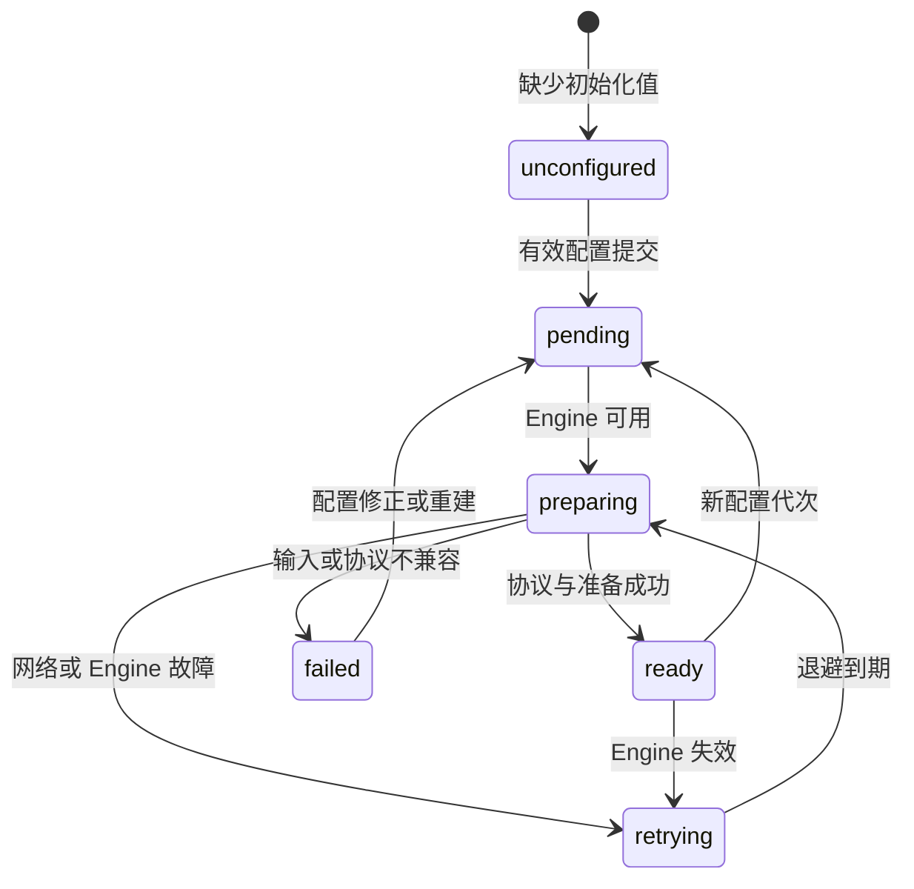
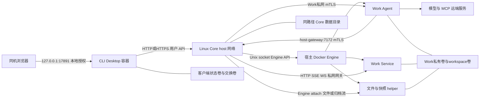

# Design

## Context

动机与交付范围见 [proposal.md](proposal.md)。以下是本方案依赖的实际代码行为，而非已经存在的 Docker 交付能力：

| 现状 | 对设计的影响 |
| --- | --- |
| `internal/coreapp/serve.go` 已解析初始化 env；`settings.go` 保存模型 secret，已有值不被初始化覆盖 | 复用初始化，不设计第二套配置库；修改已有配置走 operator |
| `application.go` 的启动/刷新目前同步准备镜像，单次一分钟；file/snapshot helper 首次尝试即记录 captured | 冷启动大镜像与首轮失败需要后台准备和可重试状态 |
| `internal/dockerengine` 使用 Go Engine API，Agent 的 `ControlHost` 写入 `piwork-core:host-gateway` | Core 不需要容器内 Docker CLI；Agent 控制回连需要宿主网络端口 |
| Work Agent、Service 的探测/流量由 Core 直连 Work 私网 IP | Core 采用 Linux host 网络，复用现有路由，无需新设计跨 bridge 接入 |
| Agent bind mount 的 source 使用 Core 内部绝对路径 | Core 容器与 Engine 宿主必须使用相同绝对数据路径 |
| CLI 已内嵌 Desktop，Linux 控制通道位于私有临时目录，open/logout 绑定 UID 和实例 | 在同一个运行中的 CLI 容器 exec；共享凭证卷不等于共享实例控制通道 |
| Desktop/proxy 原生只监听 127.0.0.1；proxy 部分入口校验 TCP loopback 对端 | 增加显式容器模式，但保留 Host/Origin/本地授权 |
| 已有 Agent/file/snapshot 镜像，当前 helper 与发行目标为 amd64 | 首发只声明完整可验证的 linux/amd64 组合 |
| `AdminStatus` 为严格 DTO；原生 CLI 有独立 Windows/Linux 构建和未完成验收 | 不向所有状态 DTO 塞新字段，不借 Docker 完成原生平台门禁 |

## Goals / Non-Goals

**Goals:** 把“两个入口镜像”变为可复现的安装与使用路径，明确所有运行依赖、文件位置、身份和重建规则；通过真实 Core/Desktop 使用证据判断闭环。新增行为遵循本变更的四份 specs。

**Non-Goals:** 不改变 Work/Run/Service/Files/快照格式、管理端产品、模型 HTTP 放行策略和原生默认行为。无 Desktop Docker 交付命令与能力，但不新增独立 Docker 端到端验收门禁。验证后的本次修复不执行发行、镜像 push、包上传、Release 创建或托管配置，不新增自动发行流程，不索取发布地址/凭证，不把公共下载入口验收作为修复完成条件。

## Decisions

### 1. 发行物、构建与平台

新增 `Dockerfile.core`、`Dockerfile.cli`、`deploy/docker/` 下发行模板和独立的维护者 Docker 构建/打包工具；用户入口仍只有现有两种二进制。运行层使用按发行配置固定 digest 的 Alpine 3.22、CA 与 curl（CLI 另带 jq 处理公开配置 JSON），CGO=0；Core 只包含 `piwork-serve`，CLI 包含内嵌最新 Desktop 的 `piwork-cli`。不在这两个入口镜像安装 Go/Node/Python/Docker CLI。Agent 继续带运行任务所需 SDK/Node，属于 Core 自动管理的运行镜像。

构建工具复用 Go 1.25.5 和 Node 24 的既有工具链、版本标识与 Desktop 资源构建；固定源码提交，拒绝混合/陈旧资源。两入口及 Agent/helper 使用同一 release manifest，校验镜像平台、不可变 ID、原生协议 label 和相应程序 `--version`。package helper 指向发布 Agent digest；file/snapshot 使用既有独立镜像。维护者配置 `PIWORK_RELEASE_REGISTRY` 提供真实发布前缀；打包前验证每个 digest 可读取并写入 `release.env`。不在方案里虚构已有镜像地址或版本。

发布包目录如下，原生 CLI 包继续由既有链发布：

```text
piwork-docker/
  release.env
  core.env.example
  client.env.example
  compose.core.yaml
  compose.cli.yaml
  compose.cli.linux.yaml
  README.zh-CN.md
  release-manifest.json
  SHA256SUMS
```

`release.env` 只有下列无秘密字段，值由实际发布结果生成，不由用户寻找内部 helper：`PIWORK_RELEASE_VERSION`、`PIWORK_CORE_IMAGE`、`PIWORK_CLI_IMAGE`、`PIWORK_AGENT_IMAGE`、`PIWORK_PACKAGE_HELPER_IMAGE`、`PIWORK_FILE_HELPER_IMAGE`、`PIWORK_SNAPSHOT_HELPER_IMAGE`。全部镜像为固定 digest 引用。默认公开可读取；私有 registry 只允许另行文档化的显式静态认证，不依赖容器里不存在的宿主 credential helper。

`release-manifest.json` 固定 `manifestVersion=1`，记录 releaseVersion、sourceCommit、各镜像的实际 reference/digest/platform/protocolLabels、Core format 与 schemaVersion、客户端凭证格式版本、兼容的前版 releaseVersion 列表及允许直接回退的前版列表。列表由格式/协议兼容检查和相应证据生成；无证据的旧版不能默认列为可回退。SHA256SUMS 覆盖发行包内所有其他文件，压缩包自身 SHA256 单独附于发行页。

安装校验从已取得的本机压缩包及可信 SHA256 开始。用户已有包/校验文件的实际 HTTP/HTTPS 地址时，可选择手册的下载入口；Linux Bash 与 Windows PowerShell 均先比较预期压缩包 SHA256，成功后才解压，再核对内部 SHA256SUMS。下载或校验失败时终止，不以包内自带清单替代外部压缩包校验。可选下载命令只说明使用方法，不引入发布站点、上传流程或自动发行功能。

离线取得压缩包的用户从已有包和可信 SHA256 开始同样的校验、解压及安装步骤，不再要求填写下载 URL。这里的离线仅指安装材料的取得；镜像拉取仍要求既有网络和 registry 可读，不引入离线镜像 bundle。

**本次修复边界：** 仅修正 Core 关闭规范及完整安装/校验命令、刷新本机候选材料和复核对应证据。此前已授权完成的镜像交付及 D01–D09 实机使用结果保留。实际对外发行由维护者另行决定，本次不执行、不索取发布地址或凭证，也不以尚无公共下载入口为阻塞项。本机打包只读取已验证镜像并生成文件，不能触发 push、上传或创建 Release。

Core 正常关闭的统一决策为：停止接收新任务和调度，在原有总预算内排空执行、收尾受管任务，并确认本安装全部 Work 的 Agent/Service 已停才报告正常关闭成功。一个 Work 失败仍尝试其他 Work；不能确认全部停止时非零退出并保留诊断。数据、配置、历史、desiredState 和 Service 启用意图保持，重启恢复原本期望 running 的 Work，明确 stopped 的 Work 保持停止。此决策沿用已有实现和 work-lifecycle；需要通过本变更的 core-service-startup MODIFIED requirements 修正旧的正常关闭保持容器运行以及对应重启场景，后续同步时将主规范统一。SIGKILL/崩溃/断电不作为关闭成功证据，不新增进程外监护机制；CLI 退出不停止 Work。

基线为 Linux Docker Engine 28+、Compose v2.24+；Windows Docker Desktop 使用 Linux 容器且满足所带 Engine/Compose 基线。记录实际测试版本，而非把最低版本号视为验证结果。此版本只发布 linux/amd64；Docker 能运行镜像不代表其他架构的 Agent/helper 已兼容。

选择独立 Docker 发布链而非替换原生链，是为了让原生用户继续直接安装；选择两入口加配套依赖镜像而非宣称全程仅两个容器，是因为 Agent/helper/Service 的既有隔离与生命周期本来由 Core 管理。

### 2. Compose 的确定配置

`core.env.example` 提供数据路径、7171/7172 监听及初始化字段，账号、密码、provider、model、key 均明确要求填写；可选 Base URL 行默认注释，不能用空字符串。Core 环境文件可用单引号保留 `$` 等秘密字节，遵守 Compose env 语法，不复制给 `docker run --env-file` 使用。`client.env.example` 使用无引号的普通值，适用于 Compose 与 Docker run：

```dotenv
PIWORK_CORE_URL=http://host.docker.internal:7171
PIWORK_CONFIG_PATH=/var/lib/piwork/client/credentials.json
PIWORK_CLI_CONTAINER_MODE=1
```

此默认 URL 只用于 Core 确实在 CLI 的 Linux 宿主上；Windows 用户必须填其可达的 Linux Core LAN/HTTPS 地址。双方均可填远端 Core，不要求同一电脑。

Core Compose 的规范骨架：

```yaml
name: piwork-core
services:
  core:
    image: ${PIWORK_CORE_IMAGE:?必须使用发行 release.env}
    init: true
    user: "0:0"
    network_mode: host
    command: ["serve", "--allow-insecure-remote"]
    env_file: [./core.env]
    environment:
      DOCKER_HOST: unix:///var/run/docker.sock
      DOCKER_CONTEXT: ""
      PIWORK_DATA_DIR: ${PIWORK_DATA_DIR:?必须设置绝对路径}
      PIWORK_CORE_URL: http://127.0.0.1:7171
      PIWORK_AGENT_IMAGE: ${PIWORK_AGENT_IMAGE:?}
      PIWORK_PACKAGE_HELPER_IMAGE: ${PIWORK_PACKAGE_HELPER_IMAGE:?}
      PIWORK_FILE_HELPER_IMAGE: ${PIWORK_FILE_HELPER_IMAGE:?}
      PIWORK_SNAPSHOT_HELPER_IMAGE: ${PIWORK_SNAPSHOT_HELPER_IMAGE:?}
    volumes:
      - type: bind
        source: /var/run/docker.sock
        target: /var/run/docker.sock
      - type: bind
        source: ${PIWORK_DATA_DIR:?}
        target: ${PIWORK_DATA_DIR:?}
        bind:
          create_host_path: false
      - type: bind
        source: /var/lib/piwork/core-exchange
        target: /var/lib/piwork/core-exchange
        bind:
          create_host_path: false
    stop_grace_period: 60s
    restart: unless-stopped
    healthcheck:
      test: ["CMD", "curl", "--fail", "--silent", "--show-error", "--max-time", "3", "http://127.0.0.1:7171/readyz?profile=docker-delivery"]
      interval: 5s
      timeout: 4s
      retries: 120
      start_period: 10s
```

Core image ENTRYPOINT 为 `piwork-serve`。env 设置 `PIWORK_LISTEN=0.0.0.0:7171`、`PIWORK_AGENT_GRPC_LISTEN=0.0.0.0:7172`、`PIWORK_AGENT_GRPC_ADVERTISE=piwork-core:7172`。Core 使用 host 网络，不写 `ports`。宿主网络使 Core 可达 Work IP，Agent 的 host-gateway 地址可达 7172；宿主防火墙必须允许 Work bridge 到 7172。7172 只接受已有 Work/generation/角色 mTLS，HTTP 用户接口仍使用既有用户认证；明文远程 opt-in 已在命令中显式给出。需要公网 TLS 时复用用户既有 HTTPS 入口，不能让用户以为该示例已经自动部署 TLS。[Docker host 网络](https://docs.docker.com/engine/network/drivers/host/)

`/var/lib/piwork/core-exchange` 只用于 operator 的 Skill/package/config 输入，和 Core 数据独立。Core 默认 UID 0 能访问常规 rootful socket 和新目录；已有非 root 数据使用显式 `user` 与 socket 所在补充组的 Compose 覆盖，不执行递归 chown。初版只支持本机 rootful Engine socket，remote Engine、rootless 和 Docker Desktop 上的 Core 不是这一交付基线。

CLI Compose 的规范骨架：

```yaml
name: piwork-client
services:
  cli:
    image: ${PIWORK_CLI_IMAGE:?必须使用发行 release.env}
    init: true
    user: "0:0"
    command: ["desktop", "--no-open"]
    env_file: [./client.env]
    environment:
      PIWORK_CLI_CONTAINER_MODE: "1"
      PIWORK_CONFIG_PATH: /var/lib/piwork/client/credentials.json
    ports: ["127.0.0.1:17891:17891"]
    volumes:
      - client-state:/var/lib/piwork/client
      - client-exchange:/exchange
    networks: [local]
    restart: unless-stopped
    stop_grace_period: 15s
    healthcheck:
      test: ["CMD", "curl", "--fail", "--silent", "--show-error", "--output", "/dev/null", "--max-time", "3", "--header", "Host: desktop.localhost:17891", "http://127.0.0.1:17891/"]
      interval: 5s
      timeout: 4s
      retries: 3
networks:
  local:
    name: piwork-client-local
volumes:
  client-state:
    name: piwork-client-state
  client-exchange:
    name: piwork-client-exchange
```

CLI image ENTRYPOINT 为 `piwork-cli`，CMD 为 `desktop --no-open`，image 中不设 HEALTHCHECK，使一次性业务命令不继承 Desktop 健康要求。状态目录由既有 private-file 逻辑创建成 0700、凭证 0600；交换卷不自动扫描或执行文件。CLI 不挂载 socket、Core 或 Work 的卷。

Linux 覆盖文件仅含：

```yaml
services:
  cli:
    extra_hosts: ["host.docker.internal:host-gateway"]
```

Windows 不加载此文件，保留 Desktop 内建宿主别名。bridge 保持默认隔离和 NAT，不开启 direct routing，不把不可信服务接入客户端网络；端口只发布本机。Engine 28+ 避免旧版本 localhost 发布端口的已知边界。容器内部对端不同于原生 TCP loopback，所以认证依靠严格本地 Host/Origin 与实际 ticket/session，而非信任 X-Forwarded-*。[Docker 端口发布](https://docs.docker.com/engine/network/port-publishing/)、[Desktop 网络](https://docs.docker.com/desktop/features/networking/networking-how-tos/)

基线端口固定 17891/17890。若占用，先停止冲突实例；确需改变时必须同时改 CLI `--port`、内外发布端口、health Host 与浏览器 URL，禁止仅把 `17892:17891` 当成完整配置。

### 3. 后台准备、恢复和兼容探针

改造 `Application.Listen/RefreshRuntime`：监听、初始化持久身份及调度准备后返回；状态读取只取快照。原调用准备的配置入口在持久化及必要默认字段同步后调度新代次，使用现有返回体，不能在 HTTP 请求里等待镜像拉取。`/api/v1/admin/runtime` 继续返回已保存 runtime 与真实非 ready AdminStatus；operator `config set` 确认保存后返回原 RuntimeView/exit 0，不再因后台尚未 ready 返回保存失败，后续用现有 status/探针核实运行可用性。此提交语义变更在 CORE-DOCKER-PREP-001 明确规定；输入或持久失败仍用原错误。用户业务 API 继续按当前可用性拒绝未准备的操作。

后台准备分为：

1. 有管理员与 runtime 后，建立 Engine 连接、检查权限/平台；无配置为 unconfigured，health 保持可访问。
2. 以配置 revision 和精确镜像引用为键准备 Agent、package/file/snapshot helper；最多两个并行准备任务，同一引用的拉取合并，同一组件只有一个活动尝试。
3. Agent/package helper 可用后运行既有 SDK/原生协议检查、package 恢复、默认 brain 上下文和默认配置同步；管理员已移除/禁用的 seed 不强制恢复，已完成的 seed 标记仍有效。
4. 执行现有快照/文件/Work 恢复，基础运行准备完成才进入既有 READY；file/snapshot 独立发布能力，缺失时保持原降级。依赖 helper 的恢复先保留持久意图，helper 就绪后再恢复，不能为了等待它阻塞其他 Work 恢复或将未知结果写成已完成。
5. 每两秒 Engine 探测，单次至多三秒；最多五秒撤销依赖失效的 readiness，再调度重试。现有 250ms/2s Work recovery/reconcile 循环继续负责原对象，不能另起一套代次/清理机制。

镜像及默认上下文每次准备十分钟上限；失败重试 delay=1/5/15/30/60 秒，后续 60 秒封顶，无限次可恢复外部故障不得变成不可恢复的 captured 标记。引用语法/OS/架构/原生协议错误为 failed，不热循环；Agent/profile 修改触发新代次，helper env 修改需重建 Core。普通网络、Engine、registry 拉取失败为 retrying，安全 code 提供失败类型；公开状态不暴露上游正文。成功捕获 ID 后当前代次不随 tag 移动；启动已有 Work 使用原捕获身份。

任务准入、配置 revision 与关闭标记共享短临界区，所有长 I/O 在锁外；关闭取消任务并在现有 45 秒 Core 关闭预算内回收，Compose 留 60 秒。旧代次结果不得发布到新状态；默认上下文/恢复的持久意图和清理由现有事务及安装身份约束保证幂等。file/snapshot helper 的 success-only 捕获与失败重试需替代当前 captured-on-attempt 行为。



`/control/status` 的新字段示例：

```json
{
  "state": "READY",
  "ready": true,
  "checks": {"administrator": true, "runtimeConfigured": true, "runtimeAvailable": true, "filesystemMigrationReady": true},
  "preparation": {
    "version": 1,
    "ready": false,
    "components": {
      "docker": {"state": "ready", "attempt": 1, "retryAfterSeconds": null, "code": null},
      "agent": {"state": "ready", "attempt": 1, "retryAfterSeconds": null, "code": null},
      "packageHelper": {"state": "ready", "attempt": 1, "retryAfterSeconds": null, "code": null},
      "defaultContext": {"state": "ready", "attempt": 1, "retryAfterSeconds": null, "code": null},
      "fileHelper": {"state": "retrying", "attempt": 2, "retryAfterSeconds": 5, "code": "IMAGE_UNAVAILABLE"},
      "snapshotHelper": {"state": "ready", "attempt": 1, "retryAfterSeconds": null, "code": null}
    }
  }
}
```

`preparation.ready` 为组件就绪 AND；`/readyz?profile=docker-delivery` 的 ready 还与基础 ready AND，503 的 reason 按 specs。组件都 ready 但业务恢复未完成仍是 503；探针不调用模型、不签发 ticket。默认 `/readyz` JSON 与 `AdminStatus` 均保持原契约。`piwork-serve status` 成功读取的现有退出语义保持，不能用它的 exit 0 替代完整 readiness。现有 spec 个别 status 文字与当前退出实现不一致，本变更不顺带改其退出码。

选择复用就绪 profile 与现有 status，放弃新增 `deployment status/wait`、`desktop status`：Docker Compose 的 health/`up --wait` 足以承载安装等待，避免新增用户概念。单次 `--wait-timeout 600` 到期不终止 Core 后台准备，用户可检查状态后再次等待。

### 4. Desktop 本机授权和容器模式

在 CLI 本地监听/浏览器策略集中解析 `PIWORK_CLI_CONTAINER_MODE`，按 specs 的 1/0/非法值规则处理。原生用户不设置此值，无行为改变。

Desktop 保持 `desktop.localhost` 精确 Host、Origin/CSRF、五分钟一次性 ticket、十二小时浏览器会话及 128 会话边界。容器 PID 1 启动不打印 ticket、不调用系统浏览器，只打印安全 origin 和恢复命令。健康请求只能拿公开静态页面，不能签发 ticket 或获得平台身份。`docker compose exec ... piwork-cli desktop open --no-open` 经 Linux 容器内部 Unix 控制通道返回新链接至 exec 调用方；这个输出不属于容器主进程日志。logout 仍按原本地撤销、五秒远端尝试、条件凭证清理和退出码执行。

proxy 模式中 Docker NAT 对端允许通过显式容器模式的传输门槛；PAC/WebDAV 的精确 Host/来源、Basic、平台 token 剥离及 service 应用认证隔离全部保持，原生仍要求 loopbackPeer。普通业务命令不需要容器模式就能访问远端 Core。文件请求不能因增加监听地址而借用平台身份。

状态卷与交换卷显式命名，可给 Desktop 和一次性 CLI 共用。对另一个 CLI 写入的新平台账号，运行 Desktop 不自动重新登录；先通过原实例 logout 或浏览器注销管理旧身份，然后重启 Desktop、open，读取新的保存状态或重新登录。只改 `client.env` 的 Core 地址必须重建，不能以 `restart` 宣称载入新环境。CLI 关闭/浏览器关闭不停止任何 Work。

### 5. 数据与身份交互流程



| 流程 | 完整路径与完成条件 |
| --- | --- |
| 首次启动 | env → Core 私有 store/secret → socket 检查/镜像准备/协议检查/默认上下文/恢复 → profile ready；不预建 Work |
| 本机浏览器授权 | 同容器 exec open → 一次性本地 ticket → 宿主浏览器兑换 HttpOnly 会话；未兑换不能借用已保存 Core 凭证 |
| Core 登录 | 浏览器本地会话+CSRF → CLI → Core login → Core 保存 token digest，CLI 私有卷保存用户 token；浏览器不获得 Core token |
| 创建 Work/Run | CLI 用户 API → Core 所有权/幂等检查与 Operation → Engine Agent/卷/私网 → Agent ready → Session/Run；ID 保存在 Core，断开观察不取消任务 |
| 模型与 MCP | Agent 从只读受限运行配置/secret 使用当前 Work 模型及 MCP 出站地址；并非浏览器/CLI 代调用；目标必须从 Work 网络可达 |
| Service | Agent MCP → 7172 mTLS → Core 创建/管理 Service → Desktop 本地应用入口 → Core 用户网关 → Work 私网 Service；应用的 Cookie/Authorization 与平台凭证隔离 |
| 浏览器 Files | 浏览器本地授权 → CLI 转 Core WebDAV/用户 token → 所有权检查 → Engine attach 文件 helper → 仅 workspace 卷 → 原路返回 |
| 浏览器导出/导入 | 已确认 stopped → Core snapshot helper 流归档 → CLI/浏览器下载；上传 → Core 校验/导入新 stopped Work → 明确 start；不自动 apply pending |
| 无 Desktop 文件命令 | 宿主 docker cp → `/exchange` → CLI import/inspect/export → Core；再 cp 回宿主，交换卷本身不构成安装备份 |
| 重建 | 保留 Core store、受管卷、客户端状态卷；Core 核验原安装对象并恢复，CLI 重建后重新 open，不复用旧本地实例授权 |

数据分布如下。Core 目录含 SQLite/WAL、安装身份、operator credential、模型 secret、TLS、上下文/catalog/任务记录；权限仍为根目录 0700/私密文件 0600。Work 有 `/var/data` 私有卷与 `/var/data/workspace` 工作卷，Agent/Service 使用既有 UID 10001 规则。file helper 只看到 workspace，snapshot helper 按原任务授权读取归档所需卷；CLI 看不到这些卷。

`.work` 包括现有两卷、Work 独立配置/上下文、AGENTS、Skill/package、Service 和历史；不包含平台模型 key、用户 token 或安装证书，但用户自己写入文件的秘密仍可能包含。导入产生新 Work 且停止；模型引用/兼容镜像可用性按现有 portable-work 契约校验。快照下载结果保留 24 小时，不支持断点续传，输出路径必须不存在；不要用同名旧文件重试。

现有文件限额保持：单文件 10 GiB、树/目录项 10000、Core/用户/Work helper 并发 16/8/4、Work 写者 1。浏览器/CLI 在宿主交换卷新增文件不影响这些 Work 配额。Engine 的 bind source 在 Engine 宿主解析，因此不能用 `/srv/core:/data` 替代同路径挂载。[Docker bind mount](https://docs.docker.com/engine/storage/bind-mounts/)

外部访问分清三个环境：CLI 的公网请求走其 bridge 默认出站；CLI 访问同机服务用平台对应 host.docker.internal；Agent 的模型/MCP 请求走 Linux Core 宿主的 Work bridge。当前模型 Base URL 不接受 `http://host.docker.internal:...`，不在本变更里放开；使用从 Work 可达的 HTTPS 服务。Windows 本机服务若供远端 Agent 调用，需已有的可达 HTTPS/LAN 服务地址，而非 Windows CLI 的本机别名。

### 6. 完整操作附录的约定

以下是发行手册必须提供的完整调用契约。当前已有本机候选包、此前已授权发布的镜像与使用验收证据；本次只修正材料。镜像引用来自实际 release.env，可信预期 checksum 随候选包提供；可选下载 URL 仅在用户已有实际地址时输入。账号、模型和示例 ID 需按文字取得并替换。命令表各行是独立操作，不要求盲目按顺序执行全部破坏性业务命令。

#### 6.1 获取发行包与前置检查

完整可执行命令统一维护在 [用户手册 6.1](../../../deploy/docker/README.zh-CN.md)，包括 Linux Bash 和 Windows PowerShell 各自的已有包与可选在线下载入口，以及两平台 Docker 前置检查；不再保留只打印 hash 后立即解压的旧命令骨架。

已有包入口读取本地压缩包路径及交付者提供的可信 64 位 SHA256，格式合法且与实际 hash 一致后才解压。可选下载入口读取用户已有的实际包 URL 和校验文件 URL，检查两个下载都成功，提取校验文件中的合法预期 SHA256 并比较本地压缩包；然后解压并核对内部 SHA256SUMS。两种入口均拒绝覆盖现有安装目录。Bash 使用独立的 `set -euo pipefail` 子 shell，先捕获退出码再进入目录，不能将整个子 shell 放入 `&&` 左侧而禁用 errexit；PowerShell 使用完整 script block、`Stop` 错误策略、每次原生命令的退出码检查与 `throw`，失败不能继续解压。内部 SHA256SUMS 仅验证包内一致性，不能替代可信外部 checksum。

本次用受控本机 HTTP fixture 验证下载和校验命令，不建立公共下载站点或索取发布输入。Docker 输出必须为 Linux/amd64（Architecture 可能显示 x86_64），Windows 先在 Docker Desktop 切换 Linux 容器。不运行 `docker compose config` 输出含秘密的 Core 完整配置到日志。

#### 6.2 Linux Core 首次安装

```bash
cp core.env.example core.env
chmod 600 core.env
${EDITOR:-vi} core.env
sudo install -d -m 0700 -o 0 -g 0 /var/lib/piwork/core
sudo install -d -m 0700 -o 0 -g 0 /var/lib/piwork/core-exchange
test -S /var/run/docker.sock
docker compose --env-file release.env --env-file core.env -f compose.core.yaml pull core
docker compose --env-file release.env --env-file core.env -f compose.core.yaml up -d --wait --wait-timeout 600 core
docker compose --env-file release.env --env-file core.env -f compose.core.yaml exec -T core piwork-serve --json status
docker compose --env-file release.env --env-file core.env -f compose.core.yaml exec -T core curl --fail --silent --show-error 'http://127.0.0.1:7171/readyz?profile=docker-delivery'
docker compose --env-file release.env --env-file core.env -f compose.core.yaml logs --tail 100 core
```

填写 Core env 的真实初始化值和监听字段；若自定义数据目录，env 和两个 bind 端路径相同，先按相同绝对路径创建。运行前确认 7171/7172 可用，允许 Work bridge 回连 7172；不对整个磁盘作权限重置。已有非 root 安装必须使用匹配 UID 的覆盖文件和相应 socket group，不能直接套用新安装的目录创建命令。

等待超时后根据 status 的准备组件与日志修正网络/镜像/配置，再重复同一 `up -d --wait --wait-timeout 600 core`。Core 自动 pull/retry，不添加手动 Agent/helper pull 步骤。若初始化值格式错误，先修正 core.env 再 `up --force-recreate`；已保存值的修改用 6.4。

#### 6.3 启动 CLI Desktop、重新打开和注销

Linux 用户电脑：

```bash
cp client.env.example client.env
chmod 600 client.env
${EDITOR:-vi} client.env
docker compose --env-file release.env --env-file client.env -f compose.cli.yaml -f compose.cli.linux.yaml pull cli
docker compose --env-file release.env --env-file client.env -f compose.cli.yaml -f compose.cli.linux.yaml up -d --wait --wait-timeout 60 cli
docker compose --env-file release.env --env-file client.env -f compose.cli.yaml exec -T cli piwork-cli desktop open --no-open
```

Windows 用户电脑：

```powershell
Copy-Item .\client.env.example .\client.env
notepad .\client.env
docker compose --env-file release.env --env-file client.env -f compose.cli.yaml pull cli
docker compose --env-file release.env --env-file client.env -f compose.cli.yaml up -d --wait --wait-timeout 60 cli
docker compose --env-file release.env --env-file client.env -f compose.cli.yaml exec -T cli piwork-cli desktop open --no-open
```

Windows client.env 必须填可达的 Linux Core 地址。将 open 输出的完整链接粘贴到**同机宿主浏览器**，兑换本地授权后输入 Core 账号和密码；无有效 Core 登录时可使用本地 Inspect，不能访问 Work。链接过期执行同一 open；容器日志只用于诊断，不用于寻找授权链接。

以下命令 Bash/PowerShell 都可直接执行；它们使用同一 Compose project，exec/cp/ps 不重建已有容器，因此 Linux 不需要在每次 exec 再加网络覆盖文件：

```text
docker compose --env-file release.env --env-file client.env -f compose.cli.yaml ps
docker compose --env-file release.env --env-file client.env -f compose.cli.yaml logs --tail 100 cli
docker compose --env-file release.env --env-file client.env -f compose.cli.yaml exec -T cli piwork-cli desktop open --no-open
docker compose --env-file release.env --env-file client.env -f compose.cli.yaml exec -T cli piwork-cli desktop logout
docker compose --env-file release.env --env-file client.env -f compose.cli.yaml restart cli
docker compose --env-file release.env --env-file client.env -f compose.cli.yaml exec -T cli piwork-cli desktop open --no-open
docker compose --env-file release.env --env-file client.env -f compose.cli.yaml stop cli
docker compose --env-file release.env --env-file client.env -f compose.cli.yaml down
```

restart 用于原环境下的新进程；改变 client.env/release.env 后，Linux 重复带 `compose.cli.linux.yaml` 的 `up -d --force-recreate --wait --wait-timeout 60 cli`，Windows 用基本配置的相同 up 命令。完整重建命令见 6.7。新进程都执行 open。`desktop logout` 和普通 `logout` 作用不同：前者清理指定运行 Desktop 的内存身份/派生访问，后者只操作本次业务客户端保存的会话。

#### 6.4 Core operator 完整命令

在 **Linux Core 发行包目录**执行，全部调用目标容器内已有 `piwork-serve` 和 operator credential。密码/key 默认 TTY 提示不回显；非交互可用各命令已有 `--password-stdin`/`--api-key-stdin` 与 `exec -T`，不把秘密写进参数。首管理员 bootstrap 仅适用于初始化未提供管理员的空安装；常规首次启动已由 env 完成。

下面清单中的 `USER_ID` 来自 users list，`OPERATION_ID` 来自 mutation 返回，`AGENT_IMAGE_REF` 为发行镜像或管理员选定的兼容 Docker ref，`PROVIDER`/`MODEL` 为实际模型值。Skill 目录和包文件先按紧随清单的 cp 步骤取得；同一组 clear/set、enable/disable/remove 是可选操作。

```bash
AGENT_IMAGE_REF=$(sed -n 's/^PIWORK_AGENT_IMAGE=//p' release.env)
read -r -p '实际模型 provider：' PROVIDER
read -r -p '实际模型 ID：' MODEL
```

```text
docker compose --env-file release.env --env-file core.env -f compose.core.yaml exec core piwork-serve --help
docker compose --env-file release.env --env-file core.env -f compose.core.yaml exec core piwork-serve --version
docker compose --env-file release.env --env-file core.env -f compose.core.yaml exec core piwork-serve --json status
docker compose --env-file release.env --env-file core.env -f compose.core.yaml exec core piwork-serve admin bootstrap --account admin
docker compose --env-file release.env --env-file core.env -f compose.core.yaml exec core piwork-serve admin users list
docker compose --env-file release.env --env-file core.env -f compose.core.yaml exec core piwork-serve admin users create --account demo-user --role user
docker compose --env-file release.env --env-file core.env -f compose.core.yaml exec core piwork-serve admin users create --account second-admin --role admin
docker compose --env-file release.env --env-file core.env -f compose.core.yaml exec core piwork-serve admin users enable USER_ID
docker compose --env-file release.env --env-file core.env -f compose.core.yaml exec core piwork-serve admin users disable USER_ID
docker compose --env-file release.env --env-file core.env -f compose.core.yaml exec core piwork-serve admin users reset-credential USER_ID
docker compose --env-file release.env --env-file core.env -f compose.core.yaml exec core piwork-serve config show
docker compose --env-file release.env --env-file core.env -f compose.core.yaml exec core piwork-serve config set --agent-image "$AGENT_IMAGE_REF" --model-provider "$PROVIDER" --model "$MODEL"
docker compose --env-file release.env --env-file core.env -f compose.core.yaml exec core piwork-serve config set --agent-image "$AGENT_IMAGE_REF" --model-provider "$PROVIDER" --model "$MODEL" --model-base-url https://models.example.com/v1 --api-key-file /var/lib/piwork/core-exchange/model-api-key
docker compose --env-file release.env --env-file core.env -f compose.core.yaml exec core piwork-serve config default-work show
docker compose --env-file release.env --env-file core.env -f compose.core.yaml exec core piwork-serve config default-work set --base-image "$AGENT_IMAGE_REF" --skill my-skill --package my-package --agents-md-file /var/lib/piwork/core-exchange/AGENTS.md
docker compose --env-file release.env --env-file core.env -f compose.core.yaml exec core piwork-serve config default-work set --no-skills --no-packages
docker compose --env-file release.env --env-file core.env -f compose.core.yaml exec core piwork-serve skills list
docker compose --env-file release.env --env-file core.env -f compose.core.yaml exec core piwork-serve skills show my-skill
docker compose --env-file release.env --env-file core.env -f compose.core.yaml exec core piwork-serve skills add --path /var/lib/piwork/core-exchange/my-skill
docker compose --env-file release.env --env-file core.env -f compose.core.yaml exec core piwork-serve skills update my-skill --path /var/lib/piwork/core-exchange/my-skill
docker compose --env-file release.env --env-file core.env -f compose.core.yaml exec core piwork-serve skills enable my-skill
docker compose --env-file release.env --env-file core.env -f compose.core.yaml exec core piwork-serve skills disable my-skill
docker compose --env-file release.env --env-file core.env -f compose.core.yaml exec core piwork-serve skills remove my-skill
docker compose --env-file release.env --env-file core.env -f compose.core.yaml exec core piwork-serve packages list
docker compose --env-file release.env --env-file core.env -f compose.core.yaml exec core piwork-serve packages show my-package
docker compose --env-file release.env --env-file core.env -f compose.core.yaml exec core piwork-serve packages install /var/lib/piwork/core-exchange/my-package.zip --default --wait --verbose
docker compose --env-file release.env --env-file core.env -f compose.core.yaml exec core piwork-serve packages install npm:PACKAGE_SPEC --wait
docker compose --env-file release.env --env-file core.env -f compose.core.yaml exec core piwork-serve packages install git+https://GIT_REPOSITORY#REF --wait
docker compose --env-file release.env --env-file core.env -f compose.core.yaml exec core piwork-serve packages update my-package --source /var/lib/piwork/core-exchange/my-package-v2.zip --wait --verbose
docker compose --env-file release.env --env-file core.env -f compose.core.yaml exec core piwork-serve packages enable my-package
docker compose --env-file release.env --env-file core.env -f compose.core.yaml exec core piwork-serve packages disable my-package
docker compose --env-file release.env --env-file core.env -f compose.core.yaml exec core piwork-serve packages remove my-package
docker compose --env-file release.env --env-file core.env -f compose.core.yaml exec core piwork-serve operation show OPERATION_ID
```

输入文件复制和权限准备：

```bash
docker compose --env-file release.env --env-file core.env -f compose.core.yaml cp ./my-skill core:/var/lib/piwork/core-exchange/my-skill
docker compose --env-file release.env --env-file core.env -f compose.core.yaml cp ./my-package.zip core:/var/lib/piwork/core-exchange/my-package.zip
docker compose --env-file release.env --env-file core.env -f compose.core.yaml cp ./my-package-v2.zip core:/var/lib/piwork/core-exchange/my-package-v2.zip
docker compose --env-file release.env --env-file core.env -f compose.core.yaml cp ./AGENTS.md core:/var/lib/piwork/core-exchange/AGENTS.md
docker compose --env-file release.env --env-file core.env -f compose.core.yaml cp ./model-api-key core:/var/lib/piwork/core-exchange/model-api-key
docker compose --env-file release.env --env-file core.env -f compose.core.yaml exec -T core chmod 600 /var/lib/piwork/core-exchange/model-api-key
docker compose --env-file release.env --env-file core.env -f compose.core.yaml exec -T core rm /var/lib/piwork/core-exchange/model-api-key
```

最后一行仅在完成使用后执行；secret 输入优先使用 TTY，以免产生临时 secret 文件。Skill 需为实际有效目录，package 的名字由元数据决定，查询 list 后替换 my-package；npm/git 示例需替换真实可安装 source。Core config/default-work 变更只影响后续新 Work。operator 的 base-image 是 Docker ref，而用户 work create 的 base-image 是 Core 返回的 catalog ID，两者不能互换。

#### 6.5 无 Desktop CLI Docker：完整业务命令

此节交付能力和操作文档，不作为本次 Docker 端到端验收。使用同一 CLI 镜像/状态卷，每条命令结束即移除临时容器；无需启动 Desktop，CLI 镜像没有 Desktop HEALTHCHECK。镜像预建状态目录为 0700，并创建 /exchange，确保命名卷初次挂载与私有文件检查相容。

首次创建命名卷与独立命令网络；如果 Desktop 已创建状态/交换卷，volume create 可重复，网络已有时先 inspect 并跳过 create。

```text
docker volume create piwork-client-state
docker volume create piwork-client-exchange
docker network create piwork-cli-commands
docker network inspect piwork-cli-commands
```

Linux Bash 取得实际镜像，输入可从客户端容器直接访问的 Core LAN/HTTPS 地址：

```bash
CLI_IMAGE=$(sed -n 's/^PIWORK_CLI_IMAGE=//p' release.env)
read -r -p '实际可达的 Core HTTP/HTTPS origin：' CORE_URL
```

Windows PowerShell：

```powershell
$CLI_IMAGE = (Get-Content .\release.env | Where-Object { $_.StartsWith('PIWORK_CLI_IMAGE=') } | Select-Object -First 1).Substring('PIWORK_CLI_IMAGE='.Length)
$CORE_URL = Read-Host '实际可达的 Linux Core HTTP/HTTPS origin'
```

这两个变量都是现有 Docker 参数值，不是新增命令概念。下列各行可在两种 shell 使用；显式 env 覆盖 client.env 的 Core URL。Linux 同机 Core 若没有 LAN 名称，可将 CORE_URL 设为实际 Engine host-gateway 地址：

```bash
CORE_GATEWAY=$(docker network inspect bridge --format '{{(index .IPAM.Config 0).Gateway}}')
CORE_URL="http://${CORE_GATEWAY}:7171"
```

此替代仅适用于上述 Linux Core host 网络和默认 Engine host-gateway；Windows 仍使用远端 Linux Core。网络选择改变不修改 Agent 的模型/MCP 配置。普通业务命令也可在已运行 Desktop 容器用同一原生命令执行，但登录账号/Core 变更后应按 6.3 重启 Desktop。

ID 取得规则：work create/list/show 提供 WORK_ID 和 OPERATION_ID；session create/list 提供 SESSION_ID；chat/run 结果提供 RUN_ID；work service list 提供 SERVICE_ID；export 返回快照及 Operation 信息。用原 ID 查询，不能为了检查接受结果重新提交 mutation。IMAGE_CATALOG_ID 从默认/Work 配置的 configuration.agentImage.catalogId 取得，不填写镜像 tag。

```text
docker run --rm --init -it --network piwork-cli-commands --env-file client.env --env PIWORK_CORE_URL="$CORE_URL" --mount type=volume,src=piwork-client-state,dst=/var/lib/piwork/client --mount type=volume,src=piwork-client-exchange,dst=/exchange "$CLI_IMAGE" help
docker run --rm --init -it --network piwork-cli-commands --env-file client.env --env PIWORK_CORE_URL="$CORE_URL" --mount type=volume,src=piwork-client-state,dst=/var/lib/piwork/client --mount type=volume,src=piwork-client-exchange,dst=/exchange "$CLI_IMAGE" --version
docker run --rm --init -it --network piwork-cli-commands --env-file client.env --env PIWORK_CORE_URL="$CORE_URL" --mount type=volume,src=piwork-client-state,dst=/var/lib/piwork/client --mount type=volume,src=piwork-client-exchange,dst=/exchange "$CLI_IMAGE" --json status
docker run --rm --init -it --network piwork-cli-commands --env-file client.env --env PIWORK_CORE_URL="$CORE_URL" --mount type=volume,src=piwork-client-state,dst=/var/lib/piwork/client --mount type=volume,src=piwork-client-exchange,dst=/exchange "$CLI_IMAGE" login --account demo-user
docker run --rm --init -it --network piwork-cli-commands --env-file client.env --env PIWORK_CORE_URL="$CORE_URL" --mount type=volume,src=piwork-client-state,dst=/var/lib/piwork/client --mount type=volume,src=piwork-client-exchange,dst=/exchange "$CLI_IMAGE" whoami
docker run --rm --init -it --network piwork-cli-commands --env-file client.env --env PIWORK_CORE_URL="$CORE_URL" --mount type=volume,src=piwork-client-state,dst=/var/lib/piwork/client --mount type=volume,src=piwork-client-exchange,dst=/exchange "$CLI_IMAGE" logout
docker run --rm --init -it --network piwork-cli-commands --env-file client.env --env PIWORK_CORE_URL="$CORE_URL" --mount type=volume,src=piwork-client-state,dst=/var/lib/piwork/client --mount type=volume,src=piwork-client-exchange,dst=/exchange "$CLI_IMAGE" skills list
docker run --rm --init -it --network piwork-cli-commands --env-file client.env --env PIWORK_CORE_URL="$CORE_URL" --mount type=volume,src=piwork-client-state,dst=/var/lib/piwork/client --mount type=volume,src=piwork-client-exchange,dst=/exchange "$CLI_IMAGE" skills show my-skill
docker run --rm --init -it --network piwork-cli-commands --env-file client.env --env PIWORK_CORE_URL="$CORE_URL" --mount type=volume,src=piwork-client-state,dst=/var/lib/piwork/client --mount type=volume,src=piwork-client-exchange,dst=/exchange "$CLI_IMAGE" packages list
docker run --rm --init -it --network piwork-cli-commands --env-file client.env --env PIWORK_CORE_URL="$CORE_URL" --mount type=volume,src=piwork-client-state,dst=/var/lib/piwork/client --mount type=volume,src=piwork-client-exchange,dst=/exchange "$CLI_IMAGE" packages show my-package
docker run --rm --init -it --network piwork-cli-commands --env-file client.env --env PIWORK_CORE_URL="$CORE_URL" --mount type=volume,src=piwork-client-state,dst=/var/lib/piwork/client --mount type=volume,src=piwork-client-exchange,dst=/exchange "$CLI_IMAGE" work create --name docker-demo --wait --idempotency-key docker-demo-create-1
docker run --rm --init -it --network piwork-cli-commands --env-file client.env --env PIWORK_CORE_URL="$CORE_URL" --mount type=volume,src=piwork-client-state,dst=/var/lib/piwork/client --mount type=volume,src=piwork-client-exchange,dst=/exchange "$CLI_IMAGE" work create --name docker-configured --base-image IMAGE_CATALOG_ID --skill my-skill --package my-package --agents-md-file /exchange/AGENTS.md --wait --idempotency-key docker-demo-create-2
docker run --rm --init -it --network piwork-cli-commands --env-file client.env --env PIWORK_CORE_URL="$CORE_URL" --mount type=volume,src=piwork-client-state,dst=/var/lib/piwork/client --mount type=volume,src=piwork-client-exchange,dst=/exchange "$CLI_IMAGE" work create --name docker-empty-context --no-skills --no-packages --config /exchange/work-config.json --wait
docker run --rm --init -it --network piwork-cli-commands --env-file client.env --env PIWORK_CORE_URL="$CORE_URL" --mount type=volume,src=piwork-client-state,dst=/var/lib/piwork/client --mount type=volume,src=piwork-client-exchange,dst=/exchange "$CLI_IMAGE" work list
docker run --rm --init -it --network piwork-cli-commands --env-file client.env --env PIWORK_CORE_URL="$CORE_URL" --mount type=volume,src=piwork-client-state,dst=/var/lib/piwork/client --mount type=volume,src=piwork-client-exchange,dst=/exchange "$CLI_IMAGE" work show WORK_ID
docker run --rm --init -it --network piwork-cli-commands --env-file client.env --env PIWORK_CORE_URL="$CORE_URL" --mount type=volume,src=piwork-client-state,dst=/var/lib/piwork/client --mount type=volume,src=piwork-client-exchange,dst=/exchange "$CLI_IMAGE" work start WORK_ID --wait --idempotency-key demo-start-1
docker run --rm --init -it --network piwork-cli-commands --env-file client.env --env PIWORK_CORE_URL="$CORE_URL" --mount type=volume,src=piwork-client-state,dst=/var/lib/piwork/client --mount type=volume,src=piwork-client-exchange,dst=/exchange "$CLI_IMAGE" work stop WORK_ID --wait --idempotency-key demo-stop-1
docker run --rm --init -it --network piwork-cli-commands --env-file client.env --env PIWORK_CORE_URL="$CORE_URL" --mount type=volume,src=piwork-client-state,dst=/var/lib/piwork/client --mount type=volume,src=piwork-client-exchange,dst=/exchange "$CLI_IMAGE" work retry WORK_ID --wait --idempotency-key demo-retry-1
docker run --rm --init -it --network piwork-cli-commands --env-file client.env --env PIWORK_CORE_URL="$CORE_URL" --mount type=volume,src=piwork-client-state,dst=/var/lib/piwork/client --mount type=volume,src=piwork-client-exchange,dst=/exchange "$CLI_IMAGE" work delete WORK_ID --wait --idempotency-key demo-delete-1
docker run --rm --init -it --network piwork-cli-commands --env-file client.env --env PIWORK_CORE_URL="$CORE_URL" --mount type=volume,src=piwork-client-state,dst=/var/lib/piwork/client --mount type=volume,src=piwork-client-exchange,dst=/exchange "$CLI_IMAGE" operation show OPERATION_ID
docker run --rm --init -it --network piwork-cli-commands --env-file client.env --env PIWORK_CORE_URL="$CORE_URL" --mount type=volume,src=piwork-client-state,dst=/var/lib/piwork/client --mount type=volume,src=piwork-client-exchange,dst=/exchange "$CLI_IMAGE" work config show WORK_ID
docker run --rm --init -it --network piwork-cli-commands --env-file client.env --env PIWORK_CORE_URL="$CORE_URL" --mount type=volume,src=piwork-client-state,dst=/var/lib/piwork/client --mount type=volume,src=piwork-client-exchange,dst=/exchange "$CLI_IMAGE" work config set WORK_ID --config /exchange/work-config.json
docker run --rm --init -it --network piwork-cli-commands --env-file client.env --env PIWORK_CORE_URL="$CORE_URL" --mount type=volume,src=piwork-client-state,dst=/var/lib/piwork/client --mount type=volume,src=piwork-client-exchange,dst=/exchange "$CLI_IMAGE" work config set WORK_ID --config /exchange/work-config.json --no-packages
docker run --rm --init -it --network piwork-cli-commands --env-file client.env --env PIWORK_CORE_URL="$CORE_URL" --mount type=volume,src=piwork-client-state,dst=/var/lib/piwork/client --mount type=volume,src=piwork-client-exchange,dst=/exchange "$CLI_IMAGE" work config apply WORK_ID --wait --idempotency-key demo-apply-1
docker run --rm --init -it --network piwork-cli-commands --env-file client.env --env PIWORK_CORE_URL="$CORE_URL" --mount type=volume,src=piwork-client-state,dst=/var/lib/piwork/client --mount type=volume,src=piwork-client-exchange,dst=/exchange "$CLI_IMAGE" work config skills list WORK_ID
docker run --rm --init -it --network piwork-cli-commands --env-file client.env --env PIWORK_CORE_URL="$CORE_URL" --mount type=volume,src=piwork-client-state,dst=/var/lib/piwork/client --mount type=volume,src=piwork-client-exchange,dst=/exchange "$CLI_IMAGE" work config skills set WORK_ID --skill my-skill
docker run --rm --init -it --network piwork-cli-commands --env-file client.env --env PIWORK_CORE_URL="$CORE_URL" --mount type=volume,src=piwork-client-state,dst=/var/lib/piwork/client --mount type=volume,src=piwork-client-exchange,dst=/exchange "$CLI_IMAGE" work config skills set WORK_ID --no-skills
docker run --rm --init -it --network piwork-cli-commands --env-file client.env --env PIWORK_CORE_URL="$CORE_URL" --mount type=volume,src=piwork-client-state,dst=/var/lib/piwork/client --mount type=volume,src=piwork-client-exchange,dst=/exchange "$CLI_IMAGE" work config packages list WORK_ID
docker run --rm --init -it --network piwork-cli-commands --env-file client.env --env PIWORK_CORE_URL="$CORE_URL" --mount type=volume,src=piwork-client-state,dst=/var/lib/piwork/client --mount type=volume,src=piwork-client-exchange,dst=/exchange "$CLI_IMAGE" work config packages set WORK_ID --package my-package
docker run --rm --init -it --network piwork-cli-commands --env-file client.env --env PIWORK_CORE_URL="$CORE_URL" --mount type=volume,src=piwork-client-state,dst=/var/lib/piwork/client --mount type=volume,src=piwork-client-exchange,dst=/exchange "$CLI_IMAGE" work config packages set WORK_ID --no-packages
docker run --rm --init -it --network piwork-cli-commands --env-file client.env --env PIWORK_CORE_URL="$CORE_URL" --mount type=volume,src=piwork-client-state,dst=/var/lib/piwork/client --mount type=volume,src=piwork-client-exchange,dst=/exchange "$CLI_IMAGE" work config agents show WORK_ID
docker run --rm --init -it --network piwork-cli-commands --env-file client.env --env PIWORK_CORE_URL="$CORE_URL" --mount type=volume,src=piwork-client-state,dst=/var/lib/piwork/client --mount type=volume,src=piwork-client-exchange,dst=/exchange "$CLI_IMAGE" work config agents set WORK_ID --file /exchange/AGENTS.md
docker run --rm --init -it --network piwork-cli-commands --env-file client.env --env PIWORK_CORE_URL="$CORE_URL" --mount type=volume,src=piwork-client-state,dst=/var/lib/piwork/client --mount type=volume,src=piwork-client-exchange,dst=/exchange "$CLI_IMAGE" work packages list WORK_ID
docker run --rm --init -it --network piwork-cli-commands --env-file client.env --env PIWORK_CORE_URL="$CORE_URL" --mount type=volume,src=piwork-client-state,dst=/var/lib/piwork/client --mount type=volume,src=piwork-client-exchange,dst=/exchange "$CLI_IMAGE" work packages show WORK_ID my-package
docker run --rm --init -it --network piwork-cli-commands --env-file client.env --env PIWORK_CORE_URL="$CORE_URL" --mount type=volume,src=piwork-client-state,dst=/var/lib/piwork/client --mount type=volume,src=piwork-client-exchange,dst=/exchange "$CLI_IMAGE" work packages install WORK_ID /exchange/my-package.zip --wait --verbose
docker run --rm --init -it --network piwork-cli-commands --env-file client.env --env PIWORK_CORE_URL="$CORE_URL" --mount type=volume,src=piwork-client-state,dst=/var/lib/piwork/client --mount type=volume,src=piwork-client-exchange,dst=/exchange "$CLI_IMAGE" work packages install WORK_ID npm:PACKAGE_SPEC --wait
docker run --rm --init -it --network piwork-cli-commands --env-file client.env --env PIWORK_CORE_URL="$CORE_URL" --mount type=volume,src=piwork-client-state,dst=/var/lib/piwork/client --mount type=volume,src=piwork-client-exchange,dst=/exchange "$CLI_IMAGE" work packages install WORK_ID git+https://GIT_REPOSITORY#REF --wait
docker run --rm --init -it --network piwork-cli-commands --env-file client.env --env PIWORK_CORE_URL="$CORE_URL" --mount type=volume,src=piwork-client-state,dst=/var/lib/piwork/client --mount type=volume,src=piwork-client-exchange,dst=/exchange "$CLI_IMAGE" work packages install WORK_ID --from-core my-package --wait --verbose
docker run --rm --init -it --network piwork-cli-commands --env-file client.env --env PIWORK_CORE_URL="$CORE_URL" --mount type=volume,src=piwork-client-state,dst=/var/lib/piwork/client --mount type=volume,src=piwork-client-exchange,dst=/exchange "$CLI_IMAGE" work packages update WORK_ID my-package --source /exchange/my-package-v2.zip --wait --verbose
docker run --rm --init -it --network piwork-cli-commands --env-file client.env --env PIWORK_CORE_URL="$CORE_URL" --mount type=volume,src=piwork-client-state,dst=/var/lib/piwork/client --mount type=volume,src=piwork-client-exchange,dst=/exchange "$CLI_IMAGE" work packages update WORK_ID my-package --from-core --wait --verbose
docker run --rm --init -it --network piwork-cli-commands --env-file client.env --env PIWORK_CORE_URL="$CORE_URL" --mount type=volume,src=piwork-client-state,dst=/var/lib/piwork/client --mount type=volume,src=piwork-client-exchange,dst=/exchange "$CLI_IMAGE" work packages enable WORK_ID my-package
docker run --rm --init -it --network piwork-cli-commands --env-file client.env --env PIWORK_CORE_URL="$CORE_URL" --mount type=volume,src=piwork-client-state,dst=/var/lib/piwork/client --mount type=volume,src=piwork-client-exchange,dst=/exchange "$CLI_IMAGE" work packages disable WORK_ID my-package
docker run --rm --init -it --network piwork-cli-commands --env-file client.env --env PIWORK_CORE_URL="$CORE_URL" --mount type=volume,src=piwork-client-state,dst=/var/lib/piwork/client --mount type=volume,src=piwork-client-exchange,dst=/exchange "$CLI_IMAGE" work packages remove WORK_ID my-package
docker run --rm --init -it --network piwork-cli-commands --env-file client.env --env PIWORK_CORE_URL="$CORE_URL" --mount type=volume,src=piwork-client-state,dst=/var/lib/piwork/client --mount type=volume,src=piwork-client-exchange,dst=/exchange "$CLI_IMAGE" session create WORK_ID
docker run --rm --init -it --network piwork-cli-commands --env-file client.env --env PIWORK_CORE_URL="$CORE_URL" --mount type=volume,src=piwork-client-state,dst=/var/lib/piwork/client --mount type=volume,src=piwork-client-exchange,dst=/exchange "$CLI_IMAGE" session list WORK_ID
docker run --rm --init -it --network piwork-cli-commands --env-file client.env --env PIWORK_CORE_URL="$CORE_URL" --mount type=volume,src=piwork-client-state,dst=/var/lib/piwork/client --mount type=volume,src=piwork-client-exchange,dst=/exchange "$CLI_IMAGE" session show WORK_ID SESSION_ID
docker run --rm --init -it --network piwork-cli-commands --env-file client.env --env PIWORK_CORE_URL="$CORE_URL" --mount type=volume,src=piwork-client-state,dst=/var/lib/piwork/client --mount type=volume,src=piwork-client-exchange,dst=/exchange "$CLI_IMAGE" chat WORK_ID --session SESSION_ID --message "请说明当前 workspace 内容"
docker run --rm --init -it --network piwork-cli-commands --env-file client.env --env PIWORK_CORE_URL="$CORE_URL" --mount type=volume,src=piwork-client-state,dst=/var/lib/piwork/client --mount type=volume,src=piwork-client-exchange,dst=/exchange "$CLI_IMAGE" chat WORK_ID --session SESSION_ID
docker run --rm --init -it --network piwork-cli-commands --env-file client.env --env PIWORK_CORE_URL="$CORE_URL" --mount type=volume,src=piwork-client-state,dst=/var/lib/piwork/client --mount type=volume,src=piwork-client-exchange,dst=/exchange "$CLI_IMAGE" run show WORK_ID RUN_ID
docker run --rm --init -it --network piwork-cli-commands --env-file client.env --env PIWORK_CORE_URL="$CORE_URL" --mount type=volume,src=piwork-client-state,dst=/var/lib/piwork/client --mount type=volume,src=piwork-client-exchange,dst=/exchange "$CLI_IMAGE" run watch WORK_ID RUN_ID --after 0
docker run --rm --init -it --network piwork-cli-commands --env-file client.env --env PIWORK_CORE_URL="$CORE_URL" --mount type=volume,src=piwork-client-state,dst=/var/lib/piwork/client --mount type=volume,src=piwork-client-exchange,dst=/exchange "$CLI_IMAGE" run cancel WORK_ID RUN_ID
docker run --rm --init -it --network piwork-cli-commands --env-file client.env --env PIWORK_CORE_URL="$CORE_URL" --mount type=volume,src=piwork-client-state,dst=/var/lib/piwork/client --mount type=volume,src=piwork-client-exchange,dst=/exchange "$CLI_IMAGE" work service list WORK_ID
docker run --rm --init -it --network piwork-cli-commands --env-file client.env --env PIWORK_CORE_URL="$CORE_URL" --mount type=volume,src=piwork-client-state,dst=/var/lib/piwork/client --mount type=volume,src=piwork-client-exchange,dst=/exchange "$CLI_IMAGE" work service show WORK_ID SERVICE_ID
docker run --rm --init -it --network piwork-cli-commands --env-file client.env --env PIWORK_CORE_URL="$CORE_URL" --mount type=volume,src=piwork-client-state,dst=/var/lib/piwork/client --mount type=volume,src=piwork-client-exchange,dst=/exchange "$CLI_IMAGE" work service start WORK_ID SERVICE_ID --wait --idempotency-key demo-service-start-1
docker run --rm --init -it --network piwork-cli-commands --env-file client.env --env PIWORK_CORE_URL="$CORE_URL" --mount type=volume,src=piwork-client-state,dst=/var/lib/piwork/client --mount type=volume,src=piwork-client-exchange,dst=/exchange "$CLI_IMAGE" work service stop WORK_ID SERVICE_ID --wait --idempotency-key demo-service-stop-1
docker run --rm --init -it --network piwork-cli-commands --env-file client.env --env PIWORK_CORE_URL="$CORE_URL" --mount type=volume,src=piwork-client-state,dst=/var/lib/piwork/client --mount type=volume,src=piwork-client-exchange,dst=/exchange "$CLI_IMAGE" work service restart WORK_ID SERVICE_ID --wait --idempotency-key demo-service-restart-1
docker run --rm --init -it --network piwork-cli-commands --env-file client.env --env PIWORK_CORE_URL="$CORE_URL" --mount type=volume,src=piwork-client-state,dst=/var/lib/piwork/client --mount type=volume,src=piwork-client-exchange,dst=/exchange "$CLI_IMAGE" work service retry WORK_ID SERVICE_ID --wait --idempotency-key demo-service-retry-1
docker run --rm --init -it --network piwork-cli-commands --env-file client.env --env PIWORK_CORE_URL="$CORE_URL" --mount type=volume,src=piwork-client-state,dst=/var/lib/piwork/client --mount type=volume,src=piwork-client-exchange,dst=/exchange "$CLI_IMAGE" work service remove WORK_ID SERVICE_ID --wait --idempotency-key demo-service-remove-1
docker run --rm --init -it --network piwork-cli-commands --env-file client.env --env PIWORK_CORE_URL="$CORE_URL" --mount type=volume,src=piwork-client-state,dst=/var/lib/piwork/client --mount type=volume,src=piwork-client-exchange,dst=/exchange "$CLI_IMAGE" work service logs WORK_ID SERVICE_ID --tail 100
docker run --rm --init -it --network piwork-cli-commands --env-file client.env --env PIWORK_CORE_URL="$CORE_URL" --mount type=volume,src=piwork-client-state,dst=/var/lib/piwork/client --mount type=volume,src=piwork-client-exchange,dst=/exchange "$CLI_IMAGE" work export WORK_ID --output /exchange/docker-demo.work --idempotency-key demo-export-1
docker run --rm --init -it --network piwork-cli-commands --env-file client.env --env PIWORK_CORE_URL="$CORE_URL" --mount type=volume,src=piwork-client-state,dst=/var/lib/piwork/client --mount type=volume,src=piwork-client-exchange,dst=/exchange "$CLI_IMAGE" work snapshot download SNAPSHOT_ID --output /exchange/docker-demo-redownload.work
docker run --rm --init -it --network piwork-cli-commands --env-file client.env --env PIWORK_CORE_URL="$CORE_URL" --mount type=volume,src=piwork-client-state,dst=/var/lib/piwork/client --mount type=volume,src=piwork-client-exchange,dst=/exchange "$CLI_IMAGE" work package inspect /exchange/docker-demo.work
docker run --rm --init -it --network piwork-cli-commands --env-file client.env --env PIWORK_CORE_URL="$CORE_URL" --mount type=volume,src=piwork-client-state,dst=/var/lib/piwork/client --mount type=volume,src=piwork-client-exchange,dst=/exchange "$CLI_IMAGE" work import /exchange/docker-demo.work --name imported-demo --wait --idempotency-key demo-import-1
```

普通命令的 `--json` 和 `--core` 放在业务子命令之前；清单已经用 --json status 演示。需要幂等重试时复用原 key 和内容，新操作换 key。一个名称数组可重复指定 --skill/--package；--no-* 表示明确清空，不与同类 name 混用。package 的 enable/disable/remove 没有 --wait；package --verbose 只和 --wait 配合；update 的 --from-core 是布尔 flag，不再跟 Core 包名。包、Skill、AGENTS/config 变更写入 desired，完成变更后执行清单中的 `work config apply WORK_ID --wait` 才激活到当前 Work。export 自带有界等待，不增加 --wait。import 返回的新 Work 默认 stopped，需要另行 start。登录使用实际已有账号；demo-user 是 6.4 可选创建的示例，首次初始化只有管理员时改用该管理员账号。

work config set 的 JSON 必须是 config show 中的 desired 对象，不能把整份包含 active/desired 的投影传回。读取、提取和重新复制的完整例子（WORK_ID 替换为实际 ID）。两种 shell 都让容器内执行重定向和 JSON 提取，宿主无需 Python/jq，也没有 PowerShell UTF-8 BOM 或 TTY 换行问题：

```text
docker run --rm --init -i --network piwork-cli-commands --env-file client.env --env PIWORK_CORE_URL="$CORE_URL" --mount type=volume,src=piwork-client-state,dst=/var/lib/piwork/client --mount type=volume,src=piwork-client-exchange,dst=/exchange --entrypoint sh "$CLI_IMAGE" -c 'piwork-cli --json work config show $1 > /exchange/work-config-view.json' sh WORK_ID
docker run --rm --init -i --network piwork-cli-commands --env-file client.env --env PIWORK_CORE_URL="$CORE_URL" --mount type=volume,src=piwork-client-state,dst=/var/lib/piwork/client --mount type=volume,src=piwork-client-exchange,dst=/exchange --entrypoint sh "$CLI_IMAGE" -c 'jq .desired /exchange/work-config-view.json > /exchange/work-config.json'
```

用 6.6 的停止复制容器将 `/exchange/work-config.json` 复制回宿主，在 Linux 编辑器或 Windows Notepad 中修改后复制回来，再执行上表的 config set/apply。镜像中的 jq 是文件处理工具，不增加产品命令或宿主安装要求。新 JSON 保持现有完整 WorkConfig 格式，package/Skill 选择必须来自可用 catalog；不能用旧示例 JSON 猜测当前 schema。

#### 6.6 文件输入输出、proxy 和 Service 创建

无需 Desktop 时，创建一个仅用于 docker cp 的停止容器，两个卷与真实 CLI 相同；若 Desktop 正在运行，可直接对 Compose 的 cli cp，无需额外容器。

```text
docker create --name piwork-cli-files --network none --mount type=volume,src=piwork-client-state,dst=/var/lib/piwork/client --mount type=volume,src=piwork-client-exchange,dst=/exchange "$CLI_IMAGE" help
docker cp ./AGENTS.md piwork-cli-files:/exchange/AGENTS.md
docker cp ./work-config.json piwork-cli-files:/exchange/work-config.json
docker cp ./my-package.zip piwork-cli-files:/exchange/my-package.zip
docker cp ./my-package-v2.zip piwork-cli-files:/exchange/my-package-v2.zip
docker cp ./incoming.work piwork-cli-files:/exchange/incoming.work
docker cp piwork-cli-files:/exchange/work-config.json ./work-config.json
docker cp piwork-cli-files:/exchange/docker-demo.work ./docker-demo.work
docker rm piwork-cli-files
```

Docker cp 支持停止容器；目标父目录必须已存在，已有宿主文件会被覆盖，因此先选择未存在的输出文件。容器内部 export/download 仍会拒绝已有输出路径。通过 Compose 的完整对应操作：

```text
docker compose --env-file release.env --env-file client.env -f compose.cli.yaml cp ./incoming.work cli:/exchange/incoming.work
docker compose --env-file release.env --env-file client.env -f compose.cli.yaml exec -T cli piwork-cli work package inspect /exchange/incoming.work
docker compose --env-file release.env --env-file client.env -f compose.cli.yaml exec -T cli piwork-cli work import /exchange/incoming.work --name imported-demo --wait
docker compose --env-file release.env --env-file client.env -f compose.cli.yaml exec -T cli piwork-cli work show IMPORTED_WORK_ID
docker compose --env-file release.env --env-file client.env -f compose.cli.yaml exec -T cli piwork-cli work start IMPORTED_WORK_ID --wait
docker compose --env-file release.env --env-file client.env -f compose.cli.yaml exec -T cli piwork-cli work stop WORK_ID --wait
docker compose --env-file release.env --env-file client.env -f compose.cli.yaml exec -T cli piwork-cli work export WORK_ID --output /exchange/desktop-export.work
docker compose --env-file release.env --env-file client.env -f compose.cli.yaml cp cli:/exchange/desktop-export.work ./desktop-export.work
```

浏览器用户直接使用 Desktop upload/download，不需要上述 cp。停止容器只作为命名卷的复制目标，不成为第三个常驻组件。[Docker cp](https://docs.docker.com/reference/cli/docker/container/cp/)

无 Desktop 外部 proxy 可使用同镜像前台运行，只发布宿主 127.0.0.1:17890；设置 logging=none 避免临时 WebDAV 密码进入 Docker 持久日志，终端启动输出仍提供当前密码。Ctrl+C 停止 proxy，不停止 Work。[Docker logging driver](https://docs.docker.com/engine/logging/configure/)

```text
docker run --rm --init -it --name piwork-cli-proxy --log-driver none --network piwork-cli-commands --publish 127.0.0.1:17890:17890 --env-file client.env --env PIWORK_CORE_URL="$CORE_URL" --mount type=volume,src=piwork-client-state,dst=/var/lib/piwork/client --mount type=volume,src=piwork-client-exchange,dst=/exchange "$CLI_IMAGE" proxy --port 17890
```

在另一个宿主终端访问真实 Service；Linux 使用 curl，Windows 使用 curl.exe：

```bash
curl --proxy http://127.0.0.1:17890 http://SERVICE_NAME.WORK_DNS_NAME.work/
curl --user piwork --request PROPFIND --header 'Depth: 1' http://127.0.0.1:17890/works/WORK_ID/files/
```

```powershell
curl.exe --proxy http://127.0.0.1:17890 http://SERVICE_NAME.WORK_DNS_NAME.work/
curl.exe --user piwork --request PROPFIND --header 'Depth: 1' http://127.0.0.1:17890/works/WORK_ID/files/
```

用 service show 返回的真实默认域名替换示例域名，Work ID 不是默认域名中的 DNS name；curl --user piwork 会提示临时 WebDAV 密码，不传平台密码/token。浏览器 PAC 填 http://127.0.0.1:17890/proxy.pac，WebDAV 直连文件 URL 无需 PAC。Desktop Service/Files 使用自己入口，无需启动 proxy。

现有 CLI 不提供 service create/update；通过已就绪 Work 的 chat 或 Desktop Chat 请求 Agent 创建。完整例子使用现有 chat：

```text
docker run --rm --init -it --network piwork-cli-commands --env-file client.env --env PIWORK_CORE_URL="$CORE_URL" --mount type=volume,src=piwork-client-state,dst=/var/lib/piwork/client --mount type=volume,src=piwork-client-exchange,dst=/exchange "$CLI_IMAGE" chat WORK_ID --message "请在 workspace 创建一个有持久文件的 HTTP 示例，监听 0.0.0.0:8000，提供 HTTP 与 WebSocket 路径，通过现有 Service MCP 声明端口和 readiness 并启动；返回 Service ID。"
docker run --rm --init -it --network piwork-cli-commands --env-file client.env --env PIWORK_CORE_URL="$CORE_URL" --mount type=volume,src=piwork-client-state,dst=/var/lib/piwork/client --mount type=volume,src=piwork-client-exchange,dst=/exchange "$CLI_IMAGE" work service list WORK_ID
```

Agent 选择具体应用实现，Core 管理 Service 生命周期；用户不再手动 docker run Service。验收使用固定受控 fixture 保证实际 HTTP/WS，不能只以这句自然语言提示等同验证。

#### 6.7 外部连通性、自定义 CA、更新与恢复

Linux、Windows 都可在现有 CLI 容器检查实际配置的 Core；诊断不提供平台 token：

```text
docker compose --env-file release.env --env-file client.env -f compose.cli.yaml exec -T cli sh -c 'curl --fail --silent --show-error "$PIWORK_CORE_URL/healthz"'
docker compose --env-file release.env --env-file client.env -f compose.cli.yaml exec -T cli piwork-cli --json status
docker compose --env-file release.env --env-file client.env -f compose.cli.yaml exec -T cli piwork-cli whoami
```

第一行验证容器 DNS/网络/TLS；status 验证 Core 当前状态；whoami 验证已登录会话。Desktop 本地 healthy 不代表 Core 就绪，模型真实调用仍通过 Work/Run 确认。代理/VPN/企业网络按 Docker 本身出站配置，不复制浏览器的 localhost 代理地址进容器。

自签 Core HTTPS 的 CA 由管理员提供，先复制再在 client.env 增加 `SSL_CERT_FILE=/exchange/core-ca.pem`；此文件应为满足部署需要的 PEM 信任 bundle，不能用跳过 TLS 校验替代：

```text
docker compose --env-file release.env --env-file client.env -f compose.cli.yaml cp ./core-ca.pem cli:/exchange/core-ca.pem
```

Linux 编辑与完整重建：

```bash
${EDITOR:-vi} client.env
docker compose --env-file release.env --env-file client.env -f compose.cli.yaml -f compose.cli.linux.yaml up -d --force-recreate --wait --wait-timeout 60 cli
docker compose --env-file release.env --env-file client.env -f compose.cli.yaml exec -T cli piwork-cli desktop open --no-open
```

Windows 编辑与完整重建：

```powershell
notepad .\client.env
docker compose --env-file release.env --env-file client.env -f compose.cli.yaml up -d --force-recreate --wait --wait-timeout 60 cli
docker compose --env-file release.env --env-file client.env -f compose.cli.yaml exec -T cli piwork-cli desktop open --no-open
```

Core/Agent 访问模型等服务的 CA 配置继续使用其既有运行镜像/环境能力，不能以 CLI 的 CA 文件已经可用推断 Agent 同样可用。

升级前从新发行页取得并校验完整新包，保存其为相邻 `../piwork-docker-next` 目录。同名示例不覆盖本机 core.env/client.env。查看 manifest 的数据格式兼容声明及 changelog；需要回退保障时，先对每个需保留 Work 完成 6.5/6.6 或 Desktop 的停机、导出、inspect 和宿主保存。`.work` 保证 Work 级迁移，不等于保留原 ID 的安装快照。

Linux Core 升级（已按 manifest 确认可升级后）：

```bash
cp release.env release.env.previous
cp compose.core.yaml compose.core.yaml.previous
cp ../piwork-docker-next/release.env release.env
cp ../piwork-docker-next/compose.core.yaml compose.core.yaml
docker compose --env-file release.env --env-file core.env -f compose.core.yaml pull core
docker compose --env-file release.env --env-file core.env -f compose.core.yaml up -d --force-recreate --wait --wait-timeout 600 core
docker compose --env-file release.env --env-file core.env -f compose.core.yaml exec -T core piwork-serve --json status
docker compose --env-file release.env --env-file core.env -f compose.core.yaml exec -T core curl --fail --silent --show-error 'http://127.0.0.1:7171/readyz?profile=docker-delivery'
```

Core helper 使用新发行 env，持久 runtime/默认 Agent 不被 env 强制覆盖。若管理员决定为新 Work 采用新 Agent，按 6.4 重新 `config set` 并提供完整模型/key；已有 Work 保持捕获镜像。发布前验证此版本组合的兼容性，不让升级偷偷切换已有 Work。

Linux 客户端升级：

```bash
cp release.env release.env.previous
cp compose.cli.yaml compose.cli.yaml.previous
cp compose.cli.linux.yaml compose.cli.linux.yaml.previous
cp ../piwork-docker-next/release.env release.env
cp ../piwork-docker-next/compose.cli.yaml compose.cli.yaml
cp ../piwork-docker-next/compose.cli.linux.yaml compose.cli.linux.yaml
docker compose --env-file release.env --env-file client.env -f compose.cli.yaml -f compose.cli.linux.yaml pull cli
docker compose --env-file release.env --env-file client.env -f compose.cli.yaml -f compose.cli.linux.yaml up -d --force-recreate --wait --wait-timeout 60 cli
docker compose --env-file release.env --env-file client.env -f compose.cli.yaml exec -T cli piwork-cli desktop open --no-open
```

Windows 客户端升级：

```powershell
Copy-Item .\release.env .\release.env.previous
Copy-Item .\compose.cli.yaml .\compose.cli.yaml.previous
Copy-Item ..\piwork-docker-next\release.env .\release.env
Copy-Item ..\piwork-docker-next\compose.cli.yaml .\compose.cli.yaml
docker compose --env-file release.env --env-file client.env -f compose.cli.yaml pull cli
docker compose --env-file release.env --env-file client.env -f compose.cli.yaml up -d --force-recreate --wait --wait-timeout 60 cli
docker compose --env-file release.env --env-file client.env -f compose.cli.yaml exec -T cli piwork-cli desktop open --no-open
```

升级已经保存旧引用和 Compose。下列回退命令恢复完整旧配置，仅限 manifest 确认当前数据可由旧版本读取。

Linux Core 兼容回退：

```bash
cp release.env.previous release.env
cp compose.core.yaml.previous compose.core.yaml
docker compose --env-file release.env --env-file core.env -f compose.core.yaml pull core
docker compose --env-file release.env --env-file core.env -f compose.core.yaml up -d --force-recreate --wait --wait-timeout 600 core
docker compose --env-file release.env --env-file core.env -f compose.core.yaml exec -T core piwork-serve --json status
```

Linux 客户端兼容回退：

```bash
cp release.env.previous release.env
cp compose.cli.yaml.previous compose.cli.yaml
cp compose.cli.linux.yaml.previous compose.cli.linux.yaml
docker compose --env-file release.env --env-file client.env -f compose.cli.yaml -f compose.cli.linux.yaml pull cli
docker compose --env-file release.env --env-file client.env -f compose.cli.yaml -f compose.cli.linux.yaml up -d --force-recreate --wait --wait-timeout 60 cli
docker compose --env-file release.env --env-file client.env -f compose.cli.yaml exec -T cli piwork-cli desktop open --no-open
```

Windows 客户端兼容回退：

```powershell
Copy-Item .\release.env.previous .\release.env
Copy-Item .\compose.cli.yaml.previous .\compose.cli.yaml
docker compose --env-file release.env --env-file client.env -f compose.cli.yaml pull cli
docker compose --env-file release.env --env-file client.env -f compose.cli.yaml up -d --force-recreate --wait --wait-timeout 60 cli
docker compose --env-file release.env --env-file client.env -f compose.cli.yaml exec -T cli piwork-cli desktop open --no-open
```

若数据格式不兼容，流程在恢复旧镜像之前停止，不冒险试启动。只允许管理员恢复其已有且经过验证的同一时点安装级备份（Core 目录、匹配 Work 卷及捕获镜像），或在兼容的新安装按 6.5/6.6 import `.work` 恢复为新 Work；本变更不新增安装级一键备份/任意卷恢复工具。只有 Core SQLite 或镜像时不能恢复丢失的 Work 卷。

停止/保留数据卸载 Core 的完整操作：

```bash
(
set -euo pipefail
docker compose --env-file release.env --env-file core.env -f compose.core.yaml stop core
PIWORK_CORE_CONTAINER_ID=$(docker compose --env-file release.env --env-file core.env -f compose.core.yaml ps --all --quiet core)
test -n "$PIWORK_CORE_CONTAINER_ID"
PIWORK_CORE_EXIT_CODE=$(docker inspect --format '{{.State.ExitCode}}' "$PIWORK_CORE_CONTAINER_ID")
docker compose --env-file release.env --env-file core.env -f compose.core.yaml logs --tail 100 core
[[ "$PIWORK_CORE_EXIT_CODE" == 0 ]] || { echo 'Core 关闭未确认：保留容器与诊断，停止卸载' >&2; exit 1; }
docker compose --env-file release.env --env-file core.env -f compose.core.yaml down
)
```

Core 优雅退出按 work-lifecycle 的既有关闭预算排空执行并停止 Agent/Service，保留 Work 的 desiredState 和数据；Core 重启会恢复 desiredState=running 的 Work 及启用的 Service。需要保持业务停机时，先按现有 Desktop/CLI `work stop --wait` 将目标 Work 明确停止，再执行上面命令。CLI 的 stop/down 见 6.3，不停止 Work。状态卷、交换卷和 Core/Work 数据均保留，不提供全局清理命令。恢复服务重新执行首次安装的 up/open；业务数据由原 ID 核对。[Compose up 与挂载保留](https://docs.docker.com/reference/cli/docker/compose/up/)

Core 正常关闭成功后，本安装全部受管 Work 运行容器必须已经停止；正常退出期间不要求 Work 继续运行。停止确认失败或预算耗尽时 Core 非零退出并报告未完成，仍尝试关闭其他 Work。Core 被强制杀死或崩溃时不记录关闭成功，重启核对原资源和持久意图后恢复。

#### 6.8 用户新增操作清单

| 新增交付操作 | 执行位置 | 用已有命令完成 |
| --- | --- | --- |
| 下载并校验 Docker 包 | Core 主机/用户电脑 | curl、tar、SHA 校验 |
| 填写 env | Core 主机/用户电脑 | 编辑 core.env/client.env |
| 创建 Core 私有目录并挂 socket | Linux Core 主机 | install、Core Compose |
| 使用 Linux 宿主别名覆盖 | Linux 用户电脑 | 指定 compose.cli.linux.yaml |
| 等待自动准备完成 | Core 主机 | compose up --wait、原 status/readyz profile |
| 取得 Desktop 启动授权 | 用户电脑 | 同容器 exec desktop open --no-open |
| 交换配置/包/快照/CA 文件 | 各自机器 | compose cp / docker cp |
| 无 Desktop 一次性执行 | 用户电脑，可选 | docker run 同一个 CLI 镜像 |
| 固定版本重建/兼容回退 | 各自机器 | 保存发行引用、pull、up --force-recreate、open |

这些是 Docker 交付需要的具体操作，不新增产品命令名；正常 Desktop 用户完成 6.1–6.3 后在页面使用 Work/Service/Files，无需执行 operator 全表或 headless 全表。

### 7. 验收矩阵与闭环判断

| 编号 | 覆盖范围 | 可审查的结果 |
| --- | --- | --- |
| D01 | Linux Core，无安装数据/本版运行镜像缓存 | 只 pull Core 入口，后台取得所有依赖，env 初始化成功，完整 profile 200，无预建 Work |
| D02 | Engine/拉取故障及 helper 首次失败 | 状态可读，profile 503；网络恢复后同进程重试并 ready；不兼容镜像 failed；关闭可取消 |
| D03 | Linux CLI + 同机 Linux 浏览器 | bridge/host-gateway 可达 Core；exec open 登录；宿主仅 127.0.0.1:17891 |
| D04 | Windows Docker Desktop + 同机浏览器 | 内建网络路径连 Linux Core，真实登录及 open/logout 恢复，不用原生 CLI 代测 |
| D05 | D03/D04 各自的 Work/Run | 创建一个就绪 Work，用真实受支持模型配置执行 Run，记录原 Work/Operation/Session/Run ID 与 terminal 结果；断线不重提 |
| D06 | D03/D04 各自的 Service/Files | 固定 fixture 的 HTTP/WS 通过 Desktop；上传、目录、下载字节相同；错误 Host/跨站/匿名请求拒绝 |
| D07 | D03/D04 各自的快照流程 | stopped 后浏览器 export、离线 Inspect、import 新 stopped Work、start；文件/配置/历史可核对 |
| D08 | Core/CLI 重建及持久初始化 | Core 正常关闭确认全部受管 Work 已停且保留运行意图；重启按意图恢复；用户、原对象 ID/卷内容保留；旧本地实例授权失效，新 open 可恢复；合法不同 env 不覆盖持久值 |
| D09 | 候选材料与原生兼容 | 所有 digest/平台/协议/嵌入资源对应已验证镜像；本机包及内部清单校验通过，Bash/PowerShell 的完整校验命令经静态审阅，受控本机 fixture 验证 Bash 正常及失败路径；既有原生 CLI 构建及相关检查仍通过 |

D01–D09 均为本次 Docker 验收的完成条件，Linux/Windows 浏览器场景均需环境和实际证据。无 Desktop Docker 不增设矩阵项或专门发布 gate；其文档与共用逻辑检查归 D09 的交付核查。真实模型/provider 的测试凭证是运行验收的环境输入，不写入 planning、镜像或证据日志；不能只有模拟模型回复就记录 D05 通过。

已有 D01–D09 记录支持“取得发行包 → Core 初始化/依赖 ready → CLI 本地授权 → Core 登录 → Work/Run/Service/Files → stopped 快照/新 Work → 持久重建”的使用闭环，详见 docs/docker-delivery-acceptance.md。2026-10-06 验证后的补充仅修正规范和安装文档：沿用已验证的 Core 关闭实现和未变的实机使用证据，另外记录命令静态审阅、受控本机 fixture 及本机候选包检查。公共下载站点及实际发行不是这次修复的完成条件；本机检查也不被描述为线上分发或新的 Windows 实机验收。

## Risks / Trade-offs

- [Core 挂载 socket 与 host 网络具有宿主级管理能力] → 仅用于受信任的 Core 管理者，复用安装身份和资源归属核验，CLI 不获取这些权限；不使用 privileged 或全局 prune。
- [客户端 0.0.0.0 容器监听扩大内部可达性] → 宿主仅发布 loopback、独立客户端 bridge、精确 Host/Origin 和本地实例授权，不把任意容器当成可信调用方。
- [拉取受网络/registry 影响] → 有界尝试、可读快照、自动退避，等待超时可再次查询；缺必需镜像的发行不能通过发布核查。
- [环境重建被误解为重置配置] → 初始化只补缺失；手册提供完整 operator 更新与 Desktop 重建命令。
- [只复制数据库或旧镜像被误解为完整恢复] → 明确两类 Work 卷及捕获镜像依赖，提供 Work 级 `.work` 操作；不提供不安全的安装级恢复承诺。
- [Windows 浏览器、VPN、localhost 解析存在环境差异] → 真机 Windows Docker Desktop 证据、同机浏览器和 DNS/TLS/端口负向检查；禁止用 Linux/原生结果代替。
- [准备改造影响原生 Core 与管理响应] → 默认探针/严格 DTO 不变，复用现有恢复与幂等意图；对配置换代、并发查询和关闭新增必要验证。

## Migration Plan

先实现 Core 后台准备与状态，再实现 CLI 显式模式和可信打开策略；构建同一提交镜像，生成 Compose/env/中文发行材料；完成 D01–D09 并记录可复核 manifest 和证据。既有原生发行链独立保留。本次验证后的修复只统一 Core 关闭规范、修正命令并刷新本机候选材料；实际发行另由维护者决定，不在本次 apply 中执行。

已有 Linux 安装采用 Docker 前，正常关闭原 Core、确认旧进程已释放锁，使用原相同绝对数据路径与匹配 UID；保留受管卷。Core 容器恢复后核对原 ID，再启用 CLI Docker。空安装按 6.2 操作。若用户只迁移单个 Work，按现有 stopped `.work` export/import 流程，新 Work ID 与安装级迁移明确区分。
