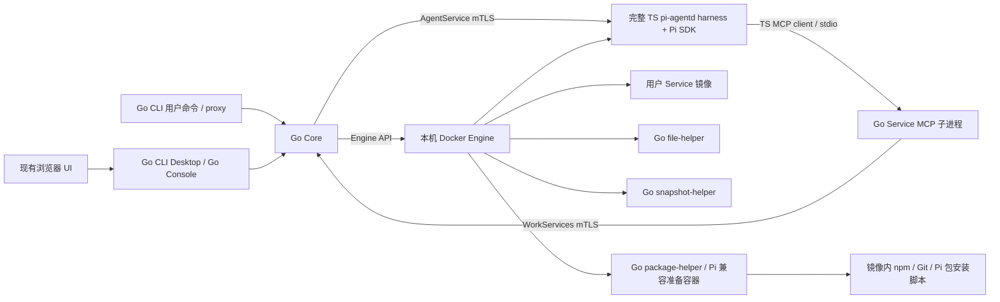

# Design

## Context

动机与交付范围见 [proposal.md](proposal.md)。此次是未发布产品的实现替换：新 Go 安装为验收基准，保留产品数据持久化与完整 `.work` 搬迁能力，不建设历史安装升级系统。

### 已核对的仓库事实

| 现有位置 | 观察到的实现 | 对迁移的约束 |
| --- | --- | --- |
| `apps/core/src/application`、`work-management`、`packages/core-store` | TS HTTP/control plane、异步持久 Operation、SQLite；当前 Core schema 10 | Core 包含编排、恢复和内容管理，不能只移植 HTTP handler |
| `packages/runtime-docker/src/docker.ts`、`stream.ts` | 调用 Docker CLI；二进制流独立于文本命令 | 必须替换所有普通调用和 attach/save/load 流，不能只替换 create/start |
| `apps/core/src/runtime/mtls.ts` | 宿主调用 openssl，生成双向内部 TLS 身份 | 改为 Go crypto；保持 Agent 可验证的身份与挂载 |
| `packages/contracts/proto/{agent,work-services}.proto` | Core→Agent 和 Agent→Core 两个方向 | 同源生成 Go/TS，不新增另一套 RPC |
| `apps/agentd`、`packages/pi-adapter`、`packages/work-store` | Pi SDK harness 的 RPC、工具分发、Session/Run 与历史；当前 SDK 0.86.1 | 整体保留 TS harness 及必要依赖，不拆出其内部通用逻辑另建 Go Agent |
| `apps/service-mcp` | stdio MCP 工具校验和 mTLS gRPC 转发，无直接 Pi SDK 执行 | 改为 Go 子进程，TS MCP 客户端和 SDK 工具注册留在 harness |
| `apps/package-helper`、`packages/pi-package` | 文件/归档处理、npm/Git 调度、Node ABI/SDK 兼容和制品摘要 | helper 本身改为 Go；镜像内保留 Node/npm/Git，Agent 只保留包加载所需 TS 校验 |
| `apps/file-helper` | Python、fd-relative 路径访问、renameat2、防链接竞争 | Go 必须保持底层文件原子性，普通路径字符串清洗不足 |
| `apps/snapshot-helper`、`packages/work-package` | TS/Python，文件树、SQLite/历史核验、完整 V1 包 | 改为 Go；受管历史字段映射与 SDK 正文字节分别处理 |
| `apps/cli/src/desktop/browser`、`apps/console/src/browser` | DOM TS，独立 browser tsconfig，运行时不依赖 Node | 可复用；迁移的是旁边的 Node HTTP 服务端 |
| `apps/cli/src/desktop` | 会话、授权、代理、文件、传输、持久 Operation 记录 | 必须整体移植，不能只提供静态页面 |
| `scripts/*acceptance*`、现有 `*.test.ts` | 真实 Docker/SDK 验收与单元、故障测试并存 | 重用场景和浏览器测试，最终被测平台替换为 Go 程序 |

主规格已经包含 `desktop-webui` 与 `browser-service-access`，无需依赖尚未同步的 Desktop change。规划时仓库无其他活动 change。

### 需要显式消除的规格冲突

1. `core-service-startup` 曾要求退出后保持容器运行；`work-lifecycle` 和当前 `CoreApplication.close()` 实际要求停止受管容器、保留 desired。采用后者，并同步修订启动规格及 operations 文档。
2. 启动规格要求 schema 8→9，但当前 TS 库已经是 10。Go 使用独立格式/schema 1；不添加 8/9/10→Go 转换链。
3. `control-cli` 的早期 login/whoami/logout 示例仍使用 `piwork`，与后来确定的 operator/user 分工冲突。本次 delta 固定为 `piwork-cli`，`piwork` 只指 operator。
4. 旧 TS 哈希容器名称接管和“新 CLI 连接旧 Core”的验收前提退出本次发布约束；同一 Go 安装的崩溃接管、能力探测与降级继续验证。

## Goals / Non-Goals

**Goals:**

- 一个 Go module、清楚的模块边界，便于先完成 Core，再完成用户 CLI 和浏览器后端；每阶段都能单独运行和验证。
- 宿主部署只需要原生程序及系统设施；四种平台辅助程序使用 Go，完整 TS Agent harness 与 Pi 生态封装在 Agent 镜像。
- 现有业务协议与 UI 作为产品基线，用场景覆盖证明等价，不要求保持旧 TS 私有类结构或内部数据库版本号。
- 完成后当前源码中只有一套平台后端；完整保留 TS pi-agentd harness 及其依赖、浏览器 UI，独立 MCP/helper 不作为 TS 例外。

**Non-Goals:**

- TS Core 数据目录升级、旧版本回滚、混合版本长期运行、已执行 Run 无中断热升级。
- 新增操作系统支持、远程 Docker 主机调度、第三方 WebDAV 方法、额外代理协议或 UI 重新设计。
- 将 SDK history 转为 Go 自己的对话格式、拆分重写 pi-agentd harness，或把 npm/Git/Pi extension 执行搬到宿主。

## Decisions

### D1. 交付程序、目录与依赖

使用仓库根 Go module `piwork`，最低工具链以当前已安装 Go 1.25.5 为构建基线；发布构建固定具体工具链和所有依赖版本，不在程序运行时下载工具链。首版验收沿用当前 README 的 Linux 单宿主模型，以 Linux/amd64 为执行基线；其他 OS/架构的正式交付另行扩展。

```text
cmd/
  piwork-serve/           Core daemon + operator 命令
  piwork-cli/             用户命令 + proxy + desktop
  piwork-console/         独立 HTTPS 管理界面后端
  piwork-file-helper/     文件容器程序
  piwork-snapshot-helper/ 快照容器程序
  piwork-service-mcp/     Agent 镜像内的 stdio MCP 子进程
  piwork-package-helper/  包准备容器程序
internal/
  contracts/             公共 HTTP DTO、严格校验、稳定错误
  rpc/                   从同源 proto 生成的 Go 类型
  core/                  application/identity/lifecycle/config/services/packages/files/snapshots
  corestore/             SQLite 事务与持久状态
  docker/                Engine API、资源身份、镜像及二进制流
  agentclient/           AgentService mTLS 客户端
  client/                Go HTTP 客户端、凭证、流与 Operation 观察
  cli/                   operator/user 命令解析、输出与信号
  desktop/               浏览器本地 API、service origin、Files、transfers
  console/               管理会话、CSRF、上传与管理 API
  workpackage/           V1 codec、图验证、历史受管 schema
  pipackage/             Go 侧来源校验、制品摘要、平台发布
  servicemcp/            MCP 工具 schema、JSON 投影、Core mTLS gRPC
  packagehelper/         prepare/init/capture/measure 与隔离环境命令调度
  safefs/                平台文件边界与 Linux fd-relative 操作
  coreassets/            内置 deploy-work-service Skill 等资源
  webassets/             编译后 Desktop/Console 资源，go:embed
proto/                   两份原有 proto 的唯一源文件
apps/desktop-webui/       从 apps/cli 搬出的浏览器 TS/HTML/CSS
apps/console-webui/       从 apps/console 搬出的浏览器 TS/HTML/CSS
apps/agentd/              完整保留 TS Agent harness
```

保留 `piwork-serve` 为 daemon 名称，避免重新引入已移除的 `piwork-core` 命令。发布 `piwork` 作为指向同一原生 operator 程序的别名。内部包不承诺为第三方 Go SDK。

| 部分 | 选择 | 理由与比较 |
| --- | --- | --- |
| HTTP | 标准库 `net/http`、显式路由表 | 现有接口有限且需精细流控制，无需新增完整 Web 框架 |
| gRPC | 官方 Go gRPC/protobuf，保留原 proto wire | 避免重写 Agent 协议；生成代码可再现 |
| 内置 Service MCP 服务端 | 官方 `modelcontextprotocol/go-sdk`，显式 schema 与 stdio | 保持真实 MCP→gRPC 边界；避免改成绕过 MCP 的 SDK callback |
| Docker | 官方 Go Engine client，单独包装平台接口 | 覆盖 API/版本协商；移除命令解析和子进程依赖 |
| SQLite | `database/sql` + `modernc.org/sqlite` | 纯 Go 驱动，发布 `CGO_ENABLED=0`；不引入宿主 libsqlite |
| TLS/hash/auth | `crypto/x509`、`crypto/tls`、`crypto/rand`、SHA-256、`x/crypto/argon2` | 证书和密码操作直接在 Go 中完成 |
| CLI | 显式命令表与严格选项解析、`x/term` 隐藏密码 | 重现重复选项/非法组合在 I/O 前失败的现有契约 |
| 文件 | `x/sys/unix` 的 fd-relative/no-follow/renameat2 | 满足 Linux 文件竞争边界，避免先检查后按绝对路径写入 |
| WebDAV | 按现行子集实现方法分发/XML | 通用 DAV server 默认功能和 ETag/LOCK 语义容易越出规格 |
| 静态资源 | 构建时编译浏览器资源并 `go:embed` | 独立二进制在任意 cwd 可用，无旁置 Node server |

生产构建关闭 CGo；`go test -race` 可以在开发环境启用 CGo，不把开发检测依赖转为部署依赖。依赖版本在阶段 1 固定到 `go.mod/go.sum`，后续不因迁移顺便滚动升级 Pi SDK。

相关官方依据：[Go embed](https://pkg.go.dev/embed)、[Docker Engine API](https://docs.docker.com/reference/api/engine/)、[纯 Go SQLite 驱动](https://pkg.go.dev/modernc.org/sqlite)、[MCP Go SDK](https://github.com/modelcontextprotocol/go-sdk)。这里的选型是本项目决定，不将第三方文档作为业务规格。

### D2. 新安装存储与恢复

Core 存储与 Agent 私有存储分开处理：

| 存储 | 决定 |
| --- | --- |
| Core SQLite | Go 格式 `piwork-go-core`、schemaVersion=1；以现有 schema 10 的最终业务表/索引/约束作为移植基线，压平历史迁移，不照搬 TS 迁移编号 |
| Core 目录 | 保留 core.sqlite、operator.credential、runtime-profile、secrets/runtime/skills/works/snapshots 等职责；新增严格格式 marker，内部实现可在这些职责内组织 |
| Agent 私有卷 | 保留 Work schema 3、`/var/data`、SDK history、Run/event 数据；日常访问归 TS Agent |
| Work workspace | 保留共享卷挂载 `/var/data/workspace`；Go Core 不直接打开 Docker 宿主卷路径 |
| 用户凭证 | 保留现有版本化字段、Core URL 归属与 POSIX 权限约束；新 CLI 与 Desktop 共用 Go credential store |

初始化顺序固定：打开并校验目录、对目录 fd 取得非阻塞排他 OS 锁、分类目录、持久创建 Go 初始化 marker、事务创建完整数据库及匹配的安装身份、fsync 后发布完成 marker、创建其余受管目录与 operator credential。marker 含 format/schemaVersion/installationId/初始化阶段；临时名均绑定该 installationId。没有合法 marker 的非空目录拒绝，不能先 chmod/建库再判断旧格式。空目录上在 marker 创建前崩溃不应留下业务文件；在 marker 后崩溃只恢复已登记初始化文件。事务内的 schema marker 与完成目录 marker 不匹配时拒绝并保留诊断，不猜测转换。

采用目录 fd 的 OS 锁而非 PID 存活猜测；锁随进程结束释放，离线 bootstrap/config 入口也遵守同一排他协议。配置和凭证使用私有目录、拒绝符号链接、临时文件写入+fsync+原子 rename；不在错误中返回秘密或路径。

SQLite 启用外键、WAL 和有界 busy timeout；通过专用写连接串行提交短事务，读连接使用一致快照。不得持数据库事务跨 Docker/RPC/network await。接受 mutation 的事务同时完成授权后状态核验、规范化幂等比较、版本/fence 捕获、Operation 与配额/任务归属持久化；提交后才触发副作用。副作用结果必须携带对应目标版本才能发布。

这次不从旧开发目录迁数据。Go 的 `.work` 验证按格式、运行平台、受支持镜像能力和凭证契约判断，不按生产者语言判断。满足这些条件的当前 V1 包可导入；仍可运行的开发环境可以显式导出，但若固定 Agent 镜像只有旧 TS helper，应明确报告不兼容，不自动转换镜像或承诺旧开发包运行。Go→Go 完整离线搬迁是必要验收。

### D3. Docker API 与容器基础

Core 只管理与其同机、能够访问 Core bind paths 的 Docker Engine。目标解析按以下顺序：显式 `DOCKER_CONTEXT` → 显式 `DOCKER_HOST` → `$DOCKER_CONFIG/config.json` 的 currentContext → 默认 `unix:///var/run/docker.sock`。context 为 default 时使用默认 socket；自定义 context 读取标准 context metadata 中 Docker endpoint。未知 context、TCP/SSH/npipe 或冲突/损坏配置给出安全错误，不 fallback；rootless 用户通过其本机 Unix socket 使用同一流程。

Engine client 启用 API 版本协商。镜像优先使用已捕获的 image ID；首次需 pull 时使用标准 Docker config 的静态 auths 或匿名访问，不调用 credential helpers。只有确实需要该 registry 拉取且缺受支持认证时才失败，不因无关 registry 配置阻止已有镜像运行。不新增 registry 登录命令或将凭证写入 Work。

适配器覆盖 inspect/list/create/start/stop/kill/remove、network/volume 管理、exec readiness、bounded logs、image inspect/pull/save/load、container attach/archive 和 helper 取消。处理 Docker 非 TTY multiplex framing，区分 stdout 数据流与有界 stderr；image load/pull 响应逐条检查 Engine error 字段，HTTP 200 不等于成功。镜像大流量使用背压和文件暂存，不 `ReadAll`。

资源创建前写入持久归属，容器按 installation/work/kind/logical identity/代次与 spec hash 核验。新的 Go spec hash 可重新定义为稳定规范编码，因为不接管 TS 安装；同一 Go 格式内必须稳定。Service 新名称保持 `<work-network-name>_<service-name>`，私网 alias 保持 `svc-<name>`，默认 `.work` 域名由 Core 独立 resolver 派生并持久维护网络标识。它们不进入 Work 配置或 `.work` V1。

创建超时不能假定没有资源：记录 attempt，后续按完整 labels 查找；未知资源只诊断。所有自动清理只处理已登记身份。测试只能清理唯一测试 installation label，禁止全局 prune。

### D4. 跨语言边界



proto 从 `packages/contracts/proto` 搬到根 `proto`，保持 package、field number、optional/oneof 和 enum 不变；TS 生成输出仍进入 contracts workspace，Go 输出进入 `internal/rpc`。同一固定 protoc 和两侧生成器版本构建；生成变动可检测，不手改生成文件。

Core→Agent 保留 Readiness、PrepareConfigurationChange、Drain、Session CRUD/read 与 Run submit/get/watch/cancel；Agent→Core 保留 deployment context、全部 service mutation/query/log 和 Operation。Go 的 context cancellation 只能终止一次读取/观察，不能自动变成 CancelRun。

保留 Agent runtime config v1、context contract、package contract、service-control JSON、固定路径、`/etc/piwork` TLS、`/run/piwork` context、model secret 和 `10001:10001` 身份。Core 用 Go 生成现有 CA/角色证书，验证 CN/URI SAN 与 `spiffe://piwork/installation/.../work/.../generation/.../instance/.../role/...` 对应持久状态；不能只验证证书链有效。内部 WorkServices 默认 7172、HTTP 默认 7171、Agent 7443 均不变。

类型转换显式区分缺失、null、空数组、false、0、uint64 与 JS 安全整数；对 HTTP/proto JSON 不直接套用 Go 默认 field naming。共同使用的 Skill/context/Pi package 摘要沿用当前算法，用 TS/Go 共同 fixture 核对 Unicode、文件顺序、执行位、链接和空数据。Core 私有哈希没有跨旧语言兼容要求，共享契约哈希有。

### D4.1. 完整 harness 与 Go Service MCP

TS 保留范围以完整 Agent harness 的职责确定：RPC server、readiness/drain、Session/Run、私有 WorkStore、SDK history、Skill/Pi package 加载、模型和工具执行、MCP 客户端与 SDK 工具注册均留在现有进程及其 TS 依赖中。无需根据每个函数是否直接 import SDK 再切分。Core 的编排、Docker、平台存储和代理不进入这个例外；独立 `apps/service-mcp`、`apps/package-helper` 被 Go 替换。

Go MCP 可执行文件仍放在 `/usr/local/bin/piwork-service-mcp`，由 TS MCP 客户端通过现有固定配置启动；不是用户 Service，不监听新网络端口、不获得 Docker 权限。读取原 `/etc/piwork/service-control.json` 和 mTLS 文件，连接当前 Work 的 Core WorkServices；Work/角色/代次由 Core 的身份核验决定，工具参数不可选择运行身份。

沿用全部 12 个 canonical 工具、模型名称映射、参数 schema/默认值/严格未知字段检查和错误投影。schema 显式编写并以 TS 参照 fixtures 验证，不直接采用 Go struct 自动生成的默认省略/必填语义。结果保持 text 与 structuredContent 的相同 JSON 数据；uint64 等字段按现有投影输出，不因 Go protobuf JSON 默认为另一格式改变工具结果。mutation 返回持久接受，不等待完整部署；超时不换新幂等键重发。stdout 仅传 MCP，诊断走安全 stderr；Agent 继续负责五秒退出宽限和子进程回收。MCP 协议版本按与保留 TS 客户端共同支持的版本协商，不在迁移中顺带升级其 SDK。

### D5. Core 业务编排

核心模块采用显式 service/repository/runtime interface；真实 SQLite 负责持久一致性，fake runtime 只用于可控故障测试。按 Work 串行协调互斥状态转换，不把全局工作阻塞在一个 Work 的 RPC 上；共享配额与资源发布在事务中核验。

| 模块 | 保留的关键语义 | 当前实现参照 |
| --- | --- | --- |
| identity/access | operator、管理员、owner、Agent 权限分离；管理员控制权不等于读取他人内容；token digest 与撤销 | `apps/core/src/identity`、`work-access` |
| lifecycle | desired/observed 分离、版本取代、单一 Agent、停止确认、bounded recovery、degraded | `work-management` |
| config/skills | 接受时捕获完整 context；Save 不 Apply；Apply busy 不取消 Run；失败回退配置不回退数据 | `configuration` |
| packages | Core/Work scope；上传/准备/验证/发布；不可变制品、leases、GC、错误分类 | `packages`、`packages/pi-package` |
| services | 完整定义、revision、固定镜像、原子预算、enabled 与 Work stop 分离、恢复预算、日志脱敏 | `work-services` |
| conversation | Core 先授权后路由到已核验 Agent；事件顺序/游标/终态/慢观察者独立 | Core HTTP + Agent RPC |
| files | 独立文件准入、任务归属、只访问当前 workspace、无写入重放 | `work-files` |
| snapshots | 停止且无写入者才能导出；完整验证后原子发布 stopped Work | `work-snapshots` |

优雅退出先关 HTTP/runtime/file admission，再收尾 package/snapshot/file workers、并发停止 Work 的 Agent 与 Service，最后关传输/store/锁。总预算受进程 deadline 约束，单个 worker 卡住不能让进程无界等待；正常退出保留 desired，失败非零并保留恢复证据。异常退出下先恢复各 helper/快照/包的持久任务和文件 gate，再开放对应 Work 路由，不能先启动 Agent 写同一卷。

所有错误经过稳定公共分类与白名单字段输出；继承当前业务 HTTP 状态、code、retryable、stage、correlationId 和拒绝时机。内部 Go error、SQL、Docker/npm stderr、主机路径不直接成为 API 错误。具体接口和投影以现有主规格、`packages/contracts/src` 及客户端调用契约为基线；迁移不统一成新 envelope，也不把 HTTP 应用 401 错判为平台会话失效。

### D6. Pi package 准备与内容管理

Go 实现来源/ZIP 校验、有界上传、目录树与制品管理、scope mutation、context bindings、lease 和 GC。package-helper 本身改为 Go，实现原 prepare/init/capture/measure 四入口、归档/manifest/inventory 校验、限额、共享摘要及安全结果；保留 `/package/source`、`/package/work`、`/package/spool` 和请求/结果文件协议，不让 helper 直接操作 Core DB。

Go helper 在与目标 Agent 平台/Node ABI/SDK 兼容的临时容器内调用 npm/Git，依赖与安装脚本仍使用镜像内 Pi 生态。保留 argv 执行、受控环境、命令超时/输出限额、manifest 原字节恢复、host peer 检查和失败分类；不实现替代 npm，也不把包内 JS 搬到 Core。SDK/Node 环境探测仍限制在兼容镜像内，属于所保留生态的运行信息检查。prepare 保留网络及非 root 身份；init/capture/measure 使用可信程序与原有只读/无网络/能力边界，npm/Git/包脚本不能进入这些入口。

完成依赖安装不是发布完成：Go 必须检查 helper 退出、配额和时限、完整制品树、摘要、manifest、resource inventory 与 prepared environment，发布不可变制品后才能更新 desired。失败保持旧包与 active。准备超时后的容器清理与 durable job 恢复不能只依赖内存 goroutine。

### D6.1. 原生镜像入口与兼容检查

Agent Dockerfile 增加 Go 构建阶段，把 Go MCP 和 package-helper 普通可执行文件复制到 `/usr/local/bin/piwork-service-mcp`、`/usr/local/bin/piwork-package-helper`；两者均 `CGO_ENABLED=0`，与镜像平台一致。移除旧两个 TS workspace/dist、Node shebang 和 helper 启动脚本。production/acceptance 两个 target 使用同一套 Go 平台程序，Agent 默认入口仍为 Node pi-agentd；MCP 沿用现有执行路径，包 helper 的 Core Docker entrypoint 改为 Go 文件。

Agent RPC protocol v2、context 与 Pi package 内容 contract 1 不变。包 helper 启动能力 label 明确为 `io.piwork.package-helper.contract=2`，区分旧 contract 1 的 Node 路径；新内置 MCP 能力 label 为 `io.piwork.service-mcp.contract=1`。这些是镜像配置中的运行能力标识，不能误写成 `.work` formatVersion 或 Pi package 内容版本，也不把整个 TS Agent 镜像标记成 Go。

新的 package mutation 在持久接受前检查所选准备镜像及可信 helper 镜像的包 helper 能力：label 与实际固定路径的原生可执行文件必须存在且平台匹配，只有 label 不算支持。缺失/旧 TS 入口/不兼容返回现有 `PI_PACKAGE_HELPER_INCOMPATIBLE`，不创建 Operation；已接受同键重放先返回原 Operation，不重新做兼容探测。检查资源先登记安装归属并有界回收，不执行用户包；Core 不尝试启动旧 TS helper。新建/启动/Apply Work 的 Agent 运行验证同样要求该 Go 交付的两项内置镜像能力，缺失按现有 runtime/Agent compatibility 失败并关闭路由。

固定 Agent 镜像能力通过镜像归档 config、合并文件树（正确处理 layer whiteout）、固定普通文件路径/执行位及 ELF 平台信息静态核验，不运行 ENTRYPOINT、helper、MCP 或 Node。包内固定镜像不满足上述 Go 运行能力时返回 `PACKAGE_INCOMPATIBLE`，表示包内镜像能力不受支持，不等同于包完整性失败或目标安装已验证；不偷偷换镜像、补装程序、修改 SDK 版本或新增 V1 字段。文件树检查有界；运行代码是否确由 Go 构建由发布构建证据核验，不把镜像 label 或 ELF 魔数视为信任证明。

离线 inspect 与 Core 导入检查分开：inspect 只使用包内数据验证全部字节、结构及上述静态镜像能力，不读取登录凭证、不联系 Core/Engine/网络、不打开包内 SQLite 执行语义检查；成功摘要严格保留 `integrityVerified=true`、`installationValidated=false`。Core 不信任该摘要作为安装依据，独立复核镜像能力；package 标记可导入前完成完整接收预检及隔离历史语义检查，导入接受前检查目标平台、模型/外部 MCP 凭证和 quota，发布前再次核验目标相关约束。能力及完整性检查通过而目标缺凭证/配额不足的包可以 Inspect 成功，但仍会被 Core 按既有具体错误拒绝。两个空 Go 安装间导出→导入保持原镜像身份，可离线继续运行。

Core 自带 `deploy-work-service` Skill 从 `apps/core/assets` 移到 Go embedded assets，保持内容和被拷贝进 Work 的路径/权限；不能在删除旧 Core 目录时漏掉 SDK 必需资源。

### D7. Service 转发与文件访问链路

```text
curl / WebSocket 客户端 → Go CLI proxy:17890 → Core service gateway → 当前 Service
WebDAV 客户端 → proxy 的 /works/<id>/files/ → Core files → Go file-helper → workspace
浏览器 UI → Go Desktop:17891 → Core 控制/文件 API
浏览器 Service origin → Go Desktop 的独立应用入口 → Core service gateway → Service
```

三种入口共用 Go client/传输组件，但保持路由与凭证边界：service absolute-form、WebDAV origin-form、Desktop 本机 Host/origin 授权不能相互回退。`.work` 是 Core 的逻辑服务身份，不要求公网 DNS；Desktop 用 `desktop.localhost` 及每服务 origin，实现浏览器免代理访问。

HTTP 转发保留 method/path/query/body/status；strip hop-by-hop 与平台内部头，正确传递应用认证并只在 Core 外层放平台认证。SSE 收到即 flush；WS 101 后双向传输，连接取消和授权失效必须关闭两端；不使用会截断长流的全局短 WriteTimeout。Core 保留 32 KiB 头、10 秒建连、用户 64/全局 256 连接及最多 2 秒资格复核。Go 标准 ReverseProxy 只提供传输基础，不代替资格、cookie 或 Origin 策略。

文件协议保持现行 OPTIONS/PROPFIND Depth 0/1、GET/HEAD 单段 Range、PUT/MKCOL/COPY/MOVE/DELETE 子集；多段 Range 416，不新增 LOCK/ETag/PROPPATCH 能力。保留 href/Destination/Location 的同 Work 映射、UTF-8 路径及全部大小/深度/超时限制。Go DAV handler 显式控制响应码和 XML；通用服务器库的额外方法不自动暴露。

file-helper 仍为每次受控操作建立的隔离执行资源，镜像协议标签保持现有版本，固定 entrypoint 改为原生程序。uid 10001、network none、只读 rootfs、cap-drop ALL、no-new-privileges、只挂当前 workspace；限额与现有 specs 相同。保持请求/准备/提交许可/结果协议，Core 持久 file epoch/attempt 决定是否允许提交。PUT 暂存在同一 workspace 的受管位置，fsync 后按覆盖条件原子发布；使用 openat/no-follow 和 renameat2 避免路径替换及 no-overwrite 竞争。普通 Service/Agent 对卷的直接写入不被伪装为全局受锁。

### D8. V1 包与原生快照 helper

`internal/workpackage` 被 Core、CLI 和 snapshot-helper 共用。保留 magic、64 位大端 manifest 长度、原始 blob 顺序、大小与 SHA-256、严格 JSON/字段、引用闭包和总恢复量限制；不新增 V2 或将域名放进包。必须拒绝重复 JSON key、无效 UTF-8、非安全整数、尾随字节、路径/链接越界与受管历史畸形，不依赖默认 JSON decoder 的宽松行为。

Core 实现快照准入锁、writers 核验、上传/下载/过期、durable jobs、映像传输、model/MCP bindings 和原子发布。snapshot-helper 使用 Go 操作冻结卷及 spool，保留已有最小挂载与网络隔离；为恢复 uid/gid 与硬链接所需的权限只留在受限快照容器，不传 Docker socket 或 Core secrets。

完整 `.work` 传输沿用 WSNAP-005，不支持 Range：任何显式 Range（包括有效单段和多段）返回 416，不返回部分内容、不提供断点续传。CLI/Desktop 从 Core 下载快照时不发送 Range；中断后在保留期内通过原 snapshot ID 从头重取同一内容/hash，不重新导出或读取源 Work。workspace WebDAV 文件 GET/HEAD 的单段 Range 支持仅适用于文件入口，不复用于快照路由。

文件树保留全量内容及规范元数据，包括隐藏文件、`.git`、依赖、链接、空目录、业务数据库。受管 Work SQLite 按固定 schema 白名单读取，禁用不可信扩展和 trigger 执行；重建新受管 DB 映射 Work/context 字段，而非执行源 schema SQL。SDK JSONL 与用户内容当作不透明字节保留。historyPresent=false 的未初始化 Work 保持私有历史缺席。

导入经完整验证、容量预留、隔离写卷和镜像加载后，在一个发布事务中产生新 Work/service/context/volume/Operation 身份；失败只清理已登记的临时资源，不暴露半成品。发布结果 stopped，后续由用户显式 start；不重放 Run、工具、package lifecycle script 或导出前的 service mutation。

### D9. CLI 与浏览器后端

Go client 是 operator/user/Desktop/Console 的内部共用传输库。权限选择留在各入口；不在 client 自动借用另一种 credential。CLI 优先级、命令帮助、参数前置校验、text/JSON 投影、等待期限及错误码按现有 `control-cli`；service `--wait` 与 package `--wait` 的不同期限不能统一简化。chat 的显式 Ctrl+C 按契约请求 CancelRun，proxy/desktop 退出只关闭本地入口，观察中断不取消已接受工作。

CLI 与 Desktop 共用的 Go credential store 对 Load/Save/Clear 统一核验目录和文件身份：现有父目录为当前有效用户所有，group/other 权限为零，凭证为当前用户所有的普通 `0600` 文件；新目录以私有权限创建，不通过 chmod 不安全的现有目录来接受它。路径中的符号链接明确拒绝。使用已核验目录句柄上的 fd-relative/no-follow 操作，读入文件后复核实际文件身份，写入通过同目录私有暂存、fsync 和原子发布，删除同样绑定已核验目录身份。检查后的路径替换不能将操作重定向到外部对象；核验失败不读取或发送 token，不修改原凭证或外部文件。该实现留在 Go 共享凭证层，不在两个入口各自复制检查。

保存和删除共用已核验私有父目录 FD 上的跨进程 `flock` 排他锁，以 `LOCK_EX | LOCK_NB` 非阻塞获取，锁忙或获取失败立即返回安全错误，不执行无锁回退。锁覆盖当前文件的安全核验、会话身份比较以及实际写入或删除，完成后释放；远端 HTTP 请求在锁外执行。Load 保持安全快照读取；保存仍采用同目录原子发布。共享层提供按预期会话身份清理的原子操作，身份由规范化 Core URL 与 token 组成，不改变凭证记录格式。匹配时删除并同步目录，安全确认文件不存在或身份不同则无需删除并保留当前记录；读取、解析、安全核验、锁获取或删除失败返回安全错误。所有凭证写入和删除均遵守该锁，不能仅在删除前 Load 比较后再调用无条件 Clear。

CLI logout 对所选 Core 的响应显式分类：成功撤销或可识别的 `401 AUTHENTICATION_FAILED` 后，使用请求开始时保存的 Core/token 调用共享条件清理操作；删除成功，或安全确认凭证已不存在、已被其他会话替换后，才 exit 0 并返回既有 `loggedOut=true`。该结果只表示旧会话已结束，不表示并发登录的新会话已登出。同一 Core 的新 token 与其他 Core 的新记录同样受保护。网络故障、取消、403、5xx、未知或畸形响应保留凭证。认证失效判断同时要求 Core 与所用凭证归属匹配，不跟随重定向或借用其他 Core 的 token。清理失败按本地错误退出，不谎报成功、不自动重发撤销。Desktop 的会话失效清理与登出清理也使用共享条件清理操作，继续遵守既有本地即时登出与远端撤销提示契约，不因共享文件被新会话替换而删除新凭证。

Desktop 路径保持 `/_desktop/api`、`/_desktop/files` 与静态资源路由，沿用现有 TS browser fetch 契约。bootstrap ticket 五分钟单次使用、本机会话十二小时、host-only Secure/HttpOnly Cookie、CSRF、Origin/Host/Fetch-Metadata 核验、每 Service 独立 origin 与授权票据均移植。Service cookie/Origin/Location 重写、应用自己的 Basic/Bearer、CSP/XFO 原样保留、跨 Service 跳转重新授权；不改响应正文。

Desktop 本地传输缓存仍私有、限额、绑定本机会话和 Core/user；离线 inspect 不需登录。snapshot 下载完整验证后才提供浏览器下载，保留原 snapshot/Operation ID 的恢复入口；浏览器下载开始不宣称落盘完成。Operation 历史记录持久化但不存 token，按 Core URL/user 分区，切换身份不能读取另一分区或复用传输。

Console 保持独立 `piwork-console serve`、HTTPS 配置、loopback Core 限制、管理员 bearer 驻内存、Secure/HttpOnly/SameSite Strict Cookie、CSRF 与相同管理 API。不会把 Console 合并成 Core 的公开静态路由，也不将 operator credential 交给浏览器。

浏览器目录搬迁仅调整构建路径和测试入口；若实现发现确需改浏览器请求字段，先核对是否服务端移植遗漏。允许修正必要的资源 URL/构建引用，不以迁移引入界面重做。

### D10. 最终 TS/构建清理边界

| 处理 | 范围 |
| --- | --- |
| 删除生产实现 | `apps/core`；`apps/cli` 和 `apps/console` 的 Node 后端；`apps/file-helper` Python；`apps/snapshot-helper` TS/Python；`apps/service-mcp` 和 `apps/package-helper` TS |
| 删除仅平台使用的包 | `packages/core-store`、`packages/runtime-docker`、`packages/client-sdk`、`packages/work-package`；测试需要的场景/fixture 迁入新测试目录，不保留旧平台运行库 |
| 提取后保留 | Desktop/Console browser TS 与资源；`apps/core/assets` 中内置 Skill 迁入 Go assets |
| 保留完整 harness TS | `apps/agentd`、`packages/pi-adapter`、`packages/work-store`；包括 RPC、Session/Run/history、context/resource/tool/MCP 客户端的完整依赖闭包 |
| 裁剪共享 TS | contracts 保留 Agent/浏览器使用的 DTO/schema、运行配置及生成 RPC；pi-package 只保留 Agent 包加载、内容/环境核验与其内部依赖；平台准备/上传/ZIP/source 调度转入 Go |
| 测试与工具 | 保留真实 SDK fixture、Playwright 和必要 JS 驱动；产品验收只启动 Go 后端；测试辅助 HTTP 客户端不再导入被删 production SDK |

共享包按实际模块和导出裁剪：Agent 使用的 `artifact-sync`、`inventory`、manifest/peer/environment 校验、摘要和限额保留 TS；从当前 `source`/`artifact`/`zip` 中提取这些依赖，不能因一个共享常量而保留上传、ZIP 提取/打包或 npm/Git 准备的生产实现。`source-tree`、`local-zip`、`upload`、ZIP I/O 等平台代码删除或将必要测试 fixture 工具迁入非生产 test-support。contracts 同样按剩余 harness/UI imports 核验，不保留只供旧平台使用的 HTTP client/server 运行库。纯 DTO/校验可在 Go 和保留 TS 消费者中分别生成或实现，继续通过共享 fixtures 保持契约。

发布清单必须列明 TS 保留目录、具体生产模块/导出、保留理由与消费者，以及镜像入口/子进程和随镜像分发的依赖。harness 自身及其可达依赖无需逐函数 Go 化，但不能反向 import 旧平台 package。平台产物清单包括三种宿主程序和四种镜像内 Go 程序。源码 import graph、npm workspaces/lock、Go 构建信息、镜像入口/固定文件树和实际进程同时核验；TS UI/测试属于各自明确范围，不能用其名义发布独立 TS 服务端。

用户 Service 镜像、workspace 内用户程序和 Pi 包内容保持原语言及字节，不属于“平台程序改为 Go”的源码清理对象。进程检查按平台程序、harness/Pi 生态和用户应用归属判定，不因用户计数服务使用 Python 或用户文件含 TS 而判为迁移失败。

提供 `make build`、`make test`、`make test-integration`、`make acceptance`、`make release`、`make generate` 作为统一开发入口；分别执行固定 Go 构建、剩余 npm workspace、浏览器编译/拷贝及必要生成。`go test ./...` 可独立验证 Go 单元/契约测试；外部服务测试显式进入 integration/acceptance。构建时的 Node/npm、protoc、Docker CLI 与测试工具允许存在，产物运行不能依赖它们。

发布 tar 包包含三个宿主入口/别名、版本/commit/协议构建标识、SHA256SUMS、部署说明和镜像清单。四种 Go 辅助程序随相应 helper/Agent 镜像交付，不要求用户在宿主安装它们；MCP 与 package-helper 继续使用 Agent 兼容镜像，不新增独立 MCP 服务。平台二进制不把整幅镜像藏入 executable。`make build` 和正式 release 必须包含真实浏览器资源，不能发布 placeholder 页。七种 Go 程序的发布构建均 `CGO_ENABLED=0`，检查构建信息与 ELF 动态依赖；运行测试移除宿主解释器及相关命令的 PATH，镜像内 Node/npm 仍允许用于已登记 harness/Pi 生态。

## Risks / Trade-offs

- [重写面广，编译通过掩盖业务缺失] → 使用本 change 的 `verification-matrix.md` 枚举所有现行 Requirement/Scenario，分层测试并在阶段 gate 核对证据，未验证不勾选。
- [Go 并发改变原事务排序] → 短事务、Work fence、持久配额及副作用身份，覆盖 stop/create、save/apply、delete/late helper 等竞争。
- [gRPC/JSON/摘要的语言差异] → 同源 proto 和共享字节 fixture；检查 optional/null/empty、安全整数、UTF-8/排序/哈希，而非只比字段名称。
- [取消 gRPC/HTTP 误取消 Run 或重复 mutation] → 分开执行生命周期与观察连接，故障测试计数实际提交次数。
- [文件 helper Go 化破坏防链接竞争] → Linux fd-relative 原语、原子发布与 race 测试，不能仅以单次路径清洗作为安全证明。
- [浏览器安全 Cookie、重定向和 WS 与库默认行为不同] → 原有 Chrome/Edge 场景在真实 Go 后端上重跑，包括攻击与拒绝路径，不移除 CSP/XFO 换取通过。
- [直接 Engine API 不再隐含 Docker CLI 功能] → 明确 Unix endpoint/context/auth 支持范围，完整覆盖 binary attach/save/load 和错误分类；外部 cred helper 明确失败。
- [快照的受管 SQLite 与 SDK 内容混淆] → 受管表按 whitelist 重建；用户 DB/SDK JSONL 保留字节，导入验收使用真实 TS Agent 继续会话。
- [旧开发数据被误当作可清理临时文件] → Go marker、单一安装身份、精确资源标签；初始化拒绝不会自动迁移或删除旧目录。
- [只去掉宿主 Node，却在镜像里继续运行 TS 平台 helper] → 完整 harness 的 TS 清单、七种 Go 程序构建证据、实际镜像入口检查和进程验收；缺 Go 能力明确失败，无旧 helper fallback。
- [原生 helper 更换导致静默升级包内 Agent 镜像] → 静态检查受支持镜像能力，不改 V1 framing 或固定镜像身份；旧能力明确不兼容，Go→Go 离线搬迁真实验收。
- [Linux 原生交付被理解为任意平台支持] → 当前只作 Linux 基线验收，CLI 代码保持可移植结构但不宣称未验证平台可用。

## Migration Plan

### 阶段顺序与完成门槛

| 阶段 | tasks 分组 | 完成条件 |
| --- | --- | --- |
| A：契约与原生基础 | 1–4 | 固定构建/协议、存储和 Engine/crypto 基础，可启动 Go 控制面 |
| B：完整 Go Core | 5–9 | 完整 TS harness + Go MCP/package/file/snapshot 程序；配置、包、Service、网关、文件、完整快照及恢复通过 Core gate |
| C：Go 用户 CLI | 10–11 | 用户命令、proxy、WebDAV、对话、包/快照用真实 Go Core 完成 CLI gate |
| D：Go 浏览器后端 | 12–13 | 复用 UI 在 Go Desktop/Console 上通过浏览器与权限场景 |
| E：最终替换 | 14 | 删除旧后端，干净构建、无宿主解释器运行、源码/镜像 TS 边界和全规格验收，文档/发布产物一致 |

operator 命令随 Core 阶段完成。Go 用户 CLI 的产品实现从 Core gate 后开始；Core 阶段可以通过测试 HTTP 驱动/临时旧 CLI 人工检查，后者不是最终验收依赖，也不建立兼容承诺。每次 apply 可以停在任务或阶段边界，已经完成的 gate 不重复定义。

Go MCP、Go package-helper 与原生 Agent 镜像在阶段 A 的 3.7–3.9 先完成，再进入阶段 B 的真实 harness/Work 运行。它们通过 Go/TS MCP 契约 fixture 与隔离镜像 smoke 验证基础协议和入口；7.4 及 Core gate 再验证真实 SDK→Go MCP→Go Core。文件与快照 helper 分别随 8/9 的业务实现完成，所有辅助程序都在 Core gate 前交付。

测试分层：L1 为纯 Go 单元/真实 SQLite/HTTP/MCP 和协议 fixture；L2 为真实 Docker、完整 TS Agent/SDK、Go MCP/package/file/snapshot 程序与故障注入；L3 为 Go CLI 与 Chrome/Edge/Console 真实后端；L4 为打包、无解释器宿主、TS 源码/镜像边界检查和双安装 export/import。保留现有确定性模型避免付费调用，在线 Pi package 成功验收仍按主规格执行，网络不可达只能记录未验证，不能当成成功。真实模型 smoke 维持显式 opt-in。

`verification-matrix.md` 为本次规划时的有效规格索引，包括本 change delta；每条 Requirement 列出其所有 Scenario、关联任务组和验证层级。实施时将精确 test 名、命令与结果写入 `docs/go-migration-acceptance.md`，UI 规则可附必要人工 Review/截图记录；新旧测试名不必相同，但覆盖断言不能退化。

### 开发切换与失败处理

在阶段 E 前保留旧 TS 源码供参照，使用独立 Go 数据目录和测试 installation，不让两个 Core 共用目录或归属。阶段 E 后默认入口仅 Go。没有发布版本的旧版回滚流程；开发阶段可回到早期源码继续排错，但不得以 TS fallback 完成 Go gate。若 Go 数据格式需要后续变化，应单独修改规划与 schema，不添加“未知格式自动重置”。

文档同步包含 README、operations、testing、desktop-webui、serve-console、work-files、work-snapshot、work-package-format 的实现说明，以及当前架构/构建说明。SDK adapter 文档保留 TS 边界并校正实际依赖版本。历史 OpenSpec archives 不改写；历史架构草稿和 TS 验收记录标注适用范围并链接新记录。

本方案不存在需要在 apply 阶段重新决定的产品范围或兼容策略。依赖 patch 版本、测试 fixture 文件名等不改变设计的细节在对应任务落锁并记录即可。
